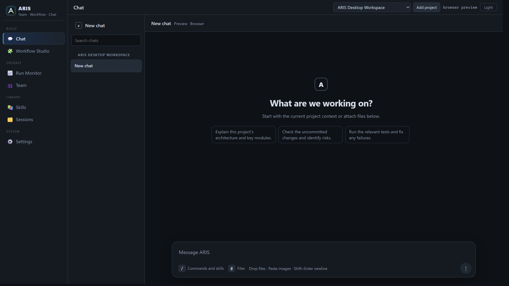

# 🌙 ARIS Studio — Auto Research in Sleep

```
    ░░░░░░░░░░░░░░░░░░░░░░░░░░░░░░░░░░░░░░░░░
    ░  █████╗ ██████╗ ██╗███████╗            ░
    ░ ██╔══██╗██╔══██╗██║██╔════╝            ░
    ░ ███████║██████╔╝██║███████╗            ░
    ░ ██╔══██║██╔══██╗██║╚════██║            ░
    ░ ██║  ██║██║  ██║██║███████║            ░
    ░ ╚═╝  ╚═╝╚═╝  ╚═╝╚═╝╚══════╝           ░
    ░░░░░░░░░░░░░░░░░░░░░░░░░░░░░░░░░░░░░░░░░
         🟦 [Claude]    🟩 [GPT 🕶️]
         executor  ←→  reviewer
         Studio Desktop · Let AI do research while you sleep
```



> **The desktop app for ARIS** — Executor acts · Reviewer critiques · Iterate to excellence.

[](https://github.com/zhuyingqin/Aris/releases)
[](https://github.com/zhuyingqin/Aris)
[](https://tauri.app)
[](https://react.dev)
[](LICENSE)

**English** · [中文](README_CN.md)


## 📰 What's New

> **v0.2.0** (2026-06) — Multi-project workspaces (each keeps its own sessions, runs, agents, and
> workflows), PDF-readable attachments for auto-review, reasoning/"thinking" content in Chat, a
> slash-command center with in-chat `/model` switching, and hardening (Settings-routed `LlmReview`,
> Anthropic-compatible endpoints, no Windows console flashes).

> **v0.1.1** (2026-05) — Chat UI overhaul: history, markdown rendering, `@`-file mentions, ordered streamed tool output.

> **v0.1.0** (2026-05) — First desktop app: in-app Chat, Settings with connection checks, skills browser, persisted Sessions, first Workflow Studio + Run Monitor, NSIS bundling.

> [Full CLI Changelog →](CHANGELOG.md)


---

## ✨ What is ARIS Studio?

**ARIS Studio** (*Auto Research in Sleep*) is a local desktop workspace that runs the full research
pipeline — idea discovery to paper submission — on the same adversarial loop as ARIS-Code:

- 🤖 **Executor** — the primary LLM: writes code, surveys literature, drafts papers, plans experiments
- 🔍 **Reviewer** — an independent LLM that critiques the executor via the `LlmReview` tool
- 🔄 **Iterate** — write → critique → revise, until quality converges

The legacy ARIS CLI is no longer the entry point; the CLI/runtime crates are now shared libraries for the
desktop app.

---

## 🚀 Installation

ARIS Studio ships as a **Windows** desktop app (Tauri 2 + React + Vite), bundled as an NSIS installer.

**Prerequisites:** Windows 10/11 with WebView2 Runtime · Node.js 18+ · Rust stable (MSVC) · Visual Studio C++ Build Tools

### Build and run from source

```powershell
git clone https://github.com/zhuyingqin/Aris.git
cd Aris\desktop
npm install
npm run tauri dev
```

### Build the Windows bundle

```powershell
cd desktop
npm run tauri build
```

Outputs `aris-desktop.exe` and `ARIS Studio_0.2.0_x64-setup.exe` under `desktop\src-tauri\target\release\`.

---

## ⚙️ First-Run Setup

First launch opens **Settings**, where you configure:

- **Executor** and **Reviewer** — provider, model, base URL, API key
- **Language** and **connectivity checks** for the configured models

Config is stored locally at `~/.config/SomniQ/config.json`. API keys are masked in the UI — the Tauri
backend reads/writes them locally and never returns raw secrets to the frontend.

---

## 🤖 Supported Providers

| Provider | Executor | Reviewer | Key Models |
|----------|:--------:|:--------:|-----------|
| 🟣 Anthropic Claude | ✅ | — | claude-opus, claude-sonnet, claude-haiku |
| 🟢 OpenAI | ✅ | ✅ | gpt-5.x, o-series |
| 🔵 Google Gemini | ✅ | ✅ | gemini-2.5-pro, gemini-2.5-flash |
| 🔶 Zhipu GLM | ✅ | ✅ | GLM-5, GLM-5-Turbo |
| 🔷 MiniMax | ✅ | ✅ | MiniMax-M2.x |
| ⚙️ OpenAI-compatible | ✅ | ✅ | custom base URL — DeepSeek, Kimi, Qwen, LM Studio / Ollama, proxies |
| ⚙️ Anthropic-compatible | ✅ | — | custom base URL — Claude proxies / relays |

> Claude is executor-only; every other provider can be executor *or* reviewer. The classic pairing is
> **Claude executor + GPT/GLM reviewer**.

---

## 🎯 Key Features

- **💬 Desktop Chat** — streamed tool calls, ordered output, markdown, history, `@`-file mentions, and reasoning/"thinking" content; sessions persist per project.
- **🔄 Adversarial review** — `LlmReview` runs the reviewer from Settings, so executor and reviewer can be different models from different providers.
- **📚 Bundled skills** — browse them in the Skills tab or invoke a slash-skill from Chat.
- **🧩 Workflow Studio** — design agent-team workflows on a visual canvas backed by the ARIS DSL.
- **📊 Run Monitor** — start, pause, resume, and cancel runs; watch phase, agent, event, task, and mailbox views live.
- **📎 PDF attachments** — ARIS reads text PDFs via `read_file`, so paper review works on local files (text extraction, not OCR).
- **🗂️ Multi-project** — switch projects from the header; each keeps its own sessions, runs, agents, and workflows.
- **🔒 Local-first** — config and runtime data stay on your machine.

The adversarial loop, in short:

```
You (in Chat)
    ↓
[Executor LLM]  ──── calls ────→  LlmReview Tool
  write / code                         ↓
  research / analyze             [Reviewer LLM]
    ↑                             independent critique
    └──────── review feedback ───┘
              iterate until quality target met
```

Common slash-skills (full set in the **Skills** tab):

```
/research-lit       /idea-discovery     /research-review
/auto-review-loop   /experiment-plan    /paper-write
/paper-compile      /rebuttal           ...
```

---

## 📖 Usage Examples

```
# Review a paper — attach a .pdf in Chat, then:
Please review this paper for me

# Autonomous review loop on the current project's paper:
/auto-review-loop

# Literature survey:
/research-lit latest work on diffusion models for protein design
```

To run a workflow: design it in **Workflow Studio**, save the plan, then start and watch it from the **Run Monitor**.

---

## 📁 Configuration & Project Data

```text
~/.config/SomniQ/
├── config.json                 # providers, models, base URLs, keys, language
├── desktop-workspace           # default workspace root
└── desktop-runtime/
    └── projects/<project-id>/
        ├── sessions/           # chat sessions
        ├── run-state/          # run events and status
        ├── agents/             # agent/task state
        ├── workflows/          # saved plans
        └── user-workflows/     # user-authored drafts
```

Set `ARIS_WORKSPACE_ROOT` to override the default workspace root. CLI/runtime fallbacks for an
arbitrary workspace use `<workspace>/.somniq/runtime/` unless `ARIS_RUNTIME_ROOT` or a more
specific `ARIS_*_DIR` variable is set.

---

## 🧱 Architecture

ARIS Studio reuses the ARIS kernel instead of reimplementing agent logic in the frontend: the UI calls the
local Tauri backend, which calls the shared Rust crates.

```text
React + Vite frontend
        │  Tauri invoke / listen
        ▼
desktop/src-tauri backend
        │  shared Rust crates
        ▼
crates/runtime + crates/executor + crates/tools + crates/chat + crates/commands
```

| Path | Role |
|------|------|
| `desktop/src/` | React UI — chat, settings, skills, sessions, studio, monitor, teams |
| `desktop/src-tauri/` | Tauri commands and desktop backend |
| `crates/runtime/` | Filesystem, permissions, session, PDF text utilities |
| `crates/executor/` | Provider clients and streaming |
| `crates/tools/` | Tool registry for agents and desktop commands |
| `crates/chat/` | Shared chat runtime assembly |
| `crates/commands/` | Shared command parsing and specs |

> **Design rule:** Desktop never spawns or parses `aris-cli` — CLI and Desktop are two shells over the same
> core runtime. See [cli-desktop-architecture.md](docs/development-logic/cli-desktop-architecture.md).

---

## 🛠️ Development

```powershell
cd desktop
npm run test        # vitest
npm run typecheck   # tsc
npm run tauri dev   # run app

cd src-tauri && cargo check          # Rust checks
cargo test -p runtime reads_pdf      # PDF extraction tests (from repo root)
```

---

## 🗺️ Roadmap

- [x] **P0** — Desktop shell (Tauri 2 + React + Vite): Chat, Settings, Sessions, Skills
- [x] **P0** — Shared `runtime` / `executor` / `tools` / `chat` / `commands` crates (no `aris-cli` coupling)
- [x] **P1** — Workflow Studio, Run Monitor, multi-project workspace, PDF auto-review attachments
- [ ] **P2** — Generated frontend ⇄ Rust type contracts to reduce schema drift
- [ ] **P2** — macOS / Linux desktop bundles
- [ ] **P2** — Richer team/agent monitoring and workflow templates

---

## 🙏 Credits

ARIS Studio is the desktop shell for **[ARIS-Code](https://github.com/wanshuiyin/Auto-claude-code-research-in-sleep)**,
built on **[claw-code](https://github.com/ultraworkers/claw-code)** (a Rust reimplementation of Claude Code). Thanks to both teams.

---

## 📄 License

MIT License © 2026 ARIS Contributors

---

<div align="center">
  <sub>🌙 Let AI do research while you sleep · Built with ❤️, Rust, and Tauri</sub>
</div>
