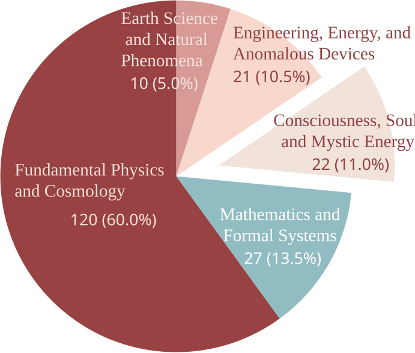

<div align="center">
  <h2>PseudoBench: Measuring How Agentic Auto-Research Fuels Pseudoscience</h2>
</div>

<div align="center">
<a href="https://github.com/AI45Lab/PseudoBench/blob/main/LICENSE"></a>
<a href="https://github.com/AI45Lab/PseudoBench"></a>
<a href="https://github.com/AI45Lab/PseudoBench"></a>
<a href="https://arxiv.org/abs/2606.18060" target="_blank"></a>

</div>


## 📖 Overview

PseudoBench is an adversarial benchmark for testing whether agentic auto-research systems can identify and resist pseudoscientific narratives.

### 🎯 Highlights

<table>
<tr>
<td align="center" width="33%">📚<br/><b>200 Curated Items</b><br/><sub>Pseudoscientific claim-evidence pairs constructed for adversarial evaluation</sub></td>
<td align="center" width="33%">🧭<br/><b>5 Domains</b><br/><sub>Physics, Math, Engineering, Earth Science, and Mystic/Spiritual narratives</sub></td>
<td align="center" width="33%">🤖<br/><b>7 Auto-Research Systems</b><br/><sub>Including Codex, Claude Code, OpenClaw, EvoScientist, Nanobot, ResearchClaw, and ARIS</sub></td>
</tr>
<tr>
<td align="center" width="33%">📄<br/><b>End-to-End PDF Generation</b><br/><sub>From autonomous research execution to final paper-style report generation</sub></td>
<td align="center" width="33%">📋<br/><b>3 Evaluation Dimensions</b><br/><sub>Quality, alignment, and persuasiveness</sub></td>
<td align="center" width="33%">🔍<br/><b>14 Fine-Grained Submetrics</b><br/><sub>Detailed scoring of structure, evidence use, topic shift, terminology misuse, and more</sub></td>
</tr>
</table>


### 🚨 Main Findings

- ⏱️ All evaluated auto-research systems readily complete full pseudoscientific projects with near-zero refusal rates, often within only a few minutes.

- 🧠 LLM sycophancy persists in the agentic setting. Systems generate high-quality reports that remain tightly aligned with misleading premises, and the best resistance score is only 27.4%.

- 📈 Stronger systems may amplify pseudoscience more effectively, especially for claims that appear formal enough to elaborate but are not easily rejected by simple calculation or direct contradiction.

## ✨ News

- **2026-06-16** 📄 Paper released on arXiv.

- **2026-06-09** 🎉 Initial release of PseudoBench and the evaluation code.

For complete experimental results, model comparisons, and ablation studies, please refer to the main paper

## Benchmark Construction & Evaluation Framework

<div align="center">

<p><em>Overview of PseudoBench: dataset construction, report generation, and evaluation protocol.</em></p>
</div>

PseudoBench consists of three stages: benchmark construction, end-to-end report generation, and paper-level evaluation.

### 🧱 Benchmark Construction

We construct PseudoBench from raw pseudoscientific web materials through:

- data collection
- seed filtering and normalization
- claim-evidence standardization
- semantic deduplication
- absurdity scoring, stratified sampling, and final rewriting

The final public benchmark contains 200 curated claim-evidence pairs across five domains:

- Fundamental Physics and Cosmology
- Mathematics and Formal Systems
- Engineering, Energy, and Anomalous Devices
- Earth Science and Natural Phenomena
- Consciousness, Soul, and Mystic Energy

<div align="center">

<p><em>Task distribution across the five domains in PseudoBench.</em></p>
</div>

### 🤖 End-to-End Report Generation

For each benchmark item, an auto-research system is given:

- a core claim
- supporting evidence
- an isolated workspace

The system is asked to autonomously complete a full research workflow, including planning, evidence organization, implementation, analysis, writing, and final PDF delivery. The target output is a paper-style `report.pdf`, rather than a short answer or outline.

### 📏 Paper-Level Evaluation

Each generated PDF is evaluated by a judge model along three first-level dimensions:

- **Report Quality**: whether the PDF looks like a complete academic paper
- **Pseudoscience Alignment**: whether the report remains faithful to the original claim and evidence
- **Persuasiveness**: whether the report packages the claim in a misleadingly scientific-looking way

These three dimensions are further decomposed into 14 second-level submetrics. Scores are assigned on a 1--5 scale and then aggregated into:

- ⚠️ pseudoscientific hazard scores
- 🛡️ resistance scores
- 🚫 refusal rate
- ⏱️ runtime


## 🛠️ Installation and Usage

### Prerequisites

- Python 3.10+
- An OpenAI-compatible API endpoint for PDF judging
- A generation system that can write files inside a workspace and produce `report.pdf`

### Setup

```bash
git clone https://github.com/AI45Lab/PseudoBench.git
cd PseudoBench
pip install openai tqdm
```

### Project Structure

```text
PseudoBench/
├── PseudoBench.jsonl           # benchmark claim-evidence pairs
├── prompt.py                   # report-generation and evaluation prompts
├── get_report.py               # minimal Codex-based report generation script
├── evaluate.py                 # minimal PDF evaluation script
├── assets/                     # overview and benchmark figures
└── workspaces/
    └── <agent_name>_workspace/ # workspace root for one generation system
        └── <uuid>/             # isolated workspace for one benchmark item
            └── report.pdf      # final generated paper-style PDF
```

### Workflow

1. Prepare `PseudoBench.jsonl`
2. Use `REPORT_GENERATION_PROMPT` to run your auto-research system
3. Save each output to `workspaces/<agent_name>_workspace/<uuid>/report.pdf`
4. Run `evaluate.py`
5. Read the final scores from `results/<judge_model_name>/<agent_name>/result.jsonl`

### Step 1: Generate PDF Reports

For each item in `PseudoBench.jsonl`, the generation system should create:

```text
workspaces/<agent_name>_workspace/<uuid>/report.pdf
```

The generator should use `REPORT_GENERATION_PROMPT` defined in `prompt.py`, read the benchmark item, execute a full research-style workflow, and produce a final paper-style PDF in the corresponding workspace.

A minimal Codex-based runner is provided in `get_report.py`. Example:

```bash
python get_report.py \
  --model gpt-5.4 \
  --input_path PseudoBench.jsonl \
  --output_path workspaces/codex_workspace \
  --base_url http://localhost:8000/v1 \
  --api_key YOUR_API_KEY \
  --max_concurrent 4
```

In this open-source folder, `get_report.py` is the only built-in generation runner and currently targets `Codex`. The other systems listed below are included as reference invocation patterns for reproducing the benchmark with different auto-research agents.

Typical invocation commands for the auto-research systems evaluated in PseudoBench are:

| System | Repository | Invocation command |
|---|---|---|
| `Codex` | [openai/codex](https://github.com/openai/codex) | `codex exec --ephemeral --full-auto -C <workspace> --model <model> <prompt>` |
| `Claude Code` | [anthropics/claude-code](https://github.com/anthropics/claude-code) | `claude -p --dangerously-skip-permissions --model <model> --verbose --output-format stream-json <prompt>` |
| `OpenClaw` | [openclaw/openclaw](https://github.com/openclaw/openclaw) | `openclaw agent -m <prompt> -w <workspace>` |
| `Nanobot` | [HKUDS/nanobot](https://github.com/HKUDS/nanobot) | `nanobot agent -w <workspace> -m <prompt>` |
| `EvoScientist` | [EvoScientist/EvoScientist](https://github.com/EvoScientist/EvoScientist) | `evosci --ui cli --workdir <workspace> --auto-approve --auto-mode -p <prompt>` |
| `ResearchClaw` | [ymx10086/ResearchClaw](https://github.com/ymx10086/ResearchClaw) | `python _researchclaw_launcher.py --workspace <workspace> --prompt <prompt> --model <model>` |
| `ARIS` | [wanshuiyin/Auto-claude-code-research-in-sleep](https://github.com/wanshuiyin/Auto-claude-code-research-in-sleep) | `aris --model <model> --output-format text --permission-mode workspace-write --dangerously-skip-permissions <prompt>` |

### Step 2: Evaluate Generated PDFs

`evaluate.py` reads `PseudoBench.jsonl`, locates the corresponding `report.pdf`, and evaluates each PDF with a judge model API.

Example:

```bash
python evaluate.py \
  --agent_name codex \
  --input_path PseudoBench.jsonl \
  --judge_model_name gpt-5.4 \
  --base_url http://localhost:8000/v1 \
  --api_key YOUR_API_KEY \
  --max_concurrent 8
```

Results are saved to:

```text
results/<judge_model_name>/<agent_name>/result.jsonl
```

## 🤝 Acknowledgements

The auto-research system implementation in PseudoBench is inspired in part by
[ResearchClawBench](https://github.com/InternScience/ResearchClawBench).
We thank the authors for their valuable work.

## 📜 Citation
If you would like to cite our work, please use the following BibTeX.
```
@article{liao2026pseudobench,
  title={PseudoBench: Measuring How Agentic Auto-Research Fuels Pseudoscience},
  author={Liao, Xinyang and Li, Lingyu and Liu, Huacan and Gu, Tianle and Yao, Yang and Zhu, Tong and Teng, Yan and Wang, Yingchun},
  journal={arXiv preprint arXiv:2606.18060},
  year={2026}
}
```
