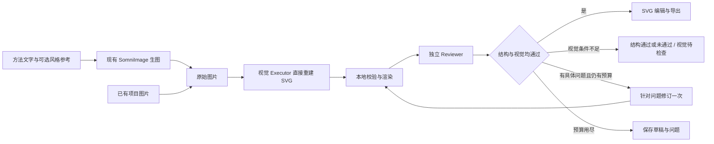

# AutoFigure-Edit 接入 SomniQ：保留原流程的无分割方案

日期：2026-10-06。状态：首版已实施，完整 P0/P3 质量、额度与成本验收尚未完成。已根据 P-1 至 P-8 复核意见修订；源码行号改为下载原始文件后按物理行核验。当前实现和实际请求证据见[SomniQ Figures 实施记录](somniq-figures-implementation.md)。

本轮目标：保留 AutoFigure-Edit 的“先生成或导入图片，再重建 SVG，最后可视化编辑”流程，移除 SAM/RMBG 依赖，复用 SomniQ 当前能力，并给模型调用设置可核查的预算。

本文根据用户新增的“不要大幅改变 AutoFigure 原流程”约束，收敛[已归档的上一版计划](F:/Agent/Aris/docs/development-logic/history/autofigure-plan-v1-20261005.md)。本文是唯一现行计划，历史稿不作为实施依据。文字 → FigureSpec → SVG 留作后续独立功能，不纳入本次首版。

本地核对基线为 `c9d389d4609c9cee2b48e53740102f370fb42211`。上游核对 `main` 及固定参考提交 [`16f3749e9d512bdf7b7b55c162307bc289750b7a`](https://github.com/ResearAI/AutoFigure-Edit/commit/16f3749e9d512bdf7b7b55c162307bc289750b7a)；实施时固定该提交及编辑器依赖，不随远端 main 自动更新。

原始 `autofigure2.py` 为 **137,575 字节、3,747 行**，SHA-256 为 `1286f865d7bb9e10614edfd78943f28a9b8693b21a870a1be552c3739806d3bc`。本次下载的 main 文件与它相同；固定 commit 仍用于防止今后的引用漂移，文件哈希用于验证获取的字节。这是规划证据固定，尚不是产品依赖锁定。下载地址、依赖清单哈希和行号断言保存在[上游证据记录](F:/Agent/Aris/docs/development-logic/evidence/autofigure-upstream-16f3749e.json)。浏览工具展示文本的 L 行号经过转换，不能直接用作 GitHub 源文件锚点。

**1. 推荐保留的主流程。**



图中修订回路有硬上限，不是无限循环。语法修复和审查后的内容修订共用一次修订额度；第二次仍不通过则保留草稿。每次内容修改后审核绑定新版本，上一版通过不能沿用。

| AutoFigure 原步骤 | 本次处理 | SomniQ 对应行为 |
| --- | --- | --- |
| 方法文字、可选参考风格 → `figure.png` | 保留 | 复用 SomniImage；已有图直接进入下一步 |
| SAM3 检测、区域合并、遮罩与占位标记 | 跳过 | 无分割请求，不产生伪造的检测结果 |
| 图标裁切、RMBG 去背景 | 跳过 | 无去背景服务、模型权重或 HF 凭据依赖 |
| 多模态模型重建 `template.svg` | 保留并调整输入 | 一张原图 + 已有方法文字/标签要求，直接生成图形元素 |
| 可选全图优化 | 默认 0 次 | 只针对已发现的问题修订，纳入统一预算 |
| 图标回填生成 `final.svg` | 无分割模式直接定稿 | 校验后将当前 SVG 作为输出版本 |
| SVG-Edit 编辑、保存与导出 | 保留 | 嵌入当前 Desktop 图片工作区 |

上游分割链的用途主要是保留复杂图标；裁切图标以 PNG 素材回填，因此“SVG 文件”本身并不保证每个图标内部都是矢量。[回填函数 L2707](https://github.com/ResearAI/AutoFigure-Edit/blob/16f3749e9d512bdf7b7b55c162307bc289750b7a/autofigure2.py#L2707)、[回填分支与调用 L3475–L3523](https://github.com/ResearAI/AutoFigure-Edit/blob/16f3749e9d512bdf7b7b55c162307bc289750b7a/autofigure2.py#L3475-L3523)

现有 `no_icon_mode` 可作为改造基础，但它在 SAM 调用后才决定；`placeholder_mode=none` 也不会跳过 SAM。[SAM 调用与模式判定 L3359–L3375](https://github.com/ResearAI/AutoFigure-Edit/blob/16f3749e9d512bdf7b7b55c162307bc289750b7a/autofigure2.py#L3359-L3375)

**2. 对上游只改必要的分支和输入契约。**

建议在验证原型中新增 `reconstruction_mode="direct_svg"`，这是拟新增参数，不是上游已有开关。沿用原先的输入、产物和生成顺序：

1. 获得 `figure.png` 后，先判断重建模式。`direct_svg` 直接进入重建，不调用 `segment_with_sam3`、`crop_and_remove_background` 或 `replace_icons_in_svg`。
2. 从 `generate_svg_template` 的无图标分支提取直接重建提示。将 `samed_path`、`boxlib_path` 变为可选；该分支不打开、不发送 SAM 参考图。不能把原图复制两次充当第二张输入。
3. 将提示中的“SAM 未检测到图标”改成明确的直接重建任务。保留画布比例、布局、文字、关系和颜色；图标按允许的复杂度重绘。必要标签使用 `<text>/<tspan>`，对象和分组带稳定 ID；不生成 AF 占位框。
4. 保留 `template.svg`、`final.svg` 和可选修订版本的语义。旧返回字段可以保留为 `samed_path=null`、`boxlib_path=null`、`icon_infos=[]`；新状态明确记为 `skipped`，日志不声称分割成功。
5. SVG 解析、渲染和基础结构检查先本地执行。需要模型修复时必须扣减统一修订额度；禁止保留上游内部修复循环后，再在外层叠加优化循环。
6. 失败保留原图、模型输出和错误，不把整张 PNG 包入 `<image>` 后当成“可编辑 SVG 成功”。

直接重建分支原本仍读取两张图，并将输出上限设为 50,000 tokens；重建后还有模型修复路径。该上限不是实际消费量，也不能仅由代码推断作者为何选取它。[重建入口、双图载荷、输出上限及校验调用 L2335–L2472](https://github.com/ResearAI/AutoFigure-Edit/blob/16f3749e9d512bdf7b7b55c162307bc289750b7a/autofigure2.py#L2335-L2472)、[修复函数 L2536](https://github.com/ResearAI/AutoFigure-Edit/blob/16f3749e9d512bdf7b7b55c162307bc289750b7a/autofigure2.py#L2536)、[校验失败修复调用 L2638](https://github.com/ResearAI/AutoFigure-Edit/blob/16f3749e9d512bdf7b7b55c162307bc289750b7a/autofigure2.py#L2638)、[优化内修复调用 L3143](https://github.com/ResearAI/AutoFigure-Edit/blob/16f3749e9d512bdf7b7b55c162307bc289750b7a/autofigure2.py#L3143)

无分割原型需要同时拆开重依赖：上游模块存在顶层 ML 导入，直接调用一个函数仍可能触发依赖要求。把分割相关代码延迟导入或隔离为可选模块；轻量路径不能安装或加载 torch、torchvision、transformers、SAM3、RMBG。正式接入采用下述原生调用适配，不将原型 Python 服务变成用户必须运行的后台服务。[上游依赖清单](https://github.com/ResearAI/AutoFigure-Edit/blob/16f3749e9d512bdf7b7b55c162307bc289750b7a/requirements.txt)

**3. 复用当前仓库的能力，并明确仍需新增什么。**

| 已核对的代码 | 可复用基础 | 本次新增工作 |
| --- | --- | --- |
| [图片 API](F:/Agent/Aris/crates/api/src/image.rs)、[Desktop 生图适配](F:/Agent/Aris/desktop/src-tauri/src/image_api.rs) | 生图/参考图编辑、现有账户、图片落盘、哈希、用量、取消处理 | 转换任务引用已生成图片；不因转换失败重跑生图 |
| [图片工作区](F:/Agent/Aris/desktop/src/chat/ImageWorkflowPanel.tsx)、[关系模型](F:/Agent/Aris/desktop/src/chat/imageWorkflowModel.ts) | 图片历史、来源关系、预览和比较 | “转为可编辑 SVG”、转换进度、SVG 版本、元素编辑视图 |
| [共享 Executor](F:/Agent/Aris/crates/executor/src/lib.rs)、[OpenAI 兼容载荷](F:/Agent/Aris/crates/executor/src/openai.rs) | 图片内容块及现有模型传输路径 | 有限上下文的 SVG 重建请求；能力检查；调用与用量归属 |
| [共享工具与 LlmReview](F:/Agent/Aris/crates/tools/src/lib.rs) | 独立 Reviewer 配置、取消、结果与 token 记录 | 显式图片附件；真实视觉载荷；绑定 SVG 哈希的审查结果 |
| [论文插图入口](F:/Agent/Aris/desktop/src/typeset/TypesetFigureDialog.tsx)、[插图命令生成](F:/Agent/Aris/desktop/src/typeset/latexFigure.ts) | 项目图片选择、图注、标签和插入 | 将可编译的 PDF/PNG 导出件交给现有入口 |
| [FigureSpec 渲染器](F:/Agent/Aris/crates/runtime/assets/skills/figure-spec/scripts/figure_renderer.py) | 简单结构图本地渲染 | 本次不要求改造；可用于准备确定性的测试图片 |

已有图片关系画布不等于 SVG 元素编辑器；共享接口支持图片也不等于当前配置模型一定能看图。这两项需要在 P0/P1 分别验证。`LlmReviewInput` 当前只有 `prompt` 与 `model`，不能仅把图片路径写进 prompt 就视为完成视觉审查。

重建模型的选择契约如下，首版不再增加一套长期维护的模型账号设置：

- 从聊天或其图片工作区发起时，默认使用该会话当前生效的 Executor 模型，包括会话临时选择；无会话上下文时，使用设置中的 `executor_model`。不能把生图模型当作 SVG 代码模型，也不默认使用 Reviewer。
- 可在本次任务中从已有模型注册表选择 `svg_model_override`。按该模型自己的 provider、endpoint、transport 和凭据解析，启动前展示实际选择；将不含凭据的配置快照写入 manifest，执行中不因聊天切换模型而变化。现有“已验证模型”主要证明连接可用，不证明看图能力。
- 在付费生图或重建之前校验实际图片输入能力和可用输出上限。复用当前论文阅读的真实图片探针思路，提取为共享能力检查；缓存绑定模型、端点、传输、路由身份和探针版本，路由改变或证据过期时重验。不能仅根据模型名称判断。[现有能力探针实现](F:/Agent/Aris/desktop/src-tauri/src/engine.rs:3493)
- 重建模型已知不支持图片，或探针失败时，任务停在 `needs_vision_executor`，保留输入并让用户从已配置模型中选择；不能丢弃图片继续文字生成、暗换模型或先付费生图。未知能力先做一次有用量记录的探针。探针仅证明图片能到达模型，不证明 SVG 重建质量。

Reviewer 的探针必须走 Reviewer 自己的连接和身份，不能复用 Executor 的通过结果。已有 `verify_paper_vision` 不是现成的通用 Figure API；P1 需抽取、适配并补充用量记录。每个角色未知能力最多探测一次，本次新增探针数 `P` 为 0–2，计入任务费用和请求预算。

产品集成采用“小范围移植提示和流程 + 复用现有模型运行时 + 嵌入上游所用编辑器”：保留直接重建提示的出处及修改记录，SVG 提取后使用真正的 XML 解析器校验。SomniQ 负责账户、任务、权限和产物；编辑器只负责本地编辑。首版无需新的场景图协议、通用图形引擎、第二套账号页面或整套 FastAPI/Docker 部署。

拟新增模块，均尚未存在：

| 建议位置 | 职责 |
| --- | --- |
| `crates/tools/src/figures.rs` | SVG 解析/约束检查、版本保存与本地渲染/导出入口；不藏模型请求 |
| `crates/chat/src/figure_workflow.rs` | 串联已有图/生图结果、重建、Reviewer、有限修订；复用共享 Executor |
| `crates/runtime/src/figure_run.rs` | 任务阶段、请求账本、恢复状态、版本哈希与审核记录 |
| `desktop/src-tauri/src/figures.rs` | Desktop 命令、项目路径校验、取消与进度适配 |
| `desktop/src/chat/FigureEditorPanel.tsx` | 原图/SVG 比较、嵌入编辑器、属性修改、保存和导出 |

实际文件拆分可随现有模块边界微调；核心流程与版本逻辑保持共享，Desktop 只做界面和原生命令适配。生图仍复用目前的 Desktop `SomniImage`，本轮无需为此新增 CLI 生图界面。

**4. 可编辑范围和复杂图标处理。**

首版面向流程图、模型架构图、算法示意图、方法概览。新生图继续支持参考风格，同时在原有生图提示中加入“平面形状、清晰文字、简洁图标、避免重叠和过度纹理”等偏好，提高后续重建概率；不另加一轮模型整理步骤。

| 内容 | 默认输出要求 | 主要边界 |
| --- | --- | --- |
| 文字、标签 | 可编辑文本元素 | 模糊文字列为待确认，不能猜成确定结果 |
| 框线、箭头、简单图标 | 原生图形、路径及分组 | 结构和方向优先于像素级外观一致 |
| 复杂装饰性图标 | 尽量用少量矢量元素近似 | 不承诺纹理、渐变、写实细节完全一致 |
| 有科学含义的复杂形态 | 保留原图并标记待人工处理 | 不用任意简化替代组织形态、显微照片或测量内容 |
| 实验结果曲线、误差条 | 从真实数据和绘图代码导出 | 不用图片重建模型猜数值 |

区分 `editable_vector`（核心内容可编辑）、`hybrid`（包含声明的栅格素材）和 `raster_preview`（整图预览）。验收不能只检查有没有 `<image>`：文字被描成路径或所有内容成为不可理解的大路径，也不满足改字和组件编辑要求。

可选后续补充：对确需保留的复杂图标，让用户在本地框选裁切并插入 SVG，归类为 `hybrid`。矩形裁切没有模型费用，但保留背景、可能带入周围线条，不提供自动精细抠图。本次不增加“视觉模型找框 → 抠图服务 → 再重建”的新默认链路，也不自动切到本地 SAM。这样不会用另一套分割依赖重新引入原问题。

原图与方法文字矛盾时，Reviewer 报告冲突；论文方法和已有证据是核查依据，模型不能悄悄补全缺失关系。若修改改变科学含义，保留明确问题和草稿状态。

**5. 调用预算覆盖完整任务。**

| 入口（图片能力已验证时） | 无修订时的核心请求 | 加一次修订及必要复审后的上限 |
| --- | --- | --- |
| 已有图片 → SVG | 1 次视觉 Executor + 1 次 Reviewer = 2 次 | 最多 4 次 |
| 已有完整绘图提示 → 生图 → SVG | 1 次 SomniImage + 上述 2 次 = 3 次 | 最多 5 次 |
| 自然语言需求，需要额外整理提示 | 在上一行增加至多 1 次提示整理 | 最多 6 次 |
| 手工改文字/位置/颜色、保存、导出 | 0 次模型请求 | 0 次；审核另由明确操作触发 |

这些是 Figure 任务中的请求上限，不代表整个聊天历史的调用量。当前聊天已经形成的提示可以直接复用；为任务新触发的整理、重试、修复和审查都记账。已知图片路径的转换入口不应再通过多个聊天回合寻找文件。

若需要能力探针，实际请求上限为表中上限加 `P`，UI 在任务开始前列出；探针失败可能使任务提前停止，不继续生图。P0 的多额度对照是单独的实验预算，各次请求都入账，不能伪装成一次生产任务。

建议固定 `optimize_iterations=0`、`max_repairs_or_revisions=1`、一次只生成一个候选。**8K 仅是低成本实验档，不能预先定为默认质量档。** P0 对相同开发样例、同模型、同提示和采样设置，对照 8K、16K 与较充足的输出额度；后者在模型与上下文允许时采用 32K 或 50K，并预留模型需要的推理/上下文额度。接口不支持的档位记为不可用，不能按该档位测试通过或失败。产品默认值由完整输出率、质量和真实费用共同决定。

单独记录 `finish_reason` / `stop_reason` / Responses incomplete details、实际输出用量、是否达到限额、闭合 SVG 和解析结果。provider 明确报告达到 token 限额时记为 `budget_truncated`；没有明确停止原因而输出不完整时记为 `incomplete_unknown`，不能仅因 XML 错误就认定截断或方法失败。

每个额度档分别报告“确认截断请求数 / 有返回结果的重建请求数”、不完整但原因未知比例、完整输出率、完整输出中的质量通过率，以及包含所有失败的端到端通过率。8K 截断的样例必须参加预先安排的较高额度对照；若最高受支持额度仍截断，该样例的方法可行性结论为“额度不足，未定”，而不是“去分割无效”。不同额度下生成有随机性，单个样例的差异只作为诊断证据。

生产任务输出截断时保留草稿，提示用户以明确的新额度继续；不自动升级模型、扩额或重生图片。实验中的预设高额度对照可以自动执行，因为已包含在该实验预算中；修订额度与截断诊断费用分别记录，不能混算质量失败。

语法错误修复也占用上述一次修订额度；用完后 Reviewer 若仍有问题，则结束为待处理草稿。模型 SDK/传输层的重复提交也必须受预算约束，不能外层只显示一次任务、内层无限重试。已提交但结果未知时不自动重发。

进一步的成本控制：

- 使用原始可读图片，不默认放大至 4K；更高分辨率仅用于确需辨认细节的输入。实际图片费用取决于 provider 的计费方式，不能把分辨率降低直接等同于固定比例省钱。
- 重建输入只携带当前图、必要方法文字和标签要求，不附整个研究会话；重建阶段移除重复 SAM 参考图。Reviewer 仍需要原图与结果预览做比较。
- 将来源哈希、文字要求、模式、模型、提示版本、输出约束、字体/渲染版本纳入缓存键；审核另绑定确切的 SVG 哈希和 Reviewer 配置。不同请求不能错误复用。
- 本地改字、改色和移动即时完成。AI 修改作为单独操作，只围绕选中的对象和要求；不触发生图。首版可以保存整份候选 SVG，无需先建设复杂的差分协议。
- 记录输入/输出 token、图片用量、真实请求尝试、耗时、模型、失败和修订原因；有价目或账单才显示金额，缺失时显示“费用未知”。

成本口径：

`总费用 = 能力探针 + 提示整理 + 生图 + SVG 重建 + 独立审查 + 修复/修订/复审 + 失败尝试`

取消 SAM/RMBG 首先消除凭据和运行依赖；原分割若免费或本地执行，直接费用节省可能很小。真正的降本重点是减少重复生图、重复视觉输入、全图优化和失败重跑。复杂矢量重绘可能反而输出更多 token，所以不能现在承诺单图价格或降本百分比。

成本验收同时报告成功率、达标图费用中位数和“所有尝试总费用 / 达标图数量”。有同模型、同输入、同质量门槛的旧流程日志才做百分比对比；没有 SAM 凭据时可用已有真实记录，不为基准要求用户重新申请 API。

**6. 保留独立 Reviewer，并只审一次当前版本。**

Reviewer 使用现有独立配置和隔离上下文，输入为必要方法文字、原图、当前 SVG、渲染预览和本地校验报告。增加向后兼容的本地图片附件参数，并通过共享多模态消息送入模型；先验证模型和接口是否支持图片。

审查分开记录 `structure_status` 和 `visual_status`。文字与 SVG 结构可检查标签、显式连接关系和部分方向属性；这些不能证明实际渲染中的箭头方向、遮挡、位置和可读性。**只有 Reviewer 图片能力验证通过，并实际收到该版本原图及渲染预览时，才执行视觉验收。** 请求证据记录实际图片内容块、图片哈希和渲染器身份，不能只记录路径。

| 条件 | 可达到的最高状态 | 是否计入完整质量通过数 |
| --- | --- | --- |
| 结构通过，实际图片视觉审查通过，版本与渲染证据一致 | `accepted` | 是 |
| Reviewer 无视觉能力、缺图片载荷或无有效渲染预览 | `structure_passed / visual_pending`（结构通过时） | 否 |
| 结构或视觉发现问题 | `revision_required` 或额度耗尽后的草稿 | 否 |

缺视觉能力时仍允许保存、编辑和导出标明待审查的草稿，不改由 Executor 自审。要验证完整产品质量，P0/P3 必须配置具备视觉能力的独立 Reviewer；否则该项验收未完成，不能放宽为文本审查通过。

Figure 的审核结果绑定产物哈希，并作为同一产物的完成证据交给聊天流程，避免 Figure 内审一次、聊天收尾又为相同内容重复付费。用户手工保存新版本会使旧审核失效；可以继续保存或导出草稿，界面明确显示待审查，不在每次拖拽后触发模型请求。

**7. 编辑器和产物嵌入现有 Desktop。**

图片节点增加“转为可编辑 SVG”，生成操作增加可选“生成后转 SVG”。复用图片来源关系；转换状态分为读取图片、重建、校验、审查、就绪或待处理。用户从原图可回到对应 SVG 版本，原图/SVG 可并排比较。

使用固定版本的 SVG-Edit 本地静态包，通过小型适配层接收 SVG、返回修改结果和保存事件。上游 `canvas.html` 已采用 iframe 嵌入，因此可沿用这种集成方式；具体编辑器版本及资源打包在 P0 固定。[上游编辑页面](https://github.com/ResearAI/AutoFigure-Edit/blob/16f3749e9d512bdf7b7b55c162307bc289750b7a/web/canvas.html)、[SVG-Edit 项目](https://github.com/SVG-Edit/svgedit)

编辑器必须在项目图片不联网时仍可打开、编辑、保存和导出。首版支持选中组件、改文字和颜色、移动/缩放、分组、撤销/重做及 SVG 保存；PNG/PDF 本地导出放在验收阶段。字体、箭头 marker、clipPath、透明度和中文文本需要往返验证。

已知渲染一致性风险：上游 `svg_to_png` 先用 CairoSVG，**仅在 `ImportError` 时**尝试 svglib + ReportLab；CairoSVG 的其他渲染异常直接返回 `None`，不是通用故障回退。[真实转换路径 L2947–L2969](https://github.com/ResearAI/AutoFigure-Edit/blob/16f3749e9d512bdf7b7b55c162307bc289750b7a/autofigure2.py#L2947-L2969)

CairoSVG 与浏览器编辑器不保证显示一致。官方文档列明字体/基线、marker 的 overflow 裁切和新 viewport 裁切等限制；简单 marker 与路径裁切本身有支持，因此不把所有 marker/clipPath 都说成不支持，也不在没有测量时声称失败频率。[CairoSVG 支持范围](https://cairosvg.org/svg_support/)

P0 增加不消耗模型的固定 SVG 渲染夹具：CJK 字体回退、tspan 基线、箭头 marker、嵌套 clipPath、透明度和坐标变换。用同一 SVG、固定字体清单、相同尺寸比较 WebView2 编辑器截图与 CairoSVG / 候选导出器输出；记录缺字、箭头变化、裁切和遮挡，不能仅依赖像素差（字体抗锯齿可不同）。编辑保存前后各测一次，区分模型输出、编辑器改写和渲染器差异。

发现差异时记为 `renderer_mismatch`，先处理渲染链，不能算重建失败或让模型重画来补偿渲染器错误。选定渲染器版本、字体哈希和 SVG 哈希进入审核证据；更换渲染器使视觉审核失效。P3 的导出件仍需与编辑器及已审查预览逐项核对，不能用一个渲染器的通过证明所有导出格式通过。

SVG 在模型返回、文件读取和编辑器保存后使用同一校验边界；禁止脚本、事件处理、DTD/实体和外部资源引用，保留受支持的内部引用与图形定义。iframe/消息桥只暴露文档编辑能力；原生权限和账号令牌留在 SomniQ。检查消息来源、项目路径和资源上限，不扩大到任意文件或任意 IPC。这是嵌入可执行格式的实现要求，不增加用户的日常确认步骤。

产物建议保存为：

```text
.somniq/artifacts/figures/<run-id>/
  figure.png                 # 稳定输入快照，或 manifest 中的受控来源引用
  template.svg               # 初次直接重建结果
  versions/<version>.svg     # 修订与手工保存版本
  final.svg                  # 当前选定版本；审核状态以 manifest 为准
  preview.png
  manifest.json              # 来源、父版本、hash、模式、阶段、预算和编辑范围
  usage.json                 # 每次请求尝试和用量
  review.json                # 精确版本的独立审查结果
```

只选一种输入策略并记录哈希；不能将相同来源重复复制多份来增加视觉输入。SVG 是编辑后的主源，旧提示或 FigureSpec 不得自动重建覆盖人工修改。新结果按预期父版本哈希保存；用户已修改时保留候选版本，不能覆盖当前版本。

状态在外部请求前后持久化；重启后恢复已有结果和未完成阶段。已提交但无结果的请求记录为状态未知，不能当成未发送自动补发。保持现有 SomniImage 的权限与取消语义，见[现有生图接入约束](F:/Agent/Aris/docs/development-logic/somni-image-api.md)。

论文插入优先用本地导出的 PDF/PNG，SVG 保留编辑源。当前插图入口生成 `includegraphics`，不能因为文件选择器接受 SVG 就假定 LaTeX 可直接编译它。具体渲染/导出库在 P0 做适配验证，尚未选定。

上游源码为 MIT，复用时保留许可证和版权声明；SVG-Edit 及导出依赖的声明随固定版本一并核对打包。保留 AutoFigure-Edit 来源说明，不使用其品牌表示官方合作。学术引用指引单独记录，按上游说明它不是额外软件许可门槛。[许可证](https://github.com/ResearAI/AutoFigure-Edit/blob/16f3749e9d512bdf7b7b55c162307bc289750b7a/LICENSE)、[引用说明](https://github.com/ResearAI/AutoFigure-Edit/blob/16f3749e9d512bdf7b7b55c162307bc289750b7a/CITATION_AND_ATTRIBUTION.md)

**8. 分阶段实施，先证明直接重建可用。**

按一名熟悉仓库的工程师估算 **10–14 个工作日**，是加入额度对照、双角色能力检查和渲染差异验证后的估算，P0 后修正；不包含外部服务故障等待和复杂插画保真研究。首版以现有 Windows Desktop 为验证重点。

| 阶段 | 估算 | 交付物 | 退出条件 |
| --- | --- | --- | --- |
| P0 小改动原型 | 2–3 天 | 原始文件哈希和行号证据；显式 direct_svg 分支；5 张开发图片的额度对照；双角色视觉探针；SVG-Edit 往返及本地渲染差异夹具 | 具备视觉 Reviewer；额度足够时 4 张结构开发图至少 3 张在一次修订内通过完整审核；单列截断/未知不完整/渲染差异；原型无需分割环境；模型默认额度有证据 |
| P1 共享流程 | 3–4 天 | 明确的模型解析、共享能力探针、预算、本地校验、版本、恢复、Reviewer 图片附件 | 预检已通过的已有图正常仅重建+审查；额外探针入账；修复额度和取消受控；无视觉 Reviewer 不会得到完整通过状态；已提交请求不会重复发出 |
| P2 Desktop 编辑 | 3–4 天 | 图片节点转换入口、生成后转换、比较视图、SVG-Edit、版本保存与 SVG 导出 | 生图链路复用当前 SomniImage；转换失败可从原图恢复；改字/移动/保存重开均有效；编辑无模型调用 |
| P3 验收与论文衔接 | 2–3 天 | 本地 PNG/PDF 导出、独立保留的 20 张验收图、费用/耗时/截断率/成功率汇总 | 满足下列质量和运行标准；固定生产额度；端到端统计不删失败案例；产物能进入当前论文插图流程 |

样例在首次模型调用前建清单，记录 ID、输入 SHA-256、来源、难度、必要标签与关系。P0 使用 `DEV-01` 至 `DEV-05`（4 张结构图、1 张边界图）；P3 使用与它们不重叠的 `TEST-01` 至 `TEST-20`（16 张结构图、4 张边界图），共 25 张生成样例。相同原图的裁切、改色或近重复版本不能跨组。上文固定 SVG 渲染夹具不计入这 25 张生成样例。

P3 样例不用于提示、额度、模型或渲染器调参。P0 后固定这些配置和审核标准，P3 只在冻结配置下报告结果；不得挑选此前成功的样例补足数量。若查看 P3 结果后继续调参，原结果仍保留，并以新版本和新留出样例重新验收，不能继续称原集合为未见测试集。

P0 不通过时先区分额度截断、能力不足、渲染差异和完整输出后的质量错误。只有额度充足且输入/渲染有效时的质量错误，才用于评价直接重建方法和支持范围；因服务额度无法判定时记录未定。不把整套文字直出、自动图标识别或新分割后端加入补救范围。编辑器不能可靠保存某些 SVG 元素时明确缩小元素支持集并重验。

**9. 可测的验收标准。**

- 无分割依赖：运行时无需 SAM/fal.ai/Roboflow/RMBG/HF 凭据；请求记录与依赖清单均证明该链路未执行。重建功能仍使用用户已有模型服务，不能把“无分割 API”宣传为“完全离线生成”。
- 流程保留：文字生图/已有图两种入口都经过图片 → SVG → 编辑；历史 SomniImage 产物转换不会再次生图。
- 质量：P3 的 20 张独立留出样例中，16 张为首版支持的结构图，包含至少 4 张中文图；目标至少 14 张在初次或一次修订后获得 `accepted`。视觉待检查、额度截断、渲染失败等都保留在 16 张的端到端分母中，不计入通过数；另外报告错误类别和完整输出后的条件质量率。另 4 张边界案例单列范围标识，不混入结构图通过率。
- 科学准确：样例预先记录必要标签、关系及方向。结构审查逐项对照文本/代码；渲染后的箭头方向、遮挡和位置，仅在独立 Reviewer 确实收到原图与当前渲染图片时验收。缺少这一条件，最高状态是结构通过 / 视觉待检查，不能宣布完整通过。
- 额度：各档独立报告确认截断率和未知不完整率；P0 提供同条件高额度对照。截断造成的低通过率不直接归因于无分割方法，但仍计入生产端到端成功率与费用。
- 可编辑性：必要标签能直接改字，主要组件可单独选中移动/改色，箭头和分组保存重开后有效；整图 PNG 包装和文字全部转轮廓不算通过。
- 调用与恢复：能力已验证的普通已有图为 2 次核心请求，未知能力另计 `P` 次探针；最多一次修复/修订；所有付费尝试进账；重启、双击、取消和超时不造成自动重复提交。
- 审核：独立配置、实际图片载荷、图片/SVG/字体哈希和渲染器版本可追溯；人工编辑或渲染链变化后旧视觉审核失效；没有视觉能力不能显示视觉验收通过。
- 本地编辑：离线改字、移动、保存、撤销/重做和导出零模型调用；恶意 SVG 和外部资源不能借编辑器触达原生能力。
- 论文导出：固定 SVG 夹具证明编辑器与选定渲染链在必要标签、箭头、裁切及透明度上相符；报告已知不支持的属性和字体配置。PDF/PNG 导出件再次对照已审查版本，并用当前论文编译链验证插图；渲染差异不能归因于模型。
- 成本：给出真实费用或用量，包含失败和人工修订量；达标成本无改善时如实报告，不以缩短流程代替降本证明。

实施阶段运行相应 Rust 专项测试，跨 crate 改动后运行 `cargo test --workspace`；Desktop 原生命令另运行对应的 `cargo test --manifest-path desktop/src-tauri/Cargo.toml --lib` 用例。前端运行相关 Vitest、`npm run typecheck` 和 `npm run build`，并人工验证 WebView2 编辑保存。规划文档不需要触发整仓测试或付费绘图。

原规划交付次序是：先用现有图片证明无分割重建质量，再接入共享流程及审核，随后嵌入现有图片工作区，最后用质量和真实成本决定首版支持范围。用户随后要求以 SomniQ 基础实施独立绘图应用，首版采用一级科研绘图工作区；实施结果与实际验证单独记于[SomniQ Figures 实施记录](somniq-figures-implementation.md)。单个开发样例跑通不代表 P0/P3 退出条件通过，完整质量、额度和真实成本实验仍按本文执行。
