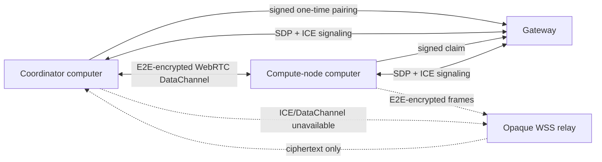

# Paired computer compute nodes

SomniQ treats remote execution as a durable **Compute Job**, not as a chat
message forwarded to another computer. Chat, Lab, and future autonomous
workflows are clients of the same job ledger.

## Invariants

- A worker is paired as `DeviceKind::ComputeNode` and can receive only the
  `ComputeJobs` scope. Mobile control scopes and compute scopes cannot be
  mixed in one device identity.
- The receiving computer rejects every remote submission until the local user
  enables **Accept remote code jobs**.
- A job has a stable UUID, monotonically sequenced events, durable stdout and
  stderr, a terminal result manifest, and SHA-256-addressed artifacts.
- Worker execution uses a child process with cancellation, timeout, output
  limits, artifact limits, and project-relative path validation. Notebook jobs
  use the existing notebook adapter but write into the same ledger.
- Source packaging excludes VCS metadata, SomniQ state, dependency/build
  caches, `.env` files, credential/secret files, SSH keys, and private-key
  container formats.
- Executor and Reviewer remain separate product roles. A remote Compute Job
  changes where code runs; it does not collapse the independent review loop.

## Connection lifecycle

After pairing, the claimed computer is the deterministic WebRTC offerer and
the inviting computer is the answerer. They exchange bounded SDP and trickled
ICE candidates through the same authenticated gateway used by mobile remote
control. The desktop WebViews perform ICE connectivity checks and NAT
traversal, while Rust retains the pairing keys, replay windows, and Compute
authorization boundary. Compute frames inside the reliable ordered
DataChannel remain `SecureEnvelope` ciphertext.

Both endpoints derive a fresh session key from their pairing keys and the
transport session UUID. If ICE negotiation or the DataChannel does not
complete within twenty seconds, the claimant creates a new session UUID and
opens the existing gateway relay. Reusing the failed P2P session is forbidden.
The gateway never receives the session key or plaintext Compute frames.

Computer pairing is intentionally code-based rather than QR-based: one
computer copies the one-time connection code to the other, then explicitly
verifies and approves its device fingerprint.

## Job flow

1. The coordinator creates the durable local job record.
2. It builds and hashes a bounded source ZIP, then sends start/chunk/submit
   frames.
3. The worker verifies size, offsets, ZIP paths, expanded size, and SHA-256
   before starting.
4. Status and log events stream live. A reconnect subscribes after the last
   persisted sequence, so already running work continues and missing events
   replay.
5. The terminal manifest names output artifacts and their digests. The
   coordinator requests bounded chunks, verifies the final digest, and stores
   them under the job ledger.
6. Chat's `ComputeJobSubmit` tool waits on this same record and returns the
   bounded logs plus result manifest; Lab renders the same jobs and lets the
   user select local or online paired targets.

## Local state

- Project ledger: `.somniq/compute/jobs/<job-id>/`
- Worker-side remote workspaces: desktop runtime
  `remote-compute/<peer-id>/workspaces/<job-id>/`
- Public peer metadata: desktop runtime `compute-peers.json`
- Private pairing identity and bearer credential: operating-system keyring

Deleting or revoking a pairing removes its claimed-node keyring entries and
causes the gateway to close signaling and relay routes.
