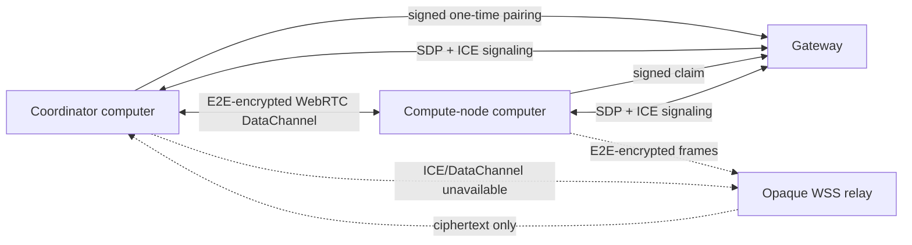

# Paired computers: Agent conversations and compute nodes

One paired-computer connection carries two deliberately separate capabilities:

- a constrained remote Agent conversation, executed in a desktop-owned project
  and Chat session on the other computer; and
- a durable **Compute Job** for explicit command, Python, and notebook work.

They share encrypted transport and device identity, but not lifecycle or
authorization. A Chat turn is not disguised as a Compute Job, and a Compute
Job is not smuggled through a chat message.

## Invariants

- A computer is paired as `DeviceKind::ComputeNode`. `ComputeJobs` is
  mandatory; new desktop pairings can additionally receive
  `ReadProjectState` and `SendChatMessages`. No other mobile-control scopes are
  valid for a computer identity.
- Existing compute-only pairings remain compute-only. Enabling Agent access
  requires revocation and a new explicit pairing ceremony; stored grants are
  never widened during migration.
- The receiving computer rejects every remote submission until the local user
  enables **Accept remote code jobs**.
- The receiving computer separately rejects Agent requests until the local
  user enables **Allow paired computers to talk to this Agent**.
- Remote Agent turns use the receiving computer's project, model, tools, and
  permission policy. Permission prompts stay on that computer.
- A job has a stable UUID, monotonically sequenced events, durable stdout and
  stderr, a terminal result manifest, and SHA-256-addressed artifacts.
- Worker execution uses a child process with cancellation, timeout, output
  limits, artifact limits, and project-relative path validation. Notebook jobs
  use the existing notebook adapter but write into the same ledger.
- Source packaging excludes VCS metadata, SomniQ state, dependency/build
  caches, `.env` files, credential/secret files, SSH keys, and private-key
  container formats.
- Executor and Reviewer remain separate product roles. A remote Compute Job
  changes where code runs; it does not collapse the independent review loop.

## Connection lifecycle

After pairing, the claimed computer is the deterministic WebRTC offerer and
the inviting computer is the answerer. They exchange bounded SDP and trickled
ICE candidates through the same authenticated gateway used by mobile remote
control. The desktop WebViews perform ICE connectivity checks and NAT
traversal, while Rust retains the pairing keys, replay windows, and Compute
authorization boundary. Compute frames inside the reliable ordered
DataChannel remain `SecureEnvelope` ciphertext.

Both endpoints derive a fresh session key from their pairing keys and the
transport session UUID. If ICE negotiation or the DataChannel does not
complete within twenty seconds, the claimant creates a new session UUID and
opens the existing gateway relay. Reusing the failed P2P session is forbidden.
The gateway never receives the session key, Agent messages, tool output, or
plaintext Compute frames.

Computer pairing is intentionally code-based rather than QR-based: one
computer copies the one-time connection code to the other. The inviting
desktop automatically polls the gateway only for that short-lived invitation;
when the signed claim arrives it opens a local approval dialog containing the
device name, fingerprint, and requested scopes. The user still explicitly
allows or declines that exact claim. After approval, the joining desktop
automatically completes activation, so neither side needs a manual refresh or
completion step.

## Desktop management surface

Remote control is a dedicated section inside Desktop Settings. Its computer
view opens directly and keeps phone pairing, computer pairing, local worker
policy, and paired-node presence in one management surface.

Worker policy switches persist as soon as they change; there is no separate
save action. Node name and parallelism edits persist on commit. Paired-node
presence refreshes on compute-peer events and explicit user actions: opening
the computer picker, selecting a remote computer, or pressing Refresh in the
management page. It does not continuously poll in the background. The table
reports the negotiated transport plus the platform, architecture, and logical
CPU count learned from the encrypted capability handshake.

## Remote Agent flow

1. Chat's left conversation sidebar owns the execution-workspace switcher.
   **This computer** shows only local projects and local sessions. Selecting an
   paired computer replaces that list with its authoritative remote projects
   and sessions. An authorized offline computer can be selected while the
   transport reconnects. Opening the workspace picker or selecting a computer
   checks its current status; connection events update the UI without
   background polling. Legacy compute-only pairings remain visible but disabled
   with a re-pairing explanation.
2. Selecting a remote project activates it on the remote computer and loads its
   recent desktop-owned sessions. The project row also creates a new remote
   Chat. Remote history is intentionally fetched only for the selected project,
   so browsing the sidebar never switches every remote project in the
   background.
3. Opening a remote session from the sidebar reads its bounded visible transcript (text,
   thinking, and tool cards) and binds a local mirror to the existing opaque
   remote session ID. Changing targets creates or opens a distinct local
   mirror so two Agent identities never share one transcript.
4. The model picker reads only models already configured and verified on the
   remote computer. Selecting one persists a per-session remote override;
   provider URLs, credentials, and the remote desktop's global default are not
   exposed or changed.
5. `ControlRequest` and correlated `ControlResponse` values travel as a second
   message family inside the existing encrypted computer channel. The gateway
   sees only opaque envelopes and routing metadata.
6. The remote desktop runs its normal Chat runtime. Text, thinking, tool call,
   tool progress, and tool result events are projected back into the initiating
   Chat under its local mirror session ID.
7. The authoritative session and execution history are persisted on the
   computer that ran the Agent. The initiating computer persists the visible
   mirror plus the opaque remote node/project/session binding.
8. Stop requests are bound to the paired device's active opaque message ID.
   Disconnect closes pending requests; reconnect can continue a persisted
   remote session on a later turn.

Attachments are intentionally disabled for remote Agent turns in the first
version. This avoids silently dropping files or widening the constrained
control protocol into arbitrary filesystem transfer.

## Job flow

1. The coordinator creates the durable local job record.
2. It builds and hashes a bounded source ZIP, then sends start/chunk/submit
   frames.
3. The worker verifies size, offsets, ZIP paths, expanded size, and SHA-256
   before starting.
4. Status and log events stream live. A reconnect subscribes after the last
   persisted sequence, so already running work continues and missing events
   replay.
5. The terminal manifest names output artifacts and their digests. The
   coordinator requests bounded chunks, verifies the final digest, and stores
   them under the job ledger.
6. Chat's `ComputeJobSubmit` tool waits on this same record and returns the
   bounded logs plus result manifest; Lab renders the same jobs and lets the
   user select local or online paired targets.

## Local state

- Project ledger: `.somniq/compute/jobs/<job-id>/`
- Worker-side remote workspaces: desktop runtime
  `remote-compute/<peer-id>/workspaces/<job-id>/`
- Public peer metadata: desktop runtime `compute-peers.json`
- Private pairing identity and bearer credential: operating-system keyring

Deleting or revoking a pairing removes its claimed-node keyring entries and
causes the gateway to close signaling and relay routes.
