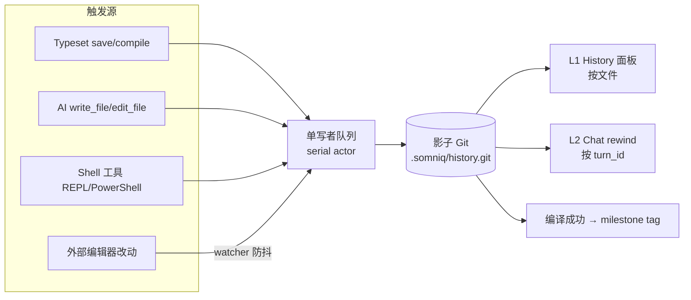

# 编辑历史与回退方案设计（LaTeX + Chat）

> 状态：提案 (Proposal) · 2026-07-15 · 目标分支 `aris-code`
>
> 范围：Typeset（LaTeX）编辑器、Chat 对话，以及两者共享的文件变更历史底座。
> 本文只做设计，不含实现改动。

---

## 1. 背景与目标

用户在 Typeset 里改 `.tex`、在 Chat 里让 AI 改文件，都需要一个**可追溯、可回退**的历史机制：

- 能回到任意一个历史版本，并看清「这一版是谁、在哪次对话里改的」；
- 人手动改的和 AI 改的走**同一套**历史，不再分裂；
- 回退有清晰的层次，不同时间尺度用不同入口，但底层只有一个事实源。

核心结论先行：**我们已经有半套系统（`change_ledger`），方案是把它升级为「影子 Git 单一底座」，而不是再叠一套。** 回退天然分三层，不是三套方案。

---

## 2. 现状盘点

### 2.1 已有能力：`change_ledger`

`crates/runtime/src/change_ledger.rs` 是一个相当完整的变更账本：

- **存储**：追加式 JSONL + SHA-256 内容寻址 blob，位于 `.somniq/changes/<session>/{ledger.jsonl, blobs/}`。
- **记录**：`FileChangeRecord` 带 `session_id / turn_id / tool_use_id / tool_name / operation / before / after / unified_diff / structured_patch / status / reverts` 等字段。
- **归属**：来自环境变量 `ARIS_SESSION_ID / ARIS_TURN_ID / ARIS_TOOL_USE_ID`。
- **回退**：`revert_file_change` 带哈希冲突检测（当前文件 hash ≠ 记录的 `after` hash 就拒绝）。
- **接线**：
  - AI 的 `write_file / edit_file / append_file` 经 `record_text_file_change` 记账（`crates/runtime/src/file_ops.rs`）。
  - `REPL / PowerShell / LaTeXRender` 等 shell 型工具经 `run_json_with_workspace_audit` 做「前后全树文本快照 diff」兜底（`crates/tools/src/lib.rs`）。
  - 工具 API：`change_list / change_get / change_revert`。
  - 桌面命令 `chat_change_revert`（`desktop/src-tauri/src/engine.rs`），前端 `chatChangeRevert`（`desktop/src/api/tauri.ts:915`），Chat 消息卡片上已有 per-turn Revert 按钮（`desktop/src/chat/ChatMessage.tsx:553`，倒序 revert 本轮的 `changeIds`）。

### 2.2 四个缺口

1. **编辑器保存完全没有历史。** Typeset / Lab 的保存走 `file_write_text`（`desktop/src-tauri/src/files.rs:553`），是裸 `std::fs::write`，**不经过 ledger**；文件树的删除/重命名/复制同样绕过。结论：**AI 改的有账，人改的没账**——一次 Ctrl+S 能永久覆盖掉 AI 改动前后的状态。
2. **没有「按文件看时间线」。** ledger 按 session 分目录存 JSONL，查单个文件的完整历史要扫所有 session 的所有记录；没有任何浏览 UI。Typeset 里那个 `history` 图标（`desktop/src/typeset/Typeset.tsx:1783`）画好了从未启用。
3. **版本 ↔ 对话不能互跳。** 数据都在（每条变更都记了 `session_id / turn_id`），但没有「这一版是哪次对话改的」的呈现。
4. **存储没有治理。** blob 上限 2 MB（超限只记哈希、不可 revert）、无压缩、无 GC、无索引。此外 `run_json_with_workspace_audit` 每次 shell 工具调用要把**整个工作区文本读进内存两次**做全量 diff，成本是 O(工作区字节数)。

Chat 对话本身（Session JSON + `session_index.rs` 的 SQLite 全文索引）是追加式的，天然是审计记录，这一侧问题不大。

---

## 3. 开源调研结论

| 项目 | 机制 | 借鉴 | 不借鉴 |
|---|---|---|---|
| **Overleaf** | operation 日志 + chunk 边界 snapshot + 内容寻址 blob；History 面板 / Labels / 单文件恢复 | 存储模型（我们已有等价物）、History UI、**Label = 里程碑**概念 | 完整 OT/chunk 分段（对小 `.tex` 过重） |
| **Cline / Kiro / Gemini CLI** | **影子 Git**：每次工具执行后 commit，`core.worktree` 指向工作区，checkpoint 挂到消息 | **影子 Git 作为底座**、三种恢复语义（只文件 / 只对话 / 都恢复） | 每步击键级 commit；一仓库服务所有项目 |
| **VS Code Local History** | 每次保存 = 全量快照，`User/History/<hash>/entries.json` | **「保存即留档」**是编辑器侧该补的最小形态 | 不依赖 git 的自建索引（我们用 git 更省） |
| **Kimi Code** | 对话级 checkpoint（JSONL 内联标记 + rotate 重放）；`/undo` fork 式；**无文件历史**（issue 区被追着要） | **对话侧 rotate 不删除 + fork 式 undo**；turn 边界打 checkpoint 标记 | 无文件回退（正是我们要补的） |
| **CRDT（Yjs/yrs、Automerge、Loro）** | 历史作为一等公民，`view(heads)` 时间旅行 | 暂不采用 | 事实源要从磁盘纯文本迁到 CRDT 文档，代价巨大且当前无协同需求 |

**关键判断**：文件侧走影子 Git 底座（Cline 系已是事实标准，Kimi 的缺失反证了需求）；对话侧采用 Kimi 的 rotate/fork 语义；两侧用 `turn_id` 对齐。CRDT 留给将来真要做实时协同时再引入编辑器层。

---

## 4. 核心决策

**建立「影子 Git 单一底座」，取代 `change_ledger` 的存储职责，而非与之并列。**

三条硬约束（判断是否「变成多套方案」的标准）：

1. **底座唯一。** 系统里只能有一个「持久且独立的历史事实源」。影子 Git 落地后必须吃掉 ledger 的存储，终态仍是 1 个，不是 2 个。
2. **L0 永不进底座。** 编辑器击键级 undo 是易失内存栈，塞进 git 会让提交数爆炸、历史被噪声淹没。
3. **L1 / L2 共享同一批 commit。** 版本视图（按文件）和对话视图（按 `turn_id`）是同一 commit 池的两个聚合视角——一个面板两个 tab，不是两套。

---

## 5. 总体架构：分层回退模型

```text
时间尺度小、易失 ────────────────────────────► 时间尺度大、持久

┌─ L0 编辑器撤销栈 ─────────────────────────────┐  独立层
│  击键级 · 会话内易失 · Ctrl+Z/Y · CodeMirror   │  不进底座
└───────────────────────────────────────────────┘

┌─ 影子 Git · 单一 commit 池（取代 change_ledger 存储）──┐
│  ┌─ L1 版本快照 ──────────────────────────────────┐  │
│  │  文件级 · 锚点：保存 / 编译 / AI 改动 / 外部改动 │  │
│  │  入口：Typeset History 面板（git log -- path）  │  │
│  └─────────────────────────────────────────────────┘  │
│  ┌─ L2 对话轮级 ──────────────────────────────────┐  │
│  │  项目级 · 按 turn_id 聚合 L1 的 commit           │  │
│  │  入口：Chat 轮级 rewind（trailer 过滤）          │  │
│  └─────────────────────────────────────────────────┘  │
└─────────────────────────────────────────────────────────┘
```

数据流：



---

## 6. LaTeX（Typeset）回退设计

### 6.1 L0 — 编辑器撤销栈（保持现状）

CodeMirror 的 `undo/redo`（`@codemirror/commands`），边界是「当前打开文件的这次编辑会话」。**Code / Visual 双模式共享同一个 history 栈**（`desktop/src/typeset/Typeset.tsx:5325` 附近），这点已经做对，不要退化成两套。L0 不持久化、不进 git。

### 6.2 L1 — 版本快照（影子 Git）

**唯一挂载点是 `save()`。** `Typeset.tsx:5534` 的 `save()` 是所有落盘的收窄口：

- `compile()`（`:5554`）会先 `await save()` 再编译；
- Visual 模式的 `saveCurrentEditor`（`:5617`）直接触发编译（也就走 save）。

所以在 `save()` 成功写盘后挂一个「提交到影子 Git」的 hook，就一次覆盖「手动保存 / 编译前保存 / Visual 模式保存」全部路径，无需在编辑器里到处埋点，也无需自建防抖定时器。

L1 的提交锚点：

| 锚点 | 来源 | Origin 标记 |
|---|---|---|
| 手动保存 / 编译前保存 | `save()` | `editor:typeset` |
| AI 改动 | `write_file / edit_file` | `agent:edit_file` |
| 外部编辑器改动 | `watcher.rs` 防抖捕获 | `watcher:external` |
| 回退产生的反向提交 | restore | `revert` |

### 6.3 LaTeX 的三个差异化红利

1. **编译成功 = 里程碑 tag。** `compile()` 里 `result.success` 分支给对应 commit 打一个轻量 tag（`milestone/compile-ok/<ts>`），History 面板高亮。LaTeX 用户想回到的几乎永远是「上一个能编过的版本」，这比 VS Code「每次保存一份」语义强得多。对应 Overleaf 的 Label。
2. **部分回退用 diff cherry-pick,不用整文件 checkout。** 高频诉求是「只回退这一个公式 / 这一段」。做法：History 面板选两个版本 → CodeMirror `@codemirror/merge` 的 MergeView 逐 hunk 显示 → 用户选中的 hunk **merge 进当前 draft**（发生在编辑器层，不是 `git checkout`）→ 正常 `save()` 产生一个新 commit。整文件恢复则走 §8.5 的 restore。
3. **Code / Visual 共享 L0**（见 6.1）。

### 6.4 入口

启用闲置的 `history` 图标（`Typeset.tsx:1783`），右侧滑出 Overleaf 式面板：

- 版本按天分组，每条显示时间 + Origin 徽标（「你」/ 某次 Chat 会话名 / 工具名）+ 里程碑星标；
- 选任意两版 → MergeView diff；
- 「恢复此版本（整文件）」/「挑选片段（部分回退）」/「查看产生此改动的对话」（跳 §7）。

---

## 7. Chat 回退设计

我们的对话事实源是 Session JSON（`crates/runtime/src/session.rs` 的 `Session` / `ConversationMessage`，`save_to_path` / `load_from_path`），派生索引是 `session_index.rs` 的可重建 SQLite。

### 7.1 rotate 不删除（借鉴 Kimi）

回退某轮时**不直接截断销毁**：把当前 `sessions/<id>.json` 先轮转存档为 `sessions/<id>.<rotation>.json`，再写回截断版本。被弃分支永久留档，天然可追溯。

### 7.2 fork 式 undo（借鉴 Kimi）

`/undo` 或轮级 rewind：弹出历史轮次选择器 → 选中后 **fork 一个新 session**（复制到该轮之前的全部历史 + 预填该轮用户消息供改写），**原 session 原封不动**。等于免费获得对话分支树的雏形，且不改消息数据结构。

### 7.3 与文件侧联动：三种恢复模式（借鉴 Cline）

`turn_id` 是对齐轴：Chat 的 turn 与影子 Git commit 的 `Turn-Id` trailer 一一对应。

| 模式 | 行为 | 用途 |
|---|---|---|
| **只回退对话** | fork/截断 session，文件不动 | 对话跑偏但代码是好的 |
| **只恢复文件** | 按 `turn_id` 把该轮涉及文件 checkout 到改动前，对话不动 | 代码改坏但对话有价值 |
| **两者都恢复** | 上面两者 | 从干净起点重来 |

现有的 per-turn Revert 按钮（`ChatMessage.tsx:553`）是「只恢复文件」的雏形，升级为按 `turn_id` 聚合的整轮恢复即可，API 保持兼容（§9）。

---

## 8. 影子 Git 底座技术设计

### 8.1 选型

- **`git2`（libgit2 绑定）** — 成熟稳定，推荐 M1 起步。
- `gix`（gitoxide，纯 Rust）— 更快、无 C 依赖，但 API 仍在演进；预留 backend trait 便于将来切换。
- `jj-lib`（jujutsu）— 语义最贴合（自动快照工作副本 + 可撤销操作日志），纯 Rust、兼容 git 存储；生态较新，M1 选型时花半天评估，选错也只是换 backend、上层不变。

**硬约束：进程内库，绝不 spawn `git.exe`。** 原因：性能、不能假设用户装了 git、以及我们有 Windows 控制台闪烁的前科（每次工具调用 spawn 既慢又要处理窗口隐藏）。

### 8.2 仓库位置

`.somniq/history.git`（项目自包含，符合 `.somniq` 设计哲学；`SOMNIQ_PROJECT_DIR_NAME = ".somniq"`）。**一个项目一个仓库**——不要用单仓库服务所有项目（锁竞争、损坏爆炸半径、隐私问题）。「全局复用」复用的是同一个 Rust 模块 + Tauri 命令 + UI 组件，不是同一个仓库。

### 8.3 单写者队列

agent 后台跑 turn 时用户同时 Ctrl+S 是常态，git index 是全局锁（`index.lock`）。所有 checkpoint 请求进 Tauri 后端的**一个串行队列（mpsc → 单 actor 线程）**消费。这是 Windows 上防「半死锁 + 半损坏」的核心。

### 8.4 自己遍历建 tree + 排除规则（决定成败）

不用 `git add -A` 语义，自己遍历工作区建 tree，用**自己的**排除表（不继承用户 `.gitignore`）：

- 构建产物：`target/ node_modules/ dist/ .venv/`
- 临时/日志：`tmp/ *.log *.tar.gz`
- **`.somniq/` 自身**（否则 history 仓库递归收进 sessions、旧 ledger、自己）
- 嵌套 `.git`：显式跳过（从根上避开 Cline「临时改名 `.git_disabled`」的 workaround）
- **secrets：`.env auth.json *.key *.pem`**（git 历史追加，一旦提交极难清除）
- 二进制：`figures/*.pdf`、`*.png` 可选纳入，设单文件大小上限（如 10 MB）

### 8.5 Commit 格式与 API 语义

Commit message 用 trailer 承载归属（ledger 最有价值的资产不能丢）：

```
Checkpoint: <origin> <short summary>

Session-Id:   sess_xxx
Turn-Id:      turn_xxx
Tool-Use-Id:  toolu_xxx
Origin:       agent:edit_file | editor:typeset | editor:lab | shell:powershell | watcher:external | revert
Reverts:      <sha>        # 仅 revert 提交
```

- **粒度**：一个锚点一个 commit；AI 一个 turn 改多文件 = 一个 commit（多文件一致快照）。
- **change_id → commit sha**：现有工具 API 的 `change_id` 语义直接映射到 commit sha。
- **revert 冲突检测**：checkout 前比对工作区文件 blob hash 与 commit 记录的 `after` hash，不一致则拒绝——与现有 `revert_conflict` 语义等价。

### 8.6 损坏自愈

影子仓库**历史不可重建**（不同于可重建的 SQLite 派生索引）。参考 Cline issue #9631（一个 `.git/config` 损坏拖垮全部 checkpoint 且无自动恢复）：打开时做轻量 fsck，失败就把坏仓库改名隔离 + 重新 `init`（丢历史但不瘫功能），并提示用户。

---

## 9. 数据模型与 API

### 9.1 新增 Tauri 命令（草案）

```
history_list(path?: string, session_id?: string) -> Version[]   # 按文件或全项目
history_diff(sha_a, sha_b, path) -> UnifiedDiff
history_restore_file(sha, path) -> RestoreResult                 # 单文件 checkout，产生 revert commit
history_restore_project(sha) -> RestoreResult                    # 整项目恢复
history_label(sha, name) -> void                                 # 打 tag
chat_undo_to(session_id, turn_id, mode: "files"|"context"|"both") -> UndoResult
```

### 9.2 兼容旧 API

`change_list / change_get / change_revert` 与 `chat_change_revert` **保持签名不变**，内部改为读写影子 Git（`change_id` ↔ commit sha）。这样迁移期可双写、切读、停写，前端与 LLM 工具无感。

---

## 10. 迁移策略

1. **M1 双写**：`record_text_file_change` 双写（JSONL 照旧 + 影子 Git checkpoint），随时可回退。
2. **M2 切读**：`change_list/get/revert` 与 Chat Revert 切到 Git 读路径，验证与 JSONL 等价。
3. **M3 停写 + 回放**：停写 JSONL；把旧 ledger（`before/after` blob 都在）一次性回放成 Git 提交，历史完整迁移。
4. 之后 JSONL 与 blobs 目录可归档删除。

---

## 11. 关键风险与衔接点

- **L0 与磁盘脱节（必须处理）**：AI 的 `write_file` 改了**正在编辑器打开**的 `.tex` 时，CodeMirror 的 L0 撤销栈与磁盘脱节——用户 Ctrl+Z 撤销的是自己上次的编辑，却盖在 AI 改过的磁盘内容上。方案：`watcher.rs` 检测外部改动 → 若该文件在编辑器打开且 dirty，提示 reload/merge；若打开未 dirty，自动 reload（重置 L0 栈，改动前状态已在 L1 兜底）。这是「人改 vs AI 改在同一文件相遇」的接缝，**M1 就要一起设计**。
- **Windows**：`index.lock` 竞争（靠 §8.3 单写者队列）、文件占用、路径分隔符。
- **大仓库性能**：git index + stat cache 比对只读变更文件，严格优于现有 `run_json_with_workspace_audit` 的全树两遍读；顺带消掉 §2.2 第 4 点的性能问题。
- **隐私**：secrets 排除表（§8.4）是硬要求；影子仓库不出机器、不推远端。

---

## 12. 里程碑

| 里程碑 | 交付物 | 验收 |
|---|---|---|
| **M1** | `history_git` 模块（git2 + 排除遍历 + trailer + 单写者队列）；`record_text_file_change` 双写；watcher 衔接（§11） | AI 改动与编辑器保存都产生 commit；打开的文件被 AI 改后能安全 reload |
| **M2** | `change_list/get/revert` + Chat Revert 切 Git 读路径 | 与 JSONL 行为等价；per-turn 恢复走 `turn_id` 聚合 |
| **M3** | 停写 JSONL + 旧 ledger 回放为 Git 历史 | 历史无损迁移；底座唯一 |
| **M4** | Typeset History 面板（启用图标）：按文件时间线、MergeView diff、整文件/部分回退、编译成功 tag、版本↔对话跳转；Lab 复用 | 用户可在 UI 里完成三层回退闭环 |

---

## 13. 未决问题 / 后续

- **Chat 消息树分支（parentId/childrenIds）**：编辑已发消息并保留多分支（open-webui / LibreChat 模式）是独立特性，与本方案正交，另行排期。§7 的 fork 式 undo 已提供分支雏形。
- **导出为真 git commit**：给想要标准 git 历史的用户一个 opt-in 导出（aider 模式），非默认。
- **jj-lib vs git2 vs gix** 的最终选型在 M1 spike 收敛。
- blob/大二进制的 GC 与旧记录时间稀释策略（Joplin 式），在 M3 之后视仓库体积决定。

---

## 附：本方案回答的两个核心问题

1. **「是不是很多套回退方案？」** 不是。是**一个分层体系**——回退天然分三个时间尺度（L0 易失 / L1 版本 / L2 对话），硬合并成一套反而更糟。碎片化的判据是「有几个持久独立的事实源」，本方案守住 = 1（影子 Git 取代 ledger）。
2. **「LaTeX 部分怎么回退？」** L0 保留编辑器 undo；L1 把影子 Git checkpoint 挂在唯一落盘口 `save()` 上，编译成功打里程碑 tag，部分回退走 MergeView cherry-pick；L2 按 `turn_id` 与对话对齐。
