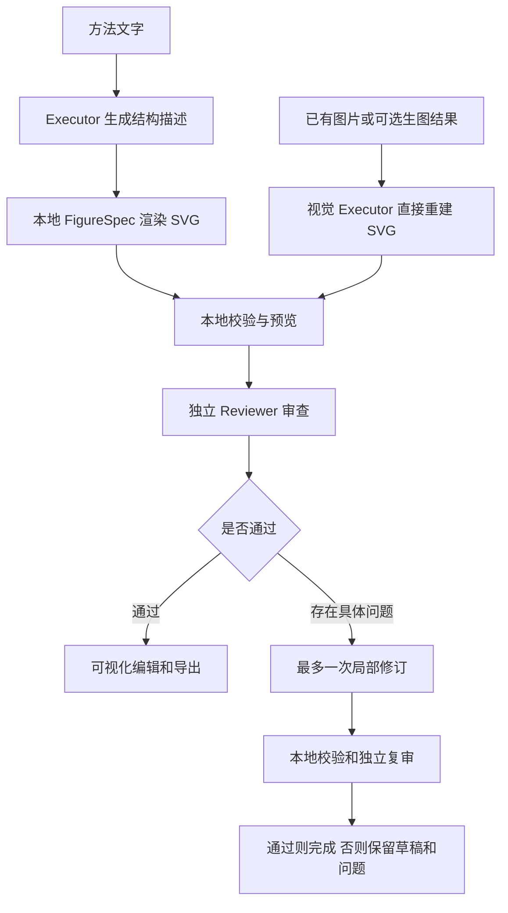

# AutoFigure-Edit 无分割科研绘图集成计划

> 历史归档，2026-10-06 起不作为实施依据。唯一现行方案是[保留原流程的无分割计划](F:/Agent/Aris/docs/development-logic/autofigure-minimal-change-integration-plan.md)。以下保留 v1 原文供追溯，其中上游行号来自浏览工具转换后的展示位置，已确认不能用作真实源文件锚点；请以现行方案的原始字节哈希和物理行号证据为准。

日期：2026-10-05。本文是实施计划；本轮只核对源码和架构，未集成应用、运行上游流程或提交付费生成请求。上游审阅对象为 `main`，实施前需固定 commit 和第三方依赖版本。

## 目标与建议

将 AutoFigure-Edit 的科研图重建、可视化编辑与导出能力引入 SomniQ Desktop。默认流程不使用 SAM3、fal.ai、Roboflow、RMBG-2.0 或 Hugging Face 模型访问凭据，不安装相关机器学习运行时。

提供两条入口：

- **已有图片转 SVG**：接收项目中的图片，包括现有 SomniImage 产物，直接让视觉模型重建可编辑 SVG。这是用户原有“生图后转 SVG”工作流的替代方案。
- **文字直接生成 SVG**：架构图、流程图和方法示意图优先生成结构描述，再本地渲染 SVG，省掉生图和图像重建两个步骤之间的往返。

保留 Executor → 独立 Reviewer → 必要时修订 → 复审。降低成本通过取消中间服务、限制模型调用、缓存和本地编辑实现；审查模型继续使用用户单独配置的 Reviewer。

建议选择性复用上游重建提示、SVG 提取思路及 SVG-Edit 编辑器，在 SomniQ 的共享 Rust 工具层和现有 Desktop 中实现流程。完整 FastAPI 服务、Docker 部署和上游账号配置不进入默认安装包。

## 已核实的依据

上游的实际路径包括生图、SAM 区域识别、裁切与 RMBG 去背景、模型生成 SVG、可选优化和图标回填。SAM 的主要作用是保留复杂图标，而文字与连接结构由模型重建。[上游流程源码](https://github.com/ResearAI/AutoFigure-Edit/blob/main/autofigure2.py#L3054-L3238)

几个会影响实现的细节：

- `method_to_svg` 先执行 `segment_with_sam3`，随后才计算 `no_icon_mode`。已有纯 SVG 回退可以作为改造基础，但它还不是跳过分割的入口。
- `placeholder_mode=none` 只改变占位符处理，不会跳过 SAM。
- `generate_svg_template` 的无图标分支要求直接重建可见内容，但仍发送原图和 SAM 参考图。改造后只发送必要的一张原图与可选的方法文字。
- SVG 重建与优化的输出上限可达 50,000 tokens；实际收费仍取决于实际使用量。语法修复和优化也可能增加调用，不能只统计生图与分割。
- 纯 SVG 回退失败时，上游允许把整张 PNG 嵌入 SVG。SomniQ 必须把这类结果识别为栅格预览，不能算作可编辑重建成功。

上述判断来自[主流程及 SVG 重建源码](https://github.com/ResearAI/AutoFigure-Edit/blob/main/autofigure2.py#L2150-L2284)与[原图包装回退](https://github.com/ResearAI/AutoFigure-Edit/blob/main/autofigure2.py#L3259-L3275)。

上游模块顶层直接导入 `torch`、`torchvision`、`AutoModelForImageSegmentation`。即使跳过某个函数，直接导入原模块仍会要求这些依赖；正式集成需要拆出轻量逻辑。[模块导入](https://github.com/ResearAI/AutoFigure-Edit/blob/main/autofigure2.py#L67-L85)

## SomniQ 可以复用什么

以下是源码中已有的基础，不代表新增集成已经通过运行验证。

| 现有位置 | 可以复用的能力 | 新增工作 |
| --- | --- | --- |
| `crates/runtime/assets/skills/figure-spec/scripts/figure_renderer.py` | JSON → SVG；节点、分组、文字和连线；主体使用 Python 标准库 | 为图形与连线补充稳定元素 ID；把渲染入口接到共享工具；复杂图形不能假定已支持 |
| `crates/api/src/image.rs`、`desktop/src-tauri/src/image_api.rs` | SomniImage 的生图/编辑、项目内产物和调用记录 | 复用既有图片；生图仅在用户选择时执行 |
| `desktop/src/chat/ImageWorkflowPanel.tsx`、`imageWorkflowModel.ts` | 图片调用、参考关系、预览和比较 | 增加 SVG 产物、转换按钮、编辑入口；当前图片关系画布不是 SVG 元素编辑器 |
| `crates/tools/src/lib.rs` 的 `LlmReview` | 独立 Reviewer 配置、请求和用量记录 | 当前输入只有文字 prompt；图片审查需要显式增加多模态载荷与能力检查 |
| `desktop/src/typeset/TypesetImagePreview.tsx`、`TypesetFigureDialog.tsx` | 项目图片预览和论文插图入口 | 从 SVG 编辑器导出论文可用 PDF/PNG，避免假定普通 LaTeX 直接支持 SVG |

现有生图接入约束见 [Somni gateway drawing](../somni-image-api.md)。新功能需保留既有付费请求的权限、取消和不重复提交语义。

## 用户流程与首版范围

首版重点是流程图、模型架构图、算法示意图和方法概览。文字保留为 `<text>`，框线、箭头和简单图标保留为图形元素或分组，可以选中、改文字、改颜色、移动和缩放。

复杂生物插画、写实器官、纹理和照片不承诺像素级复现。默认尝试简化矢量重绘；必要时用户可以手动放入本地图像素材。这种结果标记为“含栅格素材”，素材内部细节不能作为矢量编辑。

需要区分三种产物状态：

| 状态 | 含义 | 是否满足可编辑重建验收 |
| --- | --- | --- |
| `editable_vector` | 核心内容由文字、图形和路径组成 | 是，仍需通过审查 |
| `hybrid` | 可编辑结构中包含明确列出的栅格素材 | 只满足部分可编辑，需要展示范围 |
| `raster_preview` | 原图或整张图片包装进 SVG | 否，只用于保留预览和错误恢复 |

实验结果图继续使用真实数据与本地绘图库导出矢量图；不能让重建模型猜测数据点、坐标值或误差条。

## 去分割的具体改造

验证原型先把 `no_icon_mode` 提升为显式无分割入口：直接读取原图尺寸、生成 SVG、进行本地验证；不调用 SAM，不构造 `samed.png` / `boxlib.json`，不执行裁切、去背景或图标回填。`placeholder_mode=none` 不作为实现方案。

正式版本将轻量重建逻辑迁到 SomniQ 工具和模型调用边界：

1. 复用项目内图片以及当前 Executor 的视觉能力；不新建第二套 API key 设置。
2. 强制保留可读文字、准确关系、统一 `viewBox` 和稳定元素 ID；图片中看不清的文字明确列为待确认项。
3. 先本地解析、校验和预览，再提交独立审查。受支持的引用、箭头和分组不能被清洗过程误删。
4. 首版默认不调用上游全图优化器。模型修订围绕具体元素进行，避免一轮修改重新生成整张图。
5. SVG 校验或审查失败时保存草稿和问题，不把原图包装回退当作成功。

无分割路线不保证比原版更像原图，也不保证所有图都更便宜。直接重绘复杂图标可能增加输出与修订次数；先验证结构图，再决定复杂图支持范围。

## 调用预算与成本记录

普通成功流程预设如下，调用数包含独立审查：

| 模式 | 首次正常完成的新增模型调用 | 主要费用 |
| --- | --- | --- |
| 文字 → FigureSpec → SVG | 1 次 Executor + 1 次 Reviewer | 文字生成、审查输入与输出 |
| 已有图片 → SVG | 1 次视觉 Executor + 1 次 Reviewer | 图片输入、SVG 输出、独立审查 |
| 新生图 → SVG | 在上一项前增加 1 次 SomniImage | 生图费用再加重建与审查 |
| 手动改文字、位置、颜色 | 0 次模型调用 | 本地编辑；修改后的版本标记待审查 |

若首次审查未通过，最多增加一次 Executor 局部修订和一次 Reviewer 复审：无新生图时上限为 4 次逻辑模型调用。预算不足、输出截断、未通过或模型不支持输入时停止为草稿；升级模型、重试和继续修订走明确操作。请求尝试也进入账本，不能用重试隐藏额外费用。

具体控制：

- 首版建议简单图输出上限 8K、较复杂结构图 16K tokens，P0 用样例调整。输出截断不进入重复整图生成循环。
- 取消默认 4K 放大；仅在文字识别需要时发送更高分辨率，图片转换默认不重复发送相同图像。
- 转换已有 SomniImage 产物时不再次生图；可选生图一次只生成一个候选，并沿用现有尺寸和质量设置。
- 输入哈希、模型、提示版本和渲染器版本共同作为缓存键；审查缓存另外绑定精确的 SVG 版本和 Reviewer 配置。
- 人工保存版本立即使旧审查失效，不自动产生付费审查；用户请求最终审核或论文定稿流程时再执行。
- 记录各次真实 token 用量、模型、请求次数、耗时、重试、修订及最终是否通过。价格配置缺失时显示用量和“费用未知”，不推算不存在的金额。

成本公式为：生图费用 + 重建/结构生成费用 + Reviewer 费用 + 必要的修订/复审费用。取消 SAM/RMBG 能减少依赖和步骤；是否降低总价必须同时比较失败率和每张达标图的总成本。

若上游分割 API 无法获得，使用已有真实账单或缓存运行记录作为基线；没有同条件基线时只报告新版实际成本，不宣称降本百分比。本轮未取得真实单图费用。

## 架构落点与审查边界

共享层建议增加 `crates/tools/src/figures.rs`，承载 SVG 校验、元素修改、产物保存和导出服务；在共享工具目录注册 Figure 相关能力。模型请求复用现有 `crates/chat` / `crates/executor`，不在渲染工具内偷偷增加模型调用。

`crates/runtime` 保存版本、调用预算和审查状态。`desktop/src-tauri/src/figures.rs` 负责项目路径检查、取消和 UI 命令适配；Desktop 和 CLI 使用同一份核心实现。

`crates/chat/src/lib.rs` 与 Desktop 的提示/工具分派需要识别“可编辑 SVG”和“图片转矢量”意图。用户明确要求生图 API 时保留 SomniImage 行为；不可把失败的付费生图请求静默改成另一条流程。

独立 Reviewer 拿到方法原文、精确 SVG 版本、校验报告，以及视觉审查所需的原图和渲染预览。复用用户现有 Reviewer 配置，计划给共享审查入口增加向后兼容的本地图片附件参数。附件经过项目权限、大小和模型能力检查，模型接收实际图片载荷，而非无法读取的路径文字。

Reviewer 检查科学含义、箭头方向、必要标签、遮挡和可读性。文字审查与视觉审查分别记录结果。Reviewer 不支持图片时可以完成文字/结构审查，但视觉状态保持“待检查”；不能转给 Executor 自审，也不能宣布视觉验收通过。

新功能优先复用既有独立审查机制，每个版本只运行一套审核，避免 Figure 流程和聊天收尾机制重复付费审查。审核记录必须绑定产物哈希，不能把其他版本的通过状态挪用到最新版本。

产物建议保存在 `.somniq/artifacts/figures/<run-id>/`：输入快照或引用、首次生成的 FigureSpec、各版本 SVG、预览、`manifest.json`、调用账本和审查结果。`manifest` 记录项目/会话、来源哈希、父版本、模型、提示版本、编辑范围与审核状态，不保存账号凭据。

生成后的 SVG 是该版本的主编辑源；FigureSpec 保存首次生成输入。图形编辑器修改 SVG 后不从旧 JSON 自动重新渲染，以免覆盖用户修改。后续模型修改使用稳定元素 ID 和基线哈希；基线不一致时保留修改建议并处理冲突。文件保存在项目内，浏览器 localStorage 只保存临时 UI 状态。

## Desktop 编辑器与本地导出

建议本地打包固定版本的 SVG-Edit，静态资源随安装包发布，在现有图片侧栏中打开编辑视图。先验证它在 Windows WebView2 和 macOS WebKit 中的加载、文字、箭头、分组和保存往返，避免默认引入常驻 Python 服务。[上游嵌入页面](https://github.com/ResearAI/AutoFigure-Edit/blob/main/web/canvas.html)、[SVG-Edit 项目](https://github.com/SVG-Edit/svgedit)

必要 UI：已有图“转为可编辑 SVG”、文字“生成矢量图”、原图/结果比较、元素选择、属性编辑、撤销/重做、保存版本、审查状态和导出。费用入口显示预计调用次数和历史真实用量；SAM 后端与 key 配置不出现在此功能中。

SVG 属于可包含主动内容的格式。项目读取、模型生成、编辑器保存和导出均需统一检查：禁止脚本、事件属性、外部资源、DTD/实体和不受支持的嵌入内容；允许的本地栅格素材单独验证和限量。编辑器与原生 IPC 的隔离、消息来源校验和资源策略在 P0 验证，不只依赖当前 Tauri 配置。

预览与 PNG 导出评估本地 `usvg/resvg`，PDF 导出评估兼容的 `svg2pdf` 或现有渲染路径。它们是实施候选，尚未完成选型；先验证 CJK 字体、箭头、透明度、裁切与编辑器保存后的 SVG。SVG 首先交付，PDF/PNG 在后续阶段补齐。导出不调用模型。

## 分阶段交付

按一名熟悉仓库的工程师估算共 **10–14 个工作日**，是实施估算，不包含外部模型服务故障等待。阶段完成后按下面的可观测标准决定是否进入下一阶段。

| 阶段 | 估算 | 交付 | 进入下一阶段的条件 |
| --- | --- | --- | --- |
| P0 可行性验证 | 1–2 天 | 5 个代表样例；无分割图片重建原型；文字直出原型；SVG-Edit 本地加载验证；固定上游版本 | 无 SAM/RMBG 凭据和 ML 依赖即可运行；文字、框线、箭头可选中；记录真实调用数与图标保真问题；编辑器可保存重开 |
| P1 共享能力 | 3–4 天 | Figure 工具、稳定 ID、本地校验、产物版本、预算与取消；Reviewer 图片附件能力 | 权限与项目隔离通过；不会重复提交付费请求；审核绑定版本；缺少视觉 Reviewer 时状态明确 |
| P2 Desktop 首版 | 4–5 天 | 图片转 SVG、文字直出、原图比较、本地 SVG 编辑、自动保存、撤销重做、SVG 导出 | 两条入口端到端可用；编辑保存重开后保持一致；历史生图可直接转换；重启可恢复版本和调用状态 |
| P3 质量与成本验收 | 2–3 天 | 本地 PNG/PDF 导出、论文插图衔接、20 个样例验收、费用与失败率报告 | 满足下列验收门槛，报告真实成本及尚不支持的图形类型 |

最先实施 P0，优先证明“已有图不经过分割也能重建为真实可编辑 SVG”。若复杂图标明显失真，缩小支持范围或让用户补充素材；不为了通过样例重新引入另一家分割 API。

## 验收与检查

20 个验收样例建议包括：12 个流程/架构图（含 4 个中文图）、4 个算法/多面板方法图、4 个复杂插画边界样例。后 4 个检查降级与范围标识，不与结构图混算通过率。

- 16 个结构样例至少 14 个在首次生成或一次修订后通过语义和视觉审核。任何被标记通过的样例，其必要标签、关键关系和方向必须正确。
- 通过的结构图文字保持 `<text>`，关键组件能独立选择和编辑；整图 `<image>` 包装不能满足门槛。
- 正常成功时无分割请求、无去背景请求，只有一次生成与一次独立审查；修订后必须独立复审，达到上限仍未通过时保留草稿。
- 手工改字、改色、移动和导出零模型调用；保存后重开、撤销重做和产物哈希一致；编辑后的审核状态正确失效。
- 重启和取消不会自动重新发送已提交的付费请求。请求已经提交但结果未知时明确记录，不假定服务器未收费。
- 记录每张通过图的总费用、模型调用数、耗时和人工修订量。具备同条件基线后，以达标图的中位费用下降至少 30% 作为优化目标；这是待实测目标，不是当前结论。若不可比则报告调用数与实际用量。
- Reviewer 视觉能力不足、文字不清、复杂插画、输出截断和恶意 SVG 都能产生明确状态，不误报完成。

实现时运行与变更匹配的检查：

1. Rust 对 figures、审查附件、版本冲突、预算、路径边界和取消运行专项测试；跨 crate 改动运行 `cargo test --workspace`。
2. Desktop 原生命令另运行 `cargo test --manifest-path desktop/src-tauri/Cargo.toml --lib` 的相关用例，因为该目录是独立 workspace。
3. 前端运行编辑器集成、图片转换、版本保存、审核状态和论文插图的 focused Vitest；从 `desktop/` 运行 `npm run typecheck` 和 `npm run build`。
4. 真实模型检查纳入已配置的付费范围并逐项计账；无可用凭据时先完成本地/模拟测试，实际质量和费用标记未验证。

## 复用与发布记录

AutoFigure-Edit 主代码采用 MIT 许可。复制代码时保留版权和许可文本；SVG-Edit 及实际打包的第三方依赖分别保留自己的 notices。[AutoFigure-Edit LICENSE](https://github.com/ResearAI/AutoFigure-Edit/blob/main/LICENSE)、[SVG-Edit 许可入口](https://github.com/SVG-Edit/svgedit)

论文引用与 AI 辅助披露可以加入产物来源记录；上游明确说明这是学术归属建议，不是额外的软件许可限制。[上游引用说明](https://github.com/ResearAI/AutoFigure-Edit/blob/main/CITATION_AND_ATTRIBUTION.md)

正式开发前记录实际复用文件、固定 commit、依赖版本与许可证；发布说明准确描述去分割的适用范围、混合素材与可编辑范围。
