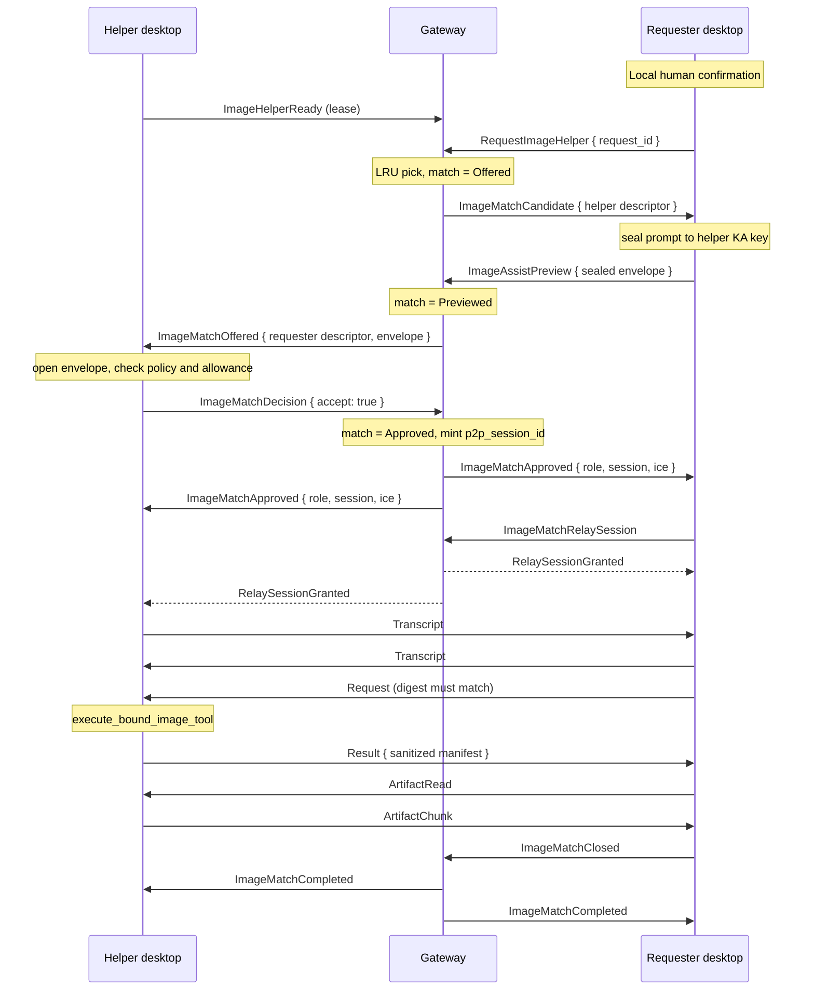

# Image Assist: brokered image generation between users

Status: revision 6, describing the implemented M0. Revision 2 resolved two
blocking protocol defects found in review of revision 1; revision 3 recorded
what a second review corrected; revision 4 records the three places where the
brokered path was wired only halfway; revision 5 records visible temporary
sessions, completion acknowledgement, and the connected relay fallback;
revision 6 records reachability-based matching, the departure path, and the
end-of-exchange semantics that stopped a successful transfer from reporting
itself as a failure. All are under
[Design corrections](#design-corrections). Sections marked *Deferred* remain out
of scope.

What exists in code: the closed wire protocol and its validation, the signed
match transcript and its exchange over the channel, the domain-separated preview
key, the gateway match state machine and its three authorization gates, the
desktop transport isolation and brokered peer reservation, the brokered
signaling paths on both sides, the request the requester sends once its peer
verifies, manifest sanitization, artifact import, the request authorization and
daily allowance, host/mDNS ICE suppression, the helper policy switch, and the
requester's send-to-a-stranger confirmation. Both desktops now expose each match
as a visible process-local temporary session from matching through acceptance,
connection, generation, transfer, and completion/failure. Matching requires a
live signal connection as well as a lease, a dropped connection closes the
matches that device is in, and each side marks its half of the exchange settled
so a transport closing after a successful transfer is not reported as a failure.
The approved match connects over the gateway-minted encrypted relay directly;
the direct WebRTC path and its ICE suppression remain in the code but are not
currently reached. End-to-end verification against two live desktops has not
been performed.

A SomniQ user with no ChatGPT image capability asks the gateway for help. The
gateway matches that request to another user who is online, has explicitly
volunteered, and whose own ChatGPT Web account is ready. The image is generated
**on the helper's computer, using the helper's account**, and only the resulting
image files travel back.

This is one capability and one interface. It is deliberately not a general
capability marketplace: no `CapabilityKind` enum, no capability negotiation, no
second capability. If a second capability is ever needed, that is the point to
introduce an abstraction, not before.

Image Assist has no relationship to the NewAPI managed account or its quota
system. It lives entirely in the remote gateway and the desktop remote
transport.

## How this differs from paired computers

[compute-nodes.md](compute-nodes.md) describes paired computers: two machines
that one person owns, joined by a durable pairing edge established through a
human-verified ceremony. Every existing authorization, addressing, and
key-derivation path hangs off that edge.

Image Assist introduces a second, orthogonal relation between machines that
have **never paired and belong to different people**.

| | Paired computers | Image Assist match |
| --- | --- | --- |
| Established by | Human-verified ceremony | Gateway matching |
| Lifetime | Durable | Minutes, single request |
| Persisted | `compute-peers.json` + OS keyring | Nothing, anywhere |
| Scope | Compute jobs, Agent chat | One image request |
| Wire type | `ComputeWireMessage` | `ImageAssistWireMessage` |
| Key trust | Human out-of-band | Gateway introduction |

The durable pairing graph keeps its exact current semantics. `are_paired` is
never widened. Image Assist is a second authorization path that can be disabled
independently and audited separately.

## Invariants

- Exactly one capability exists: image generation.
- **An Image Assist channel carries `ImageAssistWireMessage` and nothing else.**
  It never decodes, dispatches, or reaches `ComputeWireMessage`, and a brokered
  peer never enters `handle_peer_message`. See
  [Wire isolation](#wire-isolation).
- **The helper opens the full prompt before anything runs.** The sealed preview
  is decrypted and validated on the helper's machine before the match is
  accepted; an opaque or unreadable request is declined rather than served. See
  [Two-phase match](#two-phase-match).
- **No channel exists before consent.** The gateway authorizes no session
  identifier until the helper has approved. A declined or expired match never
  produces a connectable session.
- Serving a stranger requires the helper's explicit opt-in and is bounded by
  their daily allowance. As implemented, that opt-in is standing consent: the
  Settings switch is the decision, and matched requests are then accepted
  without a per-request dialog. The image still consumes the helper's account
  quota, enters the helper's ChatGPT history, and attaches content
  responsibility to the helper's account, so the switch carries the whole
  weight of that consent. See [revision 6](#corrected-in-revision-6).
- **The requester's own turn also blocks on an explicit human confirmation**
  before the prompt leaves the machine. The Chat model can reach this tool
  autonomously; the consent gate therefore lives in the executor, not in the
  schema.
- The helper executes exactly the prompt it approved. The request delivered over
  the channel is rejected unless its digest equals the approved preview digest.
- Oracle MCP is never exposed to a peer. The helper calls the first-class host
  capability `execute_bound_image_tool`. Registering Oracle as a reachable MCP
  surface would expose every Oracle tool, which
  [oracle-web.md](oracle-web.md) forbids.
- The helper never forwards `execute_bound_image_tool` output verbatim. Only a
  sanitized manifest crosses the channel. See
  [Artifact contract](#artifact-contract).
- The gateway stores no match record on disk. `PersistedDeviceState` gains no
  Image Assist field. A gateway restart cancels in-flight matches.
- The gateway emits structured lifecycle logs for matching, preview forwarding,
  acceptance or rejection, relay fallback, cancellation, expiry, and completion.
  These logs contain request/match identifiers and short device fingerprints,
  never prompt plaintext, image bytes, or account details.
- A match authorizes at most two gateway-minted session identifiers: one P2P and
  one relay fallback. A match never authorizes an unbounded session space
  between two unpaired devices.
- Attachments are not transferred, and an explicit `model` is rejected rather
  than silently reinterpreted.
- Image bytes returned by a helper are untrusted input on the requester side.

## Design corrections

Revision 1 stated that the helper's approval dialog shows the full prompt, but
sequenced the prompt to arrive over the peer channel, which only exists after
approval. Placing the prompt in a gateway frame would have made it plaintext to
the gateway. **Resolution:** a preview phase in which the requester seals the
prompt to the helper's key-agreement public key and the gateway relays opaque
ciphertext. This additionally lets the approved prompt be digest-bound, closing
a bait-and-switch hole that revision 1 did not address at all.

### Corrected in revision 3

A second review found that revision 2 still claimed guarantees the code could
not deliver. Four mattered:

- **Relay fallback was unreachable from `Approved`.** The state table allowed
  `ImageMatchRelaySession` only from `Active`, which is entered on the first
  channel bind. A direct attempt that fails during offer creation never binds,
  so the fallback was unreachable exactly when it was needed. Relay is now
  granted from `Approved` as well.
- **The preview key shared a derivation domain with the transport key.**
  Revision 2 reused `SessionKeyContext` for both. A separate
  `PreviewKeyContext` and HKDF label now keep them apart, and `MatchId` is a
  distinct type from `SessionId` so the two cannot be confused at a call site.
- **The transcript signed only device ids and public keys.** The approval dialog
  shows the peer's display name, so an unsigned name would let a malicious
  introducer relabel who is asking. The transcript now covers the full
  `DeviceDescriptor` using the same encoding as every pairing transcript.
- **The digest was taken over the raw prompt.** Oracle trims before executing,
  so "the helper executes exactly what it approved" was not true. Prompt and
  aspect ratio are now canonicalized once, before consent, and that canonical
  form is what is previewed, digest-bound, and executed.

Revision 2 also required stripping host candidates from the relay fallback's
own description. That requirement was wrong and has been removed: the fallback
is an encrypted WSS/TCP relay, not a second WebRTC negotiation, so it has no
description to filter. ICE suppression applies to the direct attempt only.

One discovery came from the implementation rather than review. The desktop's
P2P frame path resolves compute peers from the persisted device store, and an
unknown peer **falls through to the Agent control path** rather than being
rejected. A brokered stranger would therefore have had its frames dispatched as
`ControlRequest`. `classify_p2p_frame` now classifies brokered sessions first
and returns, and a test pins the fall-through behavior so it cannot regress
silently.

### Corrected in revision 4

Revision 3 claimed a transcript exchange and a working brokered transport that
the code could not perform. The match reached `Approved`, both sides reserved a
session, and then nothing happened: the helper waited for a request that no code
constructed, and the requester spent its 300-second budget in silence. Three
separate links were missing, each of them a general path that had never been
taught about a peer with no pairing edge.

- **The transcript had no wire slot.** `ImageAssistTranscript` existed, signed
  and verified and unit-tested, but `ImageAssistWireMessage` had no variant to
  carry it and no desktop code signed or checked one. The variant now exists and
  both peers exchange it the moment the data channel opens.
- **Nothing sent the first frame.** `seal_image_assist` was reachable only from
  the reply path of an inbound frame, so a channel that opened stayed idle.
  `remote_control_p2p_opened` now classifies a brokered session and sends this
  machine's signed transcript; the requester sends its approved request only
  after the peer's transcript matches its own and the proof verifies.
- **Both signaling directions resolved through the paired store.** The helper's
  offer went out through the claimed-compute path, which a brokered peer is not
  in, and the requester's inbound offer went through `reserve_p2p_session`,
  which resolves peers from the persisted device store a brokered peer must
  never enter. Both now branch on the Image Assist classification first. The
  inbound path additionally marked brokered offers `brokered: false`, which
  would have handed a stranger this machine's LAN addresses through the one
  code path the ICE suppression cannot see.

The lesson is the same one revision 3 recorded about `classify_p2p_frame`: every
path that resolves a peer from durable storage is a path a brokered stranger
silently falls out of, and the failure is always silence rather than an error.

### Corrected in revision 5

Revision 4 made the direct channel execute, but still left the product and one
transport path incomplete:

- **Progress existed only as unobserved events.** Acceptance closed the dialog
  and left both people with no visible task. A process-local temporary-session
  panel now follows matching, recipient selection, acceptance, connection,
  generation, transfer, completion, and failure on both desktops.
- **Successful transfer never closed the gateway match.** The helper therefore
  stayed busy and neither side received a terminal state. The requester now
  sends `Closed` after importing every artifact; the gateway releases the match
  and returns `Completed` to both parties.
- **The relay grant was a no-op on desktop.** A direct WebRTC failure requested
  no fallback, and `RelaySessionGranted` opened nothing. The requester now asks
  for the gateway's one relay id, both sides close the stale direct attempt,
  derive a relay-bound session, exchange transcripts again, and dispatch only
  `ImageAssistWireMessage` over the encrypted WSS relay.

### Corrected in revision 6

Revision 5 connected the parties but not the edges of the exchange: it assumed
that a lease means a peer is reachable and that a transport closing means
something went wrong. Neither holds, and each cost a whole request.

- **Matching trusted a lease instead of a connection.** A helper advertisement
  outlives the app that took it by up to a minute, and every gateway frame
  addressed to a device with no signal connection is dropped without a trace.
  A requester matched to a helper that had already quit therefore waited out
  the full 180-second match TTL for a dialog nobody could draw, and could
  burn its whole pool that way. Selection and the roster's `available` flag
  now both test for a live signal connection, and a helper that becomes
  unreachable between selection and preview ends that attempt instead of
  absorbing it.
- **Nothing acted on a departure.** `detach_signal` maintained only the
  presence graph, so quitting the app left the advertisement, the reservation,
  and the whole match in place: the surviving side heard nothing, the helper
  stayed reserved against every other requester, and the requester was refused
  a new request as "busy" for as long as the match lived. Losing the signal
  connection now withdraws the advertisement and closes every match the device
  is a party to, telling the counterparty and advancing the request when the
  helper was the one that left.
- **A completed transfer reported itself as a failure.** Every transport close
  looks alike from below, so the relay task reported one even after a clean
  finish. On the helper that raised an error banner for a request it had just
  served and cancelled a match the gateway was about to complete; on the
  requester it could overwrite a delivered result with an error, so the images
  were on disk and the tool call failed anyway. Each side now marks the match
  settled when it finishes its half — the requester after writing every image,
  the helper after serving the last slice — and a settled match treats the
  close as the end of the exchange. Results are first-write-wins for the same
  reason: several paths can end a request within one 250 ms poll.
- **A match that died after approval ended in silence.** The gateway only
  follows `MatchClosed` with another candidate or a terminal `MatchFailed`
  while the match is still unapproved. Past approval the requester received
  `MatchClosed` and nothing else, and its tool call sat out the remaining
  fifteen minutes. The requester now fails the request on a close that arrives
  once transport parameters exist.
- **The transfer paid for itself repeatedly.** Serving one 128 KiB slice
  cloned every image held for the request, so returning a 16 MiB image copied
  about two gigabytes. Slices are now read in place. Held images are also
  keyed to the session that was approved, and dropped with it, so a transfer
  cut short no longer holds them for the life of the process — and a second
  brokered channel cannot name another request's id and be handed its images.
- **Silence was still a valid outcome in three places.** A reply that could not
  be written, an oversized chunk that exceeded the relay frame limit, and image
  frames arriving before the transcript verified were all logged and dropped.
  All three now fail the channel, and the transport is released when the
  request ends rather than when the peer eventually hangs up.

Two behaviours in the shipped code differ from what this document described
before revision 6, and are recorded here rather than reverted:

- **The helper's per-request dialog is gone.** `on_offered` applies the
  Settings opt-in as standing consent and accepts without prompting;
  `ImageAssistApprovalPrompt` and its event are no longer emitted. The invariant
  below is written as implemented. This is a real reduction in consent: a
  stranger's prompt now reaches the helper's ChatGPT account with no
  per-request human decision, bounded only by the daily allowance.
- **The relay is the primary transport, not the fallback.** `on_approved`
  requests the gateway relay directly instead of attempting WebRTC first,
  because a cross-region data channel can report itself open while application
  frames never arrive. The direct path and its ICE suppression remain in the
  code but are currently unreachable.

Revision 1 added Image Assist variants to `ComputeWireMessage`. That enum is
dispatched by `handle_peer_message`
([compute.rs:2191](../../desktop/src-tauri/src/compute.rs:2191)), which handles
`ControlRequest`, `Submit`, `InputBundleStart`, and `ArtifactRead`. Since
`InputBundleStart` and `InputBundleChunk` are dispatched *before* the
`accept_remote_jobs` check in the `Submit` arm
([compute.rs:2470](../../desktop/src-tauri/src/compute.rs:2470)), a brokered
stranger could have written bundle data to disk with remote compute disabled,
and could have reached compute execution outright on a helper that also enabled
it. A `DeviceScope` value does not constrain message dispatch. **Resolution:** a
separate wire type, session type, and handler.

## Trust model

Pairing derives session keys from static X25519 keys whose authenticity was
established through a human channel. `SessionKeyContext`
([crypto.rs:302](../../crates/remote-protocol/src/crypto.rs:302)) binds protocol
version, session id, and both device ids, and the HKDF input is the
Diffie-Hellman output of two keys a human vouched for.

Two strangers have no such channel. The gateway therefore acts as a **trusted
introducer**: it tells each side the other's `key_agreement_public_key`. A
compromised gateway can substitute those keys and sit in the middle. This is a
real and deliberate reduction from the pairing model.

**The preview is the concrete cost.** The sealed prompt is encrypted to the
key the gateway introduced, and it is sent before any signature is verified, so
a compromised gateway reads it. Everything downstream inherits the same
property; the preview simply makes it immediate and specific. The requester UI
states this, and key continuity (M1) is what reduces it.

Payload confidentiality against the *relay path* is unchanged: application
frames are `SecureEnvelope` ciphertext and the gateway sees routing metadata
only.

### Signed match transcript

Both sides sign a canonical transcript and verify the peer's signature before
any request is sent. There is no bootstrap circularity: the transcript is signed
with Ed25519 **device signing keys**, so verification does not depend on the
session key it attests.

```rust
struct ImageAssistTranscript {
    version: u16,                    // starts at 1
    match_id: Uuid,
    requester_device_id: DeviceId,
    requester_signing_public_key: DevicePublicKey,
    requester_key_agreement_public_key: KeyAgreementPublicKey,
    helper_device_id: DeviceId,
    helper_signing_public_key: DevicePublicKey,
    helper_key_agreement_public_key: KeyAgreementPublicKey,
    offerer: DeviceId,               // gateway's role assignment
    session_id: String,              // the session id of THIS channel
    ice_servers: Vec<String>,        // sorted, deduplicated, at most 8
    expires_at_unix_ms: i64,
    request_digest: [u8; 32],        // SHA-256 of the approved preview plaintext
}
```

Canonical encoding follows the existing pairing convention: a versioned,
deterministic, length-prefixed byte sequence built by an
`append_signature_bytes` / `signature_transcript` pair, matching
[pairing.rs:399](../../crates/remote-protocol/src/pairing.rs:399). It is never
derived from serde output. `ice_servers` is sorted and deduplicated before
signing so both sides produce identical bytes regardless of delivery order.

**Transport stage:** the transcript is the first message on every Image Assist
channel, exchanged over the freshly derived session key before any other
variant is accepted. It covers the session id of the channel it opens, so the
relay fallback re-runs the exchange for its own session id rather than reusing
a stale signature. A mismatch in any field, including the role assignment, fails
the channel closed on both sides.

Verification is an equality check, not a re-derivation: both peers build their
copy from the same gateway introduction, so any difference means one side was
told something the other was not. The proof is checked afterwards, against the
peer's signing key as it appears in the descriptor the gateway introduced. Which
descriptor goes on which side is the one step that differs between the two
peers, and a test pins that the two orderings produce identical signed bytes —
getting it wrong would fail every brokered channel closed for a reason no log
would explain. A helper refuses a request that arrives before a transcript has
verified rather than treating it as an ordering accident.

The transcript does not defeat a fully malicious gateway, which can forge both
introductions. It does three things that matter: it defeats tampering by anyone
who is not the gateway; it forces the gateway from passive substitution into
active forgery, which key continuity detects; and it makes the local audit
record independently verifiable instead of self-asserted.

## Two-phase match

Consent precedes connectivity. Phase 1 runs entirely over the gateway signal
channel and produces an approved, digest-bound request. Phase 2 opens a
transport and executes exactly that request.



1. The requester's tool call blocks on a local human confirmation showing the
   prompt, the fact that another user will read it, and that the image will
   enter that user's ChatGPT history. Nothing leaves the machine before this.
2. `RequestImageHelper` carries no prompt.
3. The gateway picks a candidate: leased-ready, **currently connected to the
   signal endpoint**, and not already matched. Selection is
   **least-recently-matched**, not random; random selection repeatedly disturbs
   whoever stays online most. Reachability is checked separately from the lease
   because a lease survives the app that took it, and a frame addressed to a
   device with no connection is dropped rather than refused.
4. `ImageMatchCandidate` goes to the requester only, carrying the helper's
   descriptor and the match expiry — enough to seal, and nothing else.
5. The requester derives the preview key with
   `SessionKeyContext::new(match_id, requester_id, helper_id)` against the
   helper's introduced KA key, seals `{request_id, prompt, aspect_ratio}` as a
   `SecureEnvelope`, and records `request_digest` over the plaintext.
6. `ImageAssistPreview` carries only that envelope. The gateway relays it as
   opaque bytes inside `ImageMatchOffered`.
7. The helper opens and validates it, checks its own readiness and daily
   allowance, and holds one unit of that allowance. With the Settings opt-in
   standing in for a per-request decision, acceptance follows immediately and
   sends `ImageMatchDecision`; anything that fails on the way there declines.
8. Only on approval does the gateway mint `p2p_session_id` and send
   `ImageMatchApproved` to both sides. Before this, `image_match_allows` returns
   false for every session id.
9. A decline, a timeout, a helper that goes unready, or a helper whose signal
   connection drops returns the reservation and **automatically advances to the
   next candidate** with the same `request_id`. The requester observes a longer
   wait, not a failure. Past approval there is no next candidate: a match that
   closes then ends the request rather than leaving it waiting.
10. An exhausted pool returns `ImageMatchFailed`. There is no request queue in
    M0: the tool result says no helper is available, which is more honest than
    an indefinite wait.
11. Both sides exchange and verify transcripts, then the requester sends
    `Request`. The helper recomputes the digest and rejects any mismatch.
12. Both sides retain a visible temporary-session status after approval. The
    helper sees generation and transfer progress; the requester sees the chosen
    display name/fingerprint, acceptance, execution, and result receipt.
13. After the requester imports the final image it sends `ImageMatchClosed`.
    The gateway releases the helper and sends `ImageMatchCompleted` to both
    desktops so neither side is left with a silent or permanently busy match.

## Match state machine

The gateway holds one state per match and advances it by compare-and-swap. Every
transition names its single valid predecessor, so a late, duplicated, or
replayed frame is rejected rather than racing.

| From | Event | To |
| --- | --- | --- |
| — | `RequestImageHelper` | `Offered` |
| `Offered` | `ImageAssistPreview` | `Previewed` |
| `Previewed` | `ImageMatchDecision{accept}` | `Approved` |
| `Previewed` | decline / expiry | `Closed`, re-match |
| `Approved` | first authorized channel binds | `Active` |
| `Approved` or `Active` | `ImageMatchRelaySession` | relay id minted once |
| any | `ImageMatchClosed` / expiry | `Closed` |
| any | either party's signal connection drops | `Closed` |

- `ImageMatchDecision` arriving in any state but `Previewed` is rejected. A
  decision that arrives after expiry never revives a match.
- `ImageMatchRelaySession` is valid in `Approved` and `Active`, only once. The
  second attempt is rejected, not re-minted. It must be reachable from
  `Approved` because a direct attempt can fail before any frame binds a channel,
  which is exactly when the fallback is needed.
- `ImageMatchClosed` is idempotent: a duplicate close is a no-op, never a
  reopen.
- One `request_id` maps to at most one active match, and one match accepts
  exactly one `request_id`. Re-sending a known `request_id` returns the existing
  match's state rather than starting a second one.
- Either side may cancel at any state. Cancellation releases the helper
  reservation and the requester's concurrency slot.
- A party whose signal connection drops is treated as having cancelled. Quitting
  the app sends no frame, so without this the surviving side waits out the full
  TTL, the helper stays reserved against everyone else, and the requester is
  refused a new request as "busy" the whole time. A helper that leaves before
  consenting advances the request; after consent the request ends with it.

## Wire isolation

Image Assist defines its own message type, dispatched by its own handler, on a
session that can decode nothing else:

```rust
enum ImageAssistWireMessage {
    // Boxed: a transcript embeds two full descriptors and every other variant
    // is an order of magnitude smaller.
    Transcript { transcript: Box<ImageAssistTranscript>, proof: DeviceSignature },
    Request { request_id: String, prompt: String, aspect_ratio: Option<String> },
    Accepted { request_id: String },
    Result { request_id: String, artifacts: Vec<ImageArtifactEntry> },
    ArtifactRead { request_id: String, name: String, offset: u64, max_bytes: u32 },
    ArtifactChunk { request_id: String, name: String, offset: u64,
                    data: Base64UrlBytes, eof: bool, sha256: String },
    Failed { request_id: String, reason: ImageAssistFailure },
}
```

The transport below it is shared and unmodified — `SecureEnvelope` over the
DataChannel with relay fallback — but the session is constructed to open
`ImageAssistWireMessage`, so a `ComputeWireMessage` payload does not decode and
is dropped as a protocol violation. `handle_peer_message` is not reachable from
a brokered peer, and the brokered peer is not registered in any structure that
compute or control paths enumerate.

`ArtifactRead` / `ArtifactChunk` are duplicated rather than reused from
`ComputeWireMessage` for the same reason, and because the compute pair is keyed
by `ComputeJobId`: minting a synthetic job id would write a fabricated record
into the compute job ledger under `.somniq/compute/jobs/`.

`DeviceScope::ImageAssist = 7`
([control.rs:32](../../crates/remote-protocol/src/control.rs:32)) is the next
unused wire code. It gates whether a device may participate at all; it is not,
and cannot be, the mechanism that constrains message dispatch.

Images are always chunked, never inlined. `COMPUTE_MAX_ARTIFACT_CHUNK_BYTES` is
128 KiB and the gateway's default `SOMNIQ_GATEWAY_MAX_WS_BYTES` is 256 KiB.
Raising the frame cap to inline whole images would raise it for all traffic,
including traffic from unpaired strangers.

## Gateway signal frames

Carried on the existing authenticated `/v1/signal` endpoint. No new HTTP route.

```rust
// Client -> Gateway
ImageHelperReady { lease_ms: u32 },        // re-asserted; no slot count
ImageHelperStopped,
RequestImageHelper { request_id: String },
ImageAssistPreview { match_id: Uuid, envelope: SecureEnvelope },
ImageMatchDecision { match_id: Uuid, accept: bool },
ImageMatchRelaySession { match_id: Uuid },
ImageMatchCancel { match_id: Uuid },
ImageMatchClosed { match_id: Uuid },

// Gateway -> Client
ImageMatchCandidate { match_id: Uuid, peer: DeviceDescriptor, expires_at_unix_ms: i64 },
ImageMatchOffered   { match_id: Uuid, peer: DeviceDescriptor, envelope: SecureEnvelope,
                      expires_at_unix_ms: i64 },
ImageMatchApproved  { match_id: Uuid, offerer: DeviceId, session_id: String,
                      ice_servers: Vec<String>, expires_at_unix_ms: i64 },
ImageMatchRelaySessionGranted { match_id: Uuid, relay_session_id: String },
ImageMatchFailed { request_id: String, reason: MatchFailure },
ImageMatchCompleted { match_id: Uuid },
```

`MatchFailure` is `NoHelper | Declined | Timeout | RateLimited | Cancelled`.

The sealed preview envelope is bounded well under the signal frame cap; see
[Request limits](#request-limits).

## Transport

Image Assist reuses the existing computer-to-computer transport: WebRTC
DataChannel first, gateway relay on failure. It introduces no transport.

**ICE policy for brokered sessions: server-reflexive candidates only.** Between
paired machines belonging to one person, exposing LAN addresses costs nothing.
Between strangers it discloses internal network topology to an unknown party.
Mutual public-IP disclosure remains a physical consequence of any direct
connection and is accepted; the requester confirmation states it.

Configuring `iceServers` does not achieve this. The bridge currently forwards
every candidate it is handed
([RemoteP2pBridge.tsx:291](../../desktop/src/remote/RemoteP2pBridge.tsx:291),
[RemoteP2pBridge.tsx:368](../../desktop/src/remote/RemoteP2pBridge.tsx:368)).
For brokered sessions the implementation must:

- drop candidates of type `host` in `onicecandidate` before forwarding, on both
  the offerer and answerer paths;
- drop mDNS candidates whose address ends in `.local`, which conceal the address
  but still disclose that a local interface exists;
- strip `a=candidate` lines of type `host` from the SDP before the offer or
  answer is forwarded, since filtering trickled candidates alone does not clean
  a description that already embeds them;
Suppression applies to the direct attempt only. The relay fallback is an
encrypted WSS/TCP relay, not a second WebRTC negotiation, so it has no
description to filter; it is protected by session-id authorization and the
frame-size bound instead.

Whether a session is brokered travels in the offer and start events as an
explicit flag rather than being inferred. Paired-computer sessions keep their
current unfiltered behavior: both machines belong to one person, and dropping
host candidates there would push same-LAN peers onto STUN or the relay for no
privacy gain.

Tests assert that no host or mDNS candidate survives filtering, and that
non-candidate SDP lines are left intact so the description stays valid.

*Deferred:* a forced-relay privacy mode. The deployed coturn is `--stun-only`
and rejects TURN allocations by design, so hiding public IPs requires
introducing a real TURN service with its own bandwidth and operational cost.

ICE servers travel in `ImageMatchApproved` from gateway configuration, validated
by the existing `valid_public_stun_uri`
([lib.rs:2265](../../services/remote-gateway/src/lib.rs:2265)), so both ends
always agree and operations can change the STUN endpoint without shipping a
desktop release. The default remains `MANAGED_REMOTE_STUN_SERVER`.

Role assignment is explicit. Paired computers derive offerer and answerer from
the pairing direction; strangers have none. The gateway assigns: **the helper is
the offerer and takes the claimed-side path; the requester is the answerer and
takes the inviting-side path.** The assignment is covered by the transcript.

Session identifiers are minted only by the gateway, only after approval, and are
bounded to two per match.

## Authorization surface

Three gateway checks currently require a durable pairing edge:

| Location | Purpose |
| --- | --- |
| [lib.rs:2055](../../services/remote-gateway/src/lib.rs:2055) `route_signal` | SDP and trickled ICE |
| [lib.rs:2092](../../services/remote-gateway/src/lib.rs:2092) `bind_relay` | Relay session binding |
| [lib.rs:2141](../../services/remote-gateway/src/lib.rs:2141) `forward_relay` | Relay frame forwarding |

Each becomes `are_paired(..) || image_match_allows(..)`. `are_paired`
([lib.rs:2210](../../services/remote-gateway/src/lib.rs:2210)) is not modified.

`image_match_allows` returns true only when a match in state `Approved` or
`Active` joins exactly those two devices **and** the frame's session id equals
that match's `p2p_session_id` or its minted `relay_session_id`. Omitting the
session-id check would turn one brokered image request into a durable open
channel between two strangers; this is the most security-sensitive predicate in
the feature.

`revoke_device` ([lib.rs:1793](../../services/remote-gateway/src/lib.rs:1793))
also calls `are_paired` and is deliberately left alone: a brokered match is not
a device relationship and has nothing to revoke.

## Helper readiness and quota

Readiness cannot be proven in advance. `image_tool_available()`
([oracle_web.rs:1441](../../desktop/src-tauri/src/oracle_web.rs:1441)) confirms
that an image account is bound and the Oracle runtime is ready — it does not
confirm that the browser account is still signed in or currently usable. The
only true test is running a task. The design therefore treats readiness as a
**revocable lease plus a failure signal**, not a fact.

A helper advertises only when all of the following hold:

- the local user enabled **Help other users generate images**;
- `image_tool_available()` is true;
- the account has a recorded successful sign-in verification
  (`login_confirmed_at`,
  [oracle_web.rs:835](../../desktop/src-tauri/src/oracle_web.rs:835)) — necessary
  but, as that function's own comment notes, only first-verification audit
  metadata, never a liveness proof;
- the account's dedicated browser user is not open, which
  [oracle-web.md](oracle-web.md) requires a task to fail on anyway;
- the daily allowance is not exhausted;
- no Image Assist request is already in flight.

The roster UI is a compact entry point rather than an inline unbounded list.
Opening it shows aggregate availability, a searchable paginated list, and a
world distribution of helpers who explicitly chose to share an approximate
location. Location sharing is off by default. The desktop requests the OS
geolocation permission only when the user enables it, rounds latitude and
longitude to one decimal place before sending, and the native command plus the
gateway enforce the same rounding again. Helpers who do not opt in remain in
the roster under "location not shared" and are never assigned a synthetic map
position.

**There is no `slots` field.** `ORACLE_JOB_LOCK`
([oracle_web.rs:28](../../desktop/src-tauri/src/oracle_web.rs:28)) is a global
mutex serializing every Oracle job, so effective concurrency is one. Advertising
any other number would be a lie that the gateway acts on. A helper is available
or it is not.

`ImageHelperReady` carries a lease. The gateway expires an advertisement whose
lease is not renewed and removes the helper from matching. A helper whose
request fails for a readiness reason stops advertising and reports the reason
locally.

The daily allowance is a three-step atomic reservation, not a counter read at
approval time:

| Step | Trigger | Effect |
| --- | --- | --- |
| Reserve | `ImageMatchOffered` accepted for display | allowance held, helper marked in flight |
| Commit | `ImageMatchDecision{accept:true}` | allowance consumed |
| Release | decline, expiry, cancel, or failure before execution | allowance returned, helper re-advertises |

Without the reservation step, two concurrent matches could both read the same
remaining allowance, and a helper that is already showing a dialog could be
matched again.

## Request limits

The existing tool schema
([engine.rs:2103](../../desktop/src-tauri/src/engine.rs:2103)) permits a
`model` and a prompt of up to 120,000 **characters**. Neither transfers safely.

- **`model` is rejected, not forwarded.** The label is specific to the helper
  account's own configuration, so honoring it would either fail confusingly or
  let a stranger steer the helper's account onto a chosen model. A remote-routed
  call with an explicit `model` fails locally with that explanation. Remote
  execution always uses the helper account's default.
- **`files` is rejected**, matching the existing decision for remote Agent
  turns. Attachments are not transferred.
- **Prompt length is checked in UTF-8 bytes, not characters,** before anything
  leaves the machine. 120,000 characters of CJK text is roughly 360 KB, which
  exceeds the 256 KiB frame cap outright. The remote limit is **8 KiB UTF-8**,
  far above any real image prompt and far below both the frame cap and the
  sealed-envelope overhead. Exceeding it fails locally with the byte count.

## Artifact contract

`execute_bound_image_tool`
([oracle_web.rs:1492](../../desktop/src-tauri/src/oracle_web.rs:1492)) returns an
`OracleWebImageView`
([oracle_web.rs:146](../../desktop/src-tauri/src/oracle_web.rs:146)) carrying
`account_id`, `session_id`, `status`, `output`, and absolute local `path`
values. **None of that crosses the channel.** The helper converts it into:

```rust
struct ImageArtifactEntry {
    name: String,       // helper-generated, e.g. "image-01.png"
    size_bytes: u64,
    mime: String,       // image/png, image/jpeg, image/webp
    sha256: String,
}
```

The name is generated by the helper from an index and the detected type. It is
never derived from a filesystem path, the Oracle session, or the account. The
prose `output` field, which may quote arbitrary ChatGPT text, is not forwarded.

Helper-side limits, tighter than the local Oracle ceilings of
`MAX_GENERATED_IMAGE_BYTES` (32 MiB) and `MAX_GENERATED_IMAGES_TOTAL_BYTES`
(128 MiB) because the recipient is a stranger: at most **8 files**, **16 MiB per
file**, **32 MiB total**. Exceeding any of them fails the request rather than
truncating it.

Requester-side validation, applied before any byte reaches its final path:

- `name` matches `^[a-z0-9][a-z0-9-]{0,63}\.(png|jpg|jpeg|webp)$` — no path
  separators, no `..`, no leading dot, no absolute path;
- `name` is unique within the request; a duplicate fails the whole request;
- the declared count and sizes are within the limits above, checked against
  bytes actually received, not only against the manifest;
- magic bytes match the declared MIME;
- the assembled file's SHA-256 equals the manifest digest.

Files are written under `.somniq/artifacts/remote-images/<request-id>/`,
deliberately separate from the local
`.somniq/artifacts/oracle-images/<run-id>/` so provenance is visible in the path
itself. Each file is created with `create_new` semantics so an existing path is
never overwritten; the parent directory is created fresh per request and a
collision fails the request. Symlinks are never followed. Nothing is written
into project directories and nothing is opened automatically. Any failure
discards **all** artifacts for that request — partial acceptance is not allowed.

## Abuse controls

A public broker is reachable by any registered device, so the M0 scope includes
the controls that protect a helper's real, finite resources: their ChatGPT
quota, their browser history, and their attention.

In M0, with the values the implementation uses:

- per-requester-device rate limit of 12 requests per rolling hour, enforced at
  the gateway;
- at most one in-flight match per requester device;
- `request_id` idempotency, so a retry resumes rather than fans out;
- explicit `ImageMatchCancel` from either side at any state;
- a candidate that declines is not offered the same `request_id` again;
- helper-side daily allowance, default 10 per local day, with the
  reservation protocol above. The day boundary is the helper's own local date:
  the limit protects a person's account and attention, and "today" for that
  person is their own calendar day.

Helper-side daily limits alone are insufficient: they are per-helper, so a
requester can spread traffic across the whole pool and consume one approval
dialog from each.

*Deferred to M1:* sybil resistance, key continuity, and blocklists. Device
identities are self-signed and cheap to mint, so the M0 limits bound damage per
identity but not the number of identities.

## Requester-side integration

The Chat model's view of the tool does not change: `chatgpt_web_image_tool_spec`
keeps its exact schema, and only its registration condition in `tool_specs_for`
([engine.rs:1970](../../desktop/src-tauri/src/engine.rs:1970)) becomes
`image_tool_available() || remote_image_helper_online()`. Execution prefers a
local account and falls back to a brokered helper.

Because the schema is unchanged, **the model can route a request remotely on its
own initiative**. The consent gate is therefore in the executor: a remote-routed
call blocks on an explicit human confirmation, using the same pattern as the
`AskUserQuestion` tool and the permission prompt, and the prompt does not leave
the machine until it returns. Confirmation is per request; there is no session-
wide "always allow" for a stranger network.

## Local state

- Ephemeral peer: in memory only, for the lifetime of the match, carrying the
  gateway-supplied descriptor, ICE servers, assigned role, and verified
  transcript.
- **The ephemeral peer is never written to `compute-peers.json`
  ([compute.rs:51](../../desktop/src-tauri/src/compute.rs:51)) and never reaches
  the OS keyring.** Existing peer paths — including the `remote_control_p2p_*`
  commands from
  [remote.rs:3565](../../desktop/src-tauri/src/remote.rs:3565) onward — resolve
  peers from durable storage and must be extended to resolve ephemeral peers
  without persisting them. This is the highest-risk part of the desktop work and
  is covered by tests before implementation.
- Helper audit log: local, append-only, one record per served request with
  timestamp, peer fingerprint, full prompt, outcome, and the verified peer
  signature.
- Gateway: nothing durable.

## Failure behavior

- No helper leased-ready, or every candidate declined: `ImageMatchFailed`. The
  tool returns a plain "no helper is currently available" and does not retry
  indefinitely.
- Helper declines, expires, or goes unready: reservation released, next
  candidate tried under the same `request_id`, requester unaffected.
- Preview envelope fails to open on the helper: fail closed, close the match, do
  not prompt with an unreadable request.
- Request digest does not match the approved preview: reject and close. This is
  an attempted bait-and-switch, not a recoverable error.
- Transcript signature, descriptor, role, or session-id mismatch: fail closed on
  both sides; never continue with an unverified peer.
- ICE or DataChannel does not complete: request one relay session and retry
  there once, re-running the transcript exchange. A second failure ends the
  request.
- A `ComputeWireMessage` payload arriving on an Image Assist session: protocol
  violation, close the channel.
- A frame carrying a session id the match does not authorize: rejected at the
  gateway as a protocol violation.
- Helper account loses readiness mid-request: report the Oracle error to the
  requester as a failed request, stop advertising, release the allowance.
- Artifact fails name, count, size, magic-byte, or digest validation: discard all
  artifacts for that request and report failure.
- Either party quits: the gateway closes the match on the dropped signal
  connection and tells the survivor. An unapproved match advances to the next
  candidate; an approved one ends the request.
- The transport closes: a failure unless this machine already finished its half
  of the exchange, in which case it is the expected end and only releases the
  session. A request that has already produced a result keeps it; a later error
  never replaces a delivered one.
- A reply cannot be written — a closed channel, or a chunk that exceeded the
  relay frame limit: fail the channel. Dropping it leaves the peer waiting for
  a frame that will never arrive.
- Gateway restart: all matches are lost. In-flight requests fail and are
  restarted by the user.

## Verification status

Unit and integration coverage exists at every boundary this document calls a
guarantee, and each of the following is a negative assertion — the thing that
must *not* happen:

| Guarantee | Where it is pinned |
| --- | --- |
| A compute frame cannot decode on a brokered session | `remote-protocol`, desktop `tests::remote` |
| An unknown peer no longer falls through to the Agent path | desktop `tests::remote` |
| A brokered peer never enters the paired-device store | desktop `tests::remote` |
| No session id is authorized before approval | gateway `image_assist`, gateway `lib.rs` |
| A match authorizes only its own minted sessions | gateway `image_assist`, gateway `lib.rs` |
| A late decision cannot revive an expired match | gateway `image_assist` |
| Tampering with a display name or role breaks the transcript | `remote-protocol` |
| A malformed transcript is refused by the decoder, before verification | `remote-protocol` |
| Both peers build byte-identical transcripts from opposite sides | desktop `image_assist` |
| A transcript survives the sealed brokered transport intact | desktop `tests::remote` |
| A request from an unverified peer never reaches the account | desktop `image_assist` |
| The preview key differs from the transport key for the same UUID | `remote-protocol` |
| A substituted prompt never reaches the ChatGPT account | desktop `image_assist` |
| The manifest carries no account, session, or local path | desktop `image_assist` |
| A received image cannot traverse, overwrite, or mismatch its digest | desktop `image_assist` |
| Host and mDNS candidates do not survive filtering | `RemoteP2pBridge.test.tsx` |
| The requester sees the full prompt before it leaves the machine | `ImageAssistApproval.test.tsx` |
| An unreachable helper is neither matched nor listed as available | gateway `image_assist` |
| A departing party's match and reservation do not outlive it | gateway `image_assist`, gateway `lib.rs` |
| A delivered result survives a transport that closes right after it | desktop `image_assist` |
| Images are served only on the session the match approved | desktop `image_assist` |

**Not yet verified:** the full path against two live desktops and a running
gateway. Every part has been exercised in isolation; the composition has not.
Until that run happens, treat the end-to-end flow as untested regardless of the
unit coverage above.

## Deferred

- **M1**: `known_peers.json` key continuity with a changed-key warning; sybil
  rate limiting; blocklists; helper audit export.
- **M2**: penalties for repeatedly failing pairs; forced-relay privacy mode,
  which requires introducing a real TURN service.
- Not planned: a request queue, a second capability, attachment transfer,
  reputation scoring, or horizontal scaling of the matcher. Advertisement, match,
  and presence state is process-local, so the existing "do not scale this
  horizontally" constraint in
  [the gateway README](../../services/remote-gateway/README.md) hardens from
  advice into a requirement.
