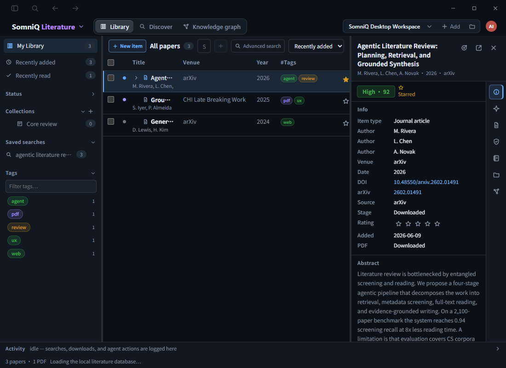
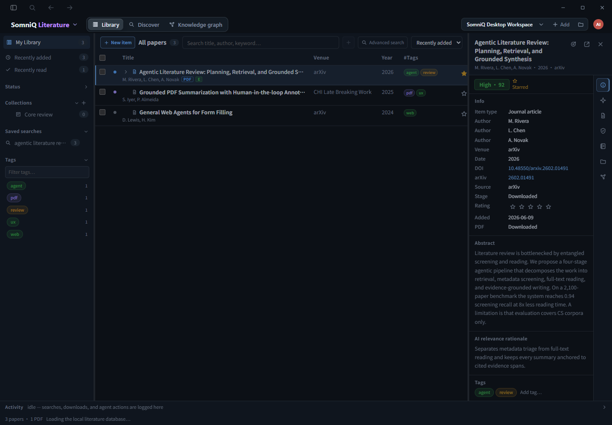

# 文献库审查与重构建议

审查日期：2026-09-26。代码基线：当前工作区，HEAD `34848597`。

## 结论与本次目标

建议保留现有本地 SQLite 内核，在其上分阶段收敛写入契约、状态语义和界面结构。主要问题是迁移后的规范化模型仍与旧投影共同参与写入，同时前端组件承担了管理、检索任务和研究加工的生命周期。单独调整颜色、间距或拆文件不能解决这些问题。

本次目标：审查文献库 UI 与管理逻辑，形成可执行的重构范围。验收标准是：给出可定位的问题、区分复现结果与推断、说明数据边界、提出分阶段的验收条件。本次没有实施产品重构。

已读取项目原有目标；其中的托管账户安全任务仍是另一项未完成工作。本报告不覆盖或替换该目标，也不恢复工作区中原有的删除内容。

## 验证范围与限制

- 检查了 Literature 页面、Zustand store、类型、Tauri API/命令、相关测试及架构文档。
- 现有文献库测试：8 个测试文件，118/118 通过。命令：在 `desktop/` 运行 `node node_modules/vitest/vitest.mjs run src/literature/tests`。
- 隔离复现：8/8 场景确认了下文描述的当前行为。这些测试故意断言问题现状，不代表问题已经修复。文件：[literature-20260926.test.tsx](../../desktop/.audit/literature-20260926.test.tsx)。命令：在 `desktop/` 运行 `node node_modules/vitest/vitest.mjs run .audit/literature-20260926.test.tsx`。
- 使用本机前端预览的样例数据，在 1440×1000 和 1100×800 窗口渲染检查。它验证布局与前端交互，不替代真实 Tauri 数据库联调。预览出现的 Tauri `transformCallback` 错误、数据库状态一直加载，不作为桌面产品缺陷计入。
- 当前工作区的 `crates/` 显示为已删除。共享内核仅通过 `git show HEAD:...` 只读对照，没有恢复文件，也没有运行 Rust 集成测试。涉及内核版本行为的结论单独标注。
- 产品实现未修改；新增审查报告、截图和隔离复现场景。

## 需要先处理的问题

### 1. P1：异步操作没有牢固绑定发起它的项目

**已复现。** 在 A 项目开始下载，切换到 B 项目且其中存在同 ID 论文，A 的下载回调会把 `papers/a.pdf` 和 `downloaded` 状态写入 B 的前端记录。两个项目包含同一 DOI/arXiv 文献是正常场景，ID 重合并不罕见。

集合队列也有同类问题：A 的第一笔集合写入尚未完成时再新增一个集合，然后切换到 B，第二笔任务在出队时才读取项目 ID，最终携带 A 的集合列表向当前 B 项目发送写入请求。复现验证的是前端请求与状态污染；真实 SQLite 落盘尚未联调。

代码位置：

- [literatureStore.ts:1942](../../desktop/src/literature/literatureStore.ts#L1942)：`persistCollections` 在 `.then()` 内读取 `loadedProjectId`，闭包中的集合快照却来自入队时。
- [literatureStore.ts:3613](../../desktop/src/literature/literatureStore.ts#L3613)：下载完成后直接修改当前 singleton store，没有发起项目校验。
- [tauri.ts:1128](../../desktop/src/api/tauri.ts#L1128)、[literature.rs:2261](../../desktop/src-tauri/src/literature.rs#L2261)：文献请求没有携带项目上下文，后端从全局当前项目解析根目录。

**修复方向：** 每个读写和后台任务显式携带发起时捕获的 `projectId`；后端解析对应项目路径，不能依赖当前激活项目。队列按项目隔离；回调更新该项目缓存，当前视图只展示匹配项目的数据。`requestId` 用于区分任务，不可代替项目身份。

### 2. P1：快速切换项目会丢弃尚未保存的修改

**代码和现有测试确认。** 旧投影写入使用 600 ms 防抖。切到另一项目时，`load()` 直接清除定时器。用户看到操作已经生效，但切回后修改可能消失。

代码位置：[literatureStore.ts:75](../../desktop/src/literature/literatureStore.ts#L75)、[literatureStore.ts:2052](../../desktop/src/literature/literatureStore.ts#L2052)。现有测试 [Literature.test.tsx:2259](../../desktop/src/literature/tests/Literature.test.tsx#L2259) 明确断言切换后不发出保存。项目切换顺序见 [store.ts:609](../../desktop/src/store.ts#L609)：先切后端，再更新前端。

**修复方向：** 与问题 1 一起修，先建立项目绑定的持久化契约，再让切换后的待保存操作安全完成。提供明确的“保存中 / 已保存 / 保存失败，重试”状态。不要通过清除定时器来解决串库，也不能直接在已经切换的后端上下文中强行 flush。

### 3. P1：全文搜索结果被前端再次过滤，产生假阴性

**已复现两个场景。** 后端返回某论文 ID 后，如果关键词只在全文中出现，列表仍会把它删掉。输入 `Persisted`，即使标题含有该词、后端也返回命中，列表仍不显示。

原因是 [Literature.tsx:2551](../../desktop/src/literature/Literature.tsx#L2551) 先检查 FTS 命中，再要求通过 `matchesQuery`。后者只拼接题录、附件描述与笔记，不含 PDF 正文，并且把语料转小写却没有把查询转小写；见 [Literature.tsx:735](../../desktop/src/literature/Literature.tsx#L735)。整串 `includes()` 还会抹掉后台的分词、OR、拼写容错等搜索语义。

**修复方向：** 后端负责文本匹配、排序、分页和命中摘要；前端仅组合标签、集合等明确的结构条件。基础字符串匹配只在搜索服务失败或浏览器预览时启用，并保持大小写规则一致。让用户能区分“题录检索”和“全文检索”，命中正文时展示页码和片段。

### 4. P1（部分静态验证）：一次元数据修改经过两条写入路径

**重复发请求已复现；真实版本冲突尚未联调。** [literatureStore.ts:2758](../../desktop/src/literature/literatureStore.ts#L2758) 先乐观修改 `library`，紧接着 `persistNow()` 将这次修改作为旧快照发送，然后又以 `libraryModel` 中的版本发送 `literatureUpdateItem`。

已提交的共享内核表明旧快照会推进 item version：`HEAD:crates/tools/src/literature.rs:4235` → `HEAD:crates/runtime/src/literature.rs:4135`。规范化写入又会校验 `expectedVersion`，见 `HEAD:crates/runtime/src/literature.rs:1220`。前端两次请求之间没有刷新该版本，因此存在自己的第一次写入使第二次写入发生版本冲突的明确代码路径。现有 mock 不模拟版本推进，会漏掉这个问题。

**修复方向：** 元数据、标签、集合、附件各自只走一个有版本约束的命令。旧 JSON 只能由内核单向生成，UI 不再把完整 `LiteraturePaper` 作为可写真相。响应应用要保留尚未提交的局部操作，不能整库覆盖正在编辑的数据。

### 5. P2：文献库非空后，常用导入入口消失

**已复现。** 导入文献库、导入 PDF、按标识符添加，全部放在 `libraryCount === 0` 的空状态分支，见 [Literature.tsx:4919](../../desktop/src/literature/Literature.tsx#L4919)。有一篇文献后，这些按钮就不再可见。常驻的“新建条目”只打开手动录入题名、类型、作者的对话框。PDF 拖放仍是另一条路径，但不解决 BibTeX/RIS 和标识符入口问题。

**修复方向：** 常驻“添加文献”菜单：导入文件、粘贴 DOI/arXiv/ISBN、手动创建。空库提示与该菜单复用同一组命令。

### 6. P2：检索任务的控制状态随页面卸载而消失

**草稿丢失已复现；运行中失去控制入口由代码确认。** 外部发现页面输入查询，切回文献库后再回来，草稿被清空。`preview`、`execution`、`busy`、停止任务用的 request ref 都在组件内部，见 [Literature.tsx:210](../../desktop/src/literature/Literature.tsx#L210)。页面切换会卸载组件，清理只取消事件监听；后端任务可继续，但重新进入没有恢复原运行的控制状态。

这不等于数据库中的 SearchRun 被删除。问题在于用户不能从同一界面可靠地找回预览、进度和停止/续跑入口。

**修复方向：** 将草稿按项目保存；SearchRun 状态由持久化任务服务拥有，页面订阅指定 `projectId + runId`。检索历史提供恢复详情入口，页面切换不决定任务是否存在。

### 7. P2：单个 stage 混用了筛选、阅读和附件状态

`PaperStage` 同时包含 `inbox / screened / shortlist / downloaded / read / excluded`。与此同时还保存 `unread`、`readAt`、`pdf.status` 和每个任务的 screening。

已复现：`markRead()` 让 `unread=false`，但 `stage` 仍是 `inbox`；见 [literatureStore.ts:2558](../../desktop/src/literature/literatureStore.ts#L2558)。静态可见：下载完成会把 `shortlist` 改成 `downloaded`，使文献离开候选视图；见 [literatureStore.ts:3616](../../desktop/src/literature/literatureStore.ts#L3616)。另外，单击选择题录就会调用 `markRead`，并不要求打开全文；见 [Literature.tsx:3150](../../desktop/src/literature/Literature.tsx#L3150)。

**修复方向：** 收藏/标签属于组织状态；已读属于阅读状态；是否有 PDF、是否已索引属于附件状态；纳入/排除属于某个研究任务。它们可以同时成立，不应互相覆盖。“已查看题录”与“已阅读全文”需要统一产品定义。

### 8. P2：三栏布局没有优先保护搜索和题名

**渲染确认。** 1100×800 窗口中，左栏 220 px、详情栏 336 px，中间表格约 536 px，搜索框实际只有 **28.27 px**。固定的期刊、年份、标签列继续占位，题名只剩几个字符。

代码位置：[Literature.css:467](../../desktop/src/literature/Literature.css#L467)、[Literature.css:1351](../../desktop/src/literature/Literature.css#L1351)、[Literature.css:3137](../../desktop/src/literature/Literature.css#L3137)、[Literature.tsx:4807](../../desktop/src/literature/Literature.tsx#L4807)。





**修复方向：** 根据中间区域实际可用宽度折叠次要列和工具按钮；详情面板可收起，在窄窗口改为抽屉。搜索框至少保持可输入长度，题名获得最优先空间。右侧七个图标页签应收敛为更少的有文字分组。

## 建议的信息架构

主界面保持“文献库 / 发现与检索”，阅读器以文献标签页打开。知识图谱作为选中文献或研究任务的关联视图；系统综述工作流继续由已有 Workflow 模块负责，文献库显示它的筛选结果与来源链接。

| 区域 | 主要内容 | 交互边界 |
| --- | --- | --- |
| 左侧导航 | 全部文献、最近添加、未分类、收藏；集合；智能视图；回收站 | 集合、动态查询、外部检索历史分别表达，避免全部叫“已保存搜索” |
| 顶部工具栏 | 添加文献、当前范围、搜索、筛选、排序 | 有数据/无数据时入口一致；高级功能进入菜单或筛选条 |
| 中间列表 | 题名/作者、年份、来源、PDF/阅读状态；标签为可选列 | 选中才出现批量操作；标题列优先；保留现有虚拟化 |
| 右侧详情 | 资料、阅读笔记、证据、附件；AI 简报并入相关分组 | 缺省突出题录；低频字段按需展开；阅读器独立打开 |
| 任务区域 | 导入、下载、索引、检索运行进度与失败重试 | 任务独立于页面存在，用户可离开页面后返回 |

建议布局骨架：

```text
文献库  |  发现与检索                       项目
------------------------------------------------------
集合与视图 | 添加文献  搜索……  筛选  排序 | 详情开关
          | 题名 / 作者       年份  状态 | 资料
全部文献  |                            | 阅读笔记
未分类    | 文献列表                    | 证据
收藏      |                            | 附件
集合      |                            |
智能视图  |                            |
回收站    |                            |
------------------------------------------------------
保存状态 / 正在执行的任务 / 重试
```

另一个需要单独设计的交互是去重：当前选中两篇后按勾选顺序决定保留记录，只提供确认框，见 [Literature.tsx:3322](../../desktop/src/literature/Literature.tsx#L3322)。建议提供两条记录的字段对比、附件/笔记迁移摘要与保留记录选择，再调用已有合并事务；不要仅凭勾选顺序让用户理解字段保留规则。

## 数据与代码边界

保留已经实现的规范化表、稳定 ID/别名、附件与笔记树、回收站、来源冲突记录以及 SearchProtocol/SearchRun。现有底座已足够，不建议先重新造一套数据库，也不建议把项目库强行改成全局库；跨项目引用可以之后以明确的关联能力增加。

把容易混淆的概念拆开：

| 对象 | 应拥有的状态 |
| --- | --- |
| 文献条目 | 题录、作者、标识符、版本；ID 在元数据修正后保持稳定 |
| 集合 / 标签 | 人工组织与成员关系 |
| 智能视图 | 可重新执行的本地筛选条件 |
| 检索协议 / 检索运行 | 外部查询版本、来源、覆盖率、命中成员与排序；保留审计轨迹 |
| 阅读状态 | 未读、阅读中、已读与阅读位置 |
| 附件 | PDF/补充材料、路径、获取状态、索引状态、主附件关系 |
| 研究任务判定 | `taskId + recordId` 下的纳入/排除、Reviewer 结论、人工覆盖及历史 |
| 笔记 / 证据 | 笔记可编辑；证据保留来源、页码与审核/修订历史 |

SQLite 分别生成 UI 查询模型和兼容 JSON，两者都作为单向投影。所有修改从显式命令进入同一共享服务，由 runtime/tools 完成事务。Desktop、CLI 和 Agent 复用它，不各自实现筛选/保存规则。

建议写入契约包含 `projectId`、稳定记录 ID、`expectedVersion` 和用于重试去重的 `operationId`；成功返回更新对象与版本，列表按受影响查询失效。标签等集合关系使用 add/remove 命令，避免携带整个旧关系图覆盖他人的修改。后台任务使用明确的项目与运行 ID，可恢复、可重试。

前端按职责拆成 `LibraryPage`、`LibraryNavigation`、`LibraryToolbar`、`LibraryTable`、`ItemInspector`、`ReaderWorkspace`、`DiscoveryWorkspace` 和独立任务状态。当前 `Literature.tsx` 为 7,135 行、store 为 3,736 行、CSS 为 7,902 行；这些规模是职责混合的信号，不以单纯减行数作为验收指标。

保留 Executor → independent Reviewer → revision 的独立审核链。AI 建议、启发式 fallback、Reviewer 已审结论、人工确认必须有可区分状态；页面中的建议不能自动提升为已确认研究证据。

## 分阶段实施与验收

| 阶段 | 工作 | 完成条件 |
| --- | --- | --- |
| 1：数据可靠性 | 项目绑定 API/队列；消除重复保存；修正搜索规则；恢复常驻导入入口 | A/B 含相同文献时不串写；立即切项目不丢修改；单次编辑只有一个规范化写入口；全文/大小写/多词搜索正确；非空库可导入 |
| 2：模型与任务收敛 | 拆分 stage；区分集合/智能视图/检索运行；任务脱离组件；补保存状态 | 下载不改变候选或排除决定；阅读筛选与计数一致；切页重进找回草稿/运行；错误可重试且操作幂等 |
| 3：桌面交互重组 | 新三栏约束、常驻添加菜单、详情分组、独立阅读器、去重对比 | 1100/1280/1440 宽度下搜索可用、标题可读；详情可收起；导入→整理→阅读→笔记→证据→引用导出完整走通 |
| 4：迁移与回归 | 移除 Desktop 对旧 JSON 的写依赖；真实 SQLite 和规模验证 | 老库迁移保留 ID、附件、标注、笔记、集合、来源及审核记录；重复迁移幂等；导入/合并/回收/恢复一致；大库首屏和批量操作有实测预算 |

测试重点是跨边界场景：项目切换与在途任务、快速连续编辑、Agent/CLI 与 UI 并发、重启恢复、全文命中、附件丢失及去重后的引用关系。现有组件 happy-path 测试通过不能代替这些保证。

实施跨 crate 改动时，按项目要求先跑受影响 crate 的 focused tests，再运行 `cargo test --workspace`；UI/API 改动运行相关 Vitest、typecheck 与 `npm run build`。进入该阶段前必须先确认共享 crates 的实际可用工作区，不能覆盖当前已有删除状态。
