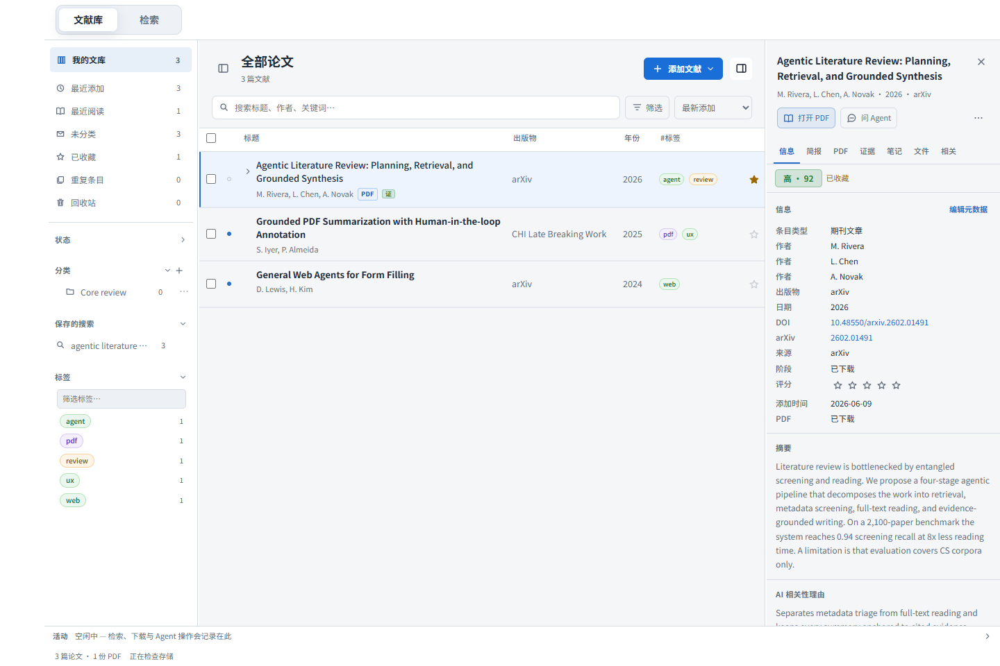
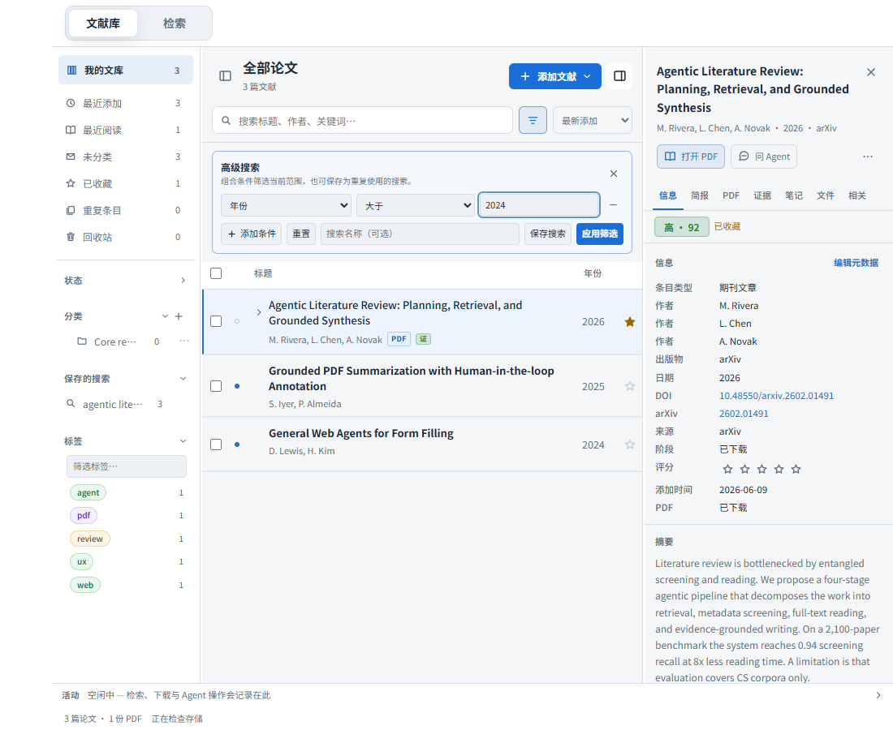

# 文献库界面与交互重构

本次改动重组 Desktop 文献库的导航、添加入口、列表工具栏、批量操作和详情面板。沿用现有文献存储、导入、证据与独立 Reviewer 流程。

## 使用路径

- 空库与非空库均提供「添加文献」：导入 PDF、导入题录、添加标识符、手工新建。
- 常用视图直接出现在侧栏；研究阶段仍按需展开。分类的新增子分类、重命名、删除合并为一个菜单，右键入口保留。
- 标题与文献数量独立于搜索行。搜索、排序、高级筛选分别表达；标签条件和高级条件可见，并可统一清除。
- 高级筛选可以直接应用于当前范围，也可以保存为动态搜索。临时应用不修改已保存的搜索。
- 选择题录只打开详情；实际打开 PDF 或显式标记才更新阅读状态。阅读圆点与研究阶段颜色分离。
- 批量操作只针对当前可见范围，切换范围会清理隐藏的勾选。常用批量动作常驻，低频动作进入菜单。
- 详情支持收起和恢复，文字页签替代纯图标导航；PDF 与 Chat 动作集中在标题下方。元数据有明确编辑入口。
- 菜单支持上下键、Home / End、Escape 与焦点恢复；创建对话框限制 Tab 焦点范围；子控件按键不会冒泡触发行选择。

## 图标审查

| 原表达 | 调整 | 原因 |
| --- | --- | --- |
| PDF 打开与下载共用靶心 | 打开书本 / 下载箭头，并显示文字 | 分开阅读与获取行为 |
| Chat 用外链箭头 | 对话气泡 +「问 Agent」 | 表达对话操作 |
| 重复条目用书库 | 重叠页面 | 表达重复记录 |
| 最近阅读用勾号 | 打开的书 | 避免混同于审核完成 |
| 分类用文档、子分类用圆点 | 文件夹 | 同一种层级使用一致语义 |
| 删除分类、删除搜索用关闭叉号 | 菜单中的垃圾桶和删除文案 | 区分关闭与破坏性操作 |
| 每个题录都重复文档图标 | 移除 | 将横向空间留给标题 |
| 详情导航只显示信息、魔法、盾牌等图标 | 直接显示文字页签 | 不要求记忆图标；证据入口不暗示已核验 |
| 顶部页签、简报小标题重复装饰 | 移除 | 保留有助于识别操作的图标 |
| 保存搜索用加号 | 条件存在时显示「保存搜索」 | 区分添加文献与保存查询 |
| 高级筛选与普通搜索都用放大镜 | 筛选图标 | 区分关键词与结构化条件 |

## 实现边界

`LiteratureToolbar`、`LibraryActionMenu`、`LiteratureBatchBar` 和 `LiteratureDetailTabs` 承担可复用的界面交互。`LibraryWorkspace.css` 管理文献库外壳及按容器宽度调整的列；移除了已退出使用的旧工具栏样式。列表继续使用现有虚拟滚动和稳定文献 ID。

原有未提交的阅读器、导读和后端工作继续保留。本次开始前的相关文件和旧项目目标保存在 `.somniq/changes/literature-ui-2026-09-27/`，不以仓库 HEAD 冒充本次任务基线。

## 验证

- 文献模块和现有动效接线：12 个文件、146 项 Vitest 测试通过。
- `npm run typecheck` 通过；`npm run build` 通过。构建有较大 chunk 提示，不影响通过。
- 使用真实 React 组件和浏览器预览数据检查 1440、1280、1100、860 像素窗口；页面宽度均未溢出。1100 像素时搜索输入宽度 328 px、题名列 406 px。
- 真实浏览器验证了临时筛选、清除、详情恢复、未读状态、菜单键盘与中英文布局。2000 条文献在顶部和底部均只挂载 20 行，能够滚动到第 2000 条；未收到页面运行时错误。
- 浏览器使用独立预览数据；真实 Tauri 文件对话框和 SQLite I/O 没有在浏览器中端到端执行，相关既有调用路径由组件测试覆盖。

截图与机器可读检查结果在 [验收目录](./literature-ui-2026-09-27/)。

