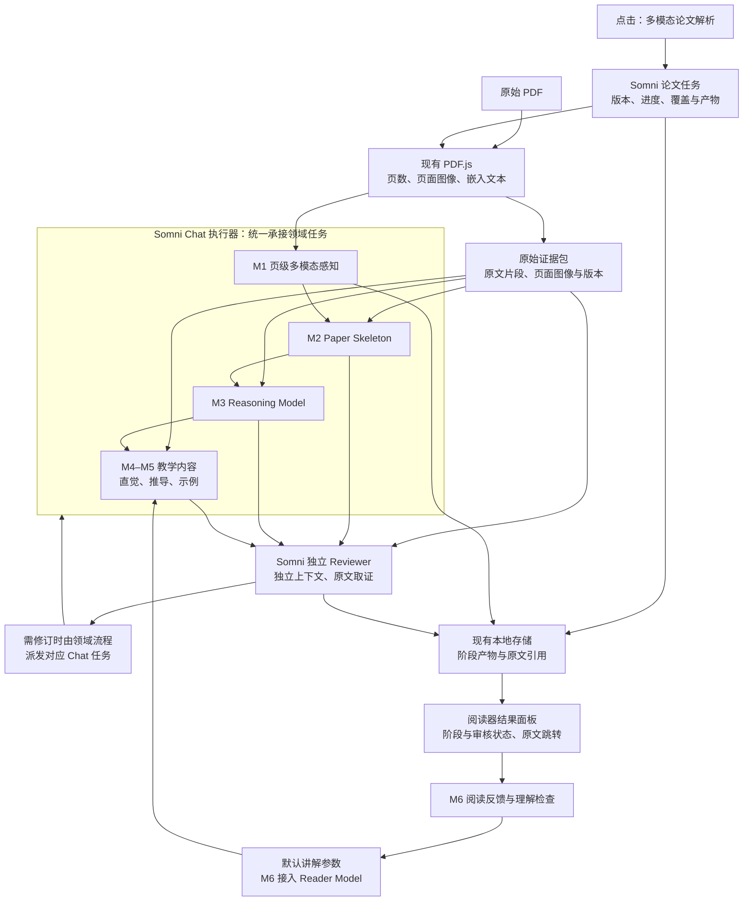

**SomniQ 论文理解与教学阅读器实施计划**

日期：2026-09-26。当前优先级：暂停 Reviewer 接入及审核／修订实验，直接交付文献库里帮助读者理解的图文讲解。用户再次明确：仅有 PDF 页级处理不满足目标。现已在原有全文感知后接入主线／主题讲解生成及并排阅读界面；真实模型生成 6 个主题，但语义抽查尚未通过，下一步优先改进讲解质量和读者效果。目标论文为 AI／机器学习方法论文。实现与验证见[图文讲解记录](paper-reader-multimodal-guide-2026-09-26.md)及[构建记录](paper-reader-m0-m1-build-status-2026-09-26.md)。

当前验收围绕具体阅读任务：能否结合方法图理解流程、解释公式及其假设、正确解读实验行列，通过小例子理解关键难点，并回到原页核对。使用现有 Somni Chat、持久化和页面导航实现这版讲解，通用 Skeleton／Reasoning／Reader Model 仍按下述分期计划推进。发现的内容错误、展示问题和实际耗时都记入报告。独立审核仍是后续架构的一部分，本轮不调用 Reviewer，也不把人工抽查或执行器自检写成独立审核通过。

**四项高优先级修改的落实时点。**

| 优先级 | 修改项 | 何时明确 | 验收依据 |
| --- | --- | --- | --- |
| 高 | 一个核心理解难点的完整教学验证样例 | 样例保留；先完成 PDF 阅读用途验证，再恢复 T0，当前暂停审核／修订实验 | 恢复后取得原文 → 理解 → 三类教学 → 独立审核 → 修订 → 原文回查的单元级记录；不能仅用逐页处理成功代替 |
| 高 | 关键生成阶段必须读取原始证据 | 阶段输入协议设计时固定，T0 即验证 | 输入有实际原文材料及读取记录，感知草稿和来源 ID 都不能替代原文 |
| 高 | 分开页面处理覆盖、已识别内容覆盖、识别完整性 | M1 状态设计时固定 | 三套独立字段、分母与界面文案；漏识别样例不能被“100% 已处理”掩盖 |
| 高 | 明确 Chat 任务的工具权限、上下文边界和调度归属 | M0 接入验证时固定 | 权限表、任务上下文契约、调度职责表及越界／重复调度验证记录 |

这些约束在对应阶段开始实现前确定，不留到 M7 发布验收时补设。

**架构决定：Somni Chat 是多模态理解的统一执行底座。**

页面理解、公式识别、图表解读、论文骨架、推理结构和教学内容生成，都作为 Somni Chat 执行器承接的领域任务。复用其模型接入、会话、工具、权限、取消、执行事件和已有重试机制。论文阅读器负责提供入口和显示结果，领域模块负责组织输入、校验产物、保存进度与推进依赖阶段。

PDF.js 负责确定性的文档准备：读取页数、提取可用的嵌入文本、渲染页面及处理显示坐标。页面图像与辅助文本进入 Chat，由当前配置且支持图像的 Executor 完成多模态理解。所需共享接口有缺口时，在现有执行路径上补齐。

独立 Reviewer 继续走 Somni 现有的独立审核通道，保持独立角色、上下文和配置。共享执行基础设施不能消除 Executor 与 Reviewer 的隔离。执行器的自检只能作为生成阶段的检查，不能产生“独立审核通过”状态。

**最终产品目标保持一键完成整篇分析。**

用户在文献库打开论文，点击一次“多模态论文解析”，系统自动完成全文感知、Paper Skeleton、Reasoning Model、Reader Model 初始化、三类教学材料、独立核查及修订，并保存可回到原文的结果。正常运行时阶段自动推进，公式选区和逐项点击不是分析前提。

系统记录全文覆盖情况；无法完成的内容具有明确的失败、待核对或不适用原因。最终成功标准包括论文骨架、Claim／Gap／Evidence、直觉讲解、数学推导、示例推演、审核结论和跨会话恢复。开发阶段逐步增加能力，M1 只交付全文页级感知，界面如实标明当前范围。

项目数据默认保存在本地。向模型发送的文本和页面图像沿用 Somni 的模型配置、权限与数据发送设置；使用云端 Executor 时，相关内容会发送到配置的模型服务。界面说明这一行为，已有授权范围内的阶段转换无需再次询问。

图中是能力逐步齐备后的产品运行结构。M1 尚无通用论文理解、教学和独立审核产物；M2 起逐步接入这些产品阶段。并行的 T0 提前用真实 Somni Chat 与独立 Reviewer 验证一个教学单元，不据此宣布通用能力已完成。单篇论文内部的关系采用结构化记录、大纲和卡片展示，沿用已移除全局知识图谱入口的决定。

**现有代码的复用位置与实际缺口。**

| 当前能力 | 已核对位置 | 本计划中的处理 |
| --- | --- | --- |
| Chat 的富消息入口与共享执行路径 | [engine.rs](F:/Agent/Aris/desktop/src-tauri/src/engine.rs:4863)、[crates/chat](F:/Agent/Aris/crates/chat/src/lib.rs:2563) | 新论文任务接入这条执行链，沿用模型、工具与权限装配 |
| 绑定任务的持久 Chat 会话、后台事件 | [run_workflow_turn](F:/Agent/Aris/desktop/src-tauri/src/engine.rs:5900) | 复用会话绑定和执行机制；现有工作流入口构造的是文本消息，页面图像输入与论文任务绑定需要先验证、按需扩展 |
| 文献视觉辅助调用 | [literature.rs](F:/Agent/Aris/desktop/src-tauri/src/literature.rs:445) | 可参考页面图像封装与输入限制；当前是新建会话、禁用工具的一次性调用，不能据此宣称已经接入持久 Chat 任务 |
| PDF 显示、文本提取与页面渲染 | [PdfReader.tsx](F:/Agent/Aris/desktop/src/literature/PdfReader.tsx)、[pdfExtraction.ts](F:/Agent/Aris/desktop/src/literature/pdfExtraction.ts) | 扩展已有按钮、页面准备和定位；核实当前页数、尺寸与图像数量限制，不另建 PDF 阅读器 |
| Brief、文本／视觉证据、问答链 | [literatureStore.ts](F:/Agent/Aris/desktop/src/literature/literatureStore.ts) | 复用已存在的文献及证据关系，新增自动任务的进度落到共享 Runtime |
| 本地检索、原文资源定位 | [pdf_rag.rs](F:/Agent/Aris/crates/tools/src/pdf_rag.rs) | 供后续理解与 Reviewer 补充原文，检索卡只作为导航 |
| 独立 Reviewer 与补检索 | [knowledge.rs](F:/Agent/Aris/desktop/src-tauri/src/knowledge.rs:686)、[Chat 工具协议](F:/Agent/Aris/crates/chat/src/lib.rs:209) | M2 起明确接入现有独立审核后端；审核所需图像输入能力单独验证，存在配置不等于已经完成核查 |
| 文献权威存储与迁移 | [runtime/literature.rs](F:/Agent/Aris/crates/runtime/src/literature.rs) | 扩展现有 SQLite，页面图像和较大产物使用现有资源存储 |
| 综述工作流状态和转换约束 | [review_workflow_driver.rs](F:/Agent/Aris/crates/runtime/src/review_workflow_driver.rs)、[review_workflow.rs](F:/Agent/Aris/crates/runtime/src/review_workflow.rs) | 参考并复用适用的持久化、版本和失效机制；其阶段与任务绑定属于综述业务，需要适配论文阅读任务 |

M0 要查清后台入口能否承接富消息／图像工具结果、任务作用域、结构化产物和取消信号。不能仅复用模型配置，再在文献模块复制一套请求、循环和会话逻辑。也不预设所有后台能力已经可以直接复用。

**统一执行底座的具体接法。**

1. 主按钮创建或恢复绑定当前论文版本的领域任务，关联 Somni Chat 会话。用户留在阅读器，执行记录可追溯到对应会话与轮次。
2. 页数与待处理页清单由 PDF 读取结果建立。页面准备工具按需提供图像和可用文本；M1 先串行处理有大小上限的页面批次，必要时退到单页。
3. Chat 执行器按阶段协议理解输入，通过现有工具／产物路径返回结果。来源 ID、页码和文档版本由程序校验，模型不能自行扩展已处理页数。
4. 校验成功后保存批次产物和进度，领域流程再派发下一批。该流程只负责论文阶段、输入输出与完成条件，模型通信、工具循环、权限和事件处理沿用 Chat。
5. 骨架、推理、教学、审核及语义修订每次执行都必须取得所需原始证据。感知草稿与上游产物提供导航和候选结构；实际原文通过本阶段证据包或有记录的取证工具进入模型上下文。压缩后的摘要、来源 ID 或上一阶段“已读取”声明均不能替代本阶段证据。

当前模型无法接收图像时，任务显示明确的能力缺口，不将文本处理标成多模态解析完成。沿用已有重试机制并限定尝试次数；JSON 或来源校验失败的输出保存诊断信息，不进入成功清单。共享取消和会话事件接入时应避免后台任务覆盖用户当前 Chat 的可见消息。

**阶段输入协议：关键生成必须回读原始证据。**

输入封装同时包含任务与文档版本、当前阶段、上游产物、`originalEvidence` 和本次材料交付／读取记录。`originalEvidence` 是从指定 PDF 版本直接取得的文本片段和页面／区域图像，附页码、资源哈希、取证范围与提取方式；OCR、公式转写、图表解读和感知草稿另标为派生材料。数学符号、图表或扫描内容必须提供可回看的图像，不能只依赖转写。

| 阶段 | 必须取得的原始证据 | 上游产物用途 |
| --- | --- | --- |
| Skeleton | 对应章节的正文与上下文，覆盖所概括的问题、方法、实验和局限 | 帮助找到章节和组织候选条目 |
| Reasoning | 涉及主张、假设、符号定义、公式及相邻推导的原文；实验结论对应表格／图像、图注和设置 | 提议关系，不能充当关系成立的证据 |
| Teaching | 当前难点所依赖的定义、公式、假设、方法描述及图表原文 | 提供讲解顺序和候选推导；新增背景知识单独取证并标注来源 |
| Reviewer | 候选产物与独立取得的原文，可在同一文档范围内补查相邻材料 | 审核候选内容，不继承 Executor 的私人推理历史或自审结论 |
| 语义修订 | 审核问题、候选版本及相关原始证据，补充争议处上下文 | 定位需要修改的单元，不能只凭审核摘要改写 |

“已读取”要求材料实际进入本次模型输入或工具返回，记录关联的阶段、轮次、来源版本和内容哈希；仅有引用字段不算。这个记录证明材料可供模型使用，不证明模型已经正确理解。直接复用原始材料缓存时同样校验文档与材料版本；上下文截断、压缩或过期后须重新提供关键材料。

输入校验缺少必需证据时，先调度限定范围的取证；仍缺失则返回 `insufficient_evidence` 或可重试错误，停止该单元的受影响生成。T0 注入“感知草稿错写缩放系数、原始公式保持正确”的对照，要求后续生成回读原文纠正，并报告冲突。

**开源框架的职责收窄。**

| 组件 | 本计划中的用途 | 接入阶段 |
| --- | --- | --- |
| [PDF.js](https://github.com/mozilla/pdf.js) | 沿用现有页面显示、嵌入文本和图像准备；语义理解交给 Chat | 现有能力，M1 扩展使用 |
| [SymPy](https://docs.sympy.org/latest/explanation/gotchas.html) | 未来以受限数学工具辅助检查声明假设后的代数与求导，结果交给执行器和 Reviewer | M5 按实际检查范围评估；不承担任务编排或多模态理解 |
| [PaperQA2](https://github.com/Future-House/paper-qa) | 参考证据选择、引用与迭代取证协议 | 设计参考，沿用 Somni 检索和存储 |
| [Kotaemon](https://github.com/Cinnamon/kotaemon) | 参考证据预览与 PDF 联动交互 | 设计参考，继续使用现有 React 阅读器 |
| [LangGraph](https://docs.langchain.com/oss/python/langgraph/overview) | 参考阶段恢复与状态设计 | 设计参考，执行与持久化继续归属 Somni |
| [Docling](https://github.com/docling-project/docling)／[MinerU](https://github.com/opendatalab/MinerU) | 保留为可选的离线解析对比对象 | 当前计划不安排产品接入，不作为任何里程碑的前置依赖 |

此前的“Docling 默认候选＋Python 解析进程＋MinerU 第二适配器”退出本轮实施范围。无需先安装另一套模型服务、解析服务或 Agent 编排框架。若以后质量评测发现明确缺口，再单独评估工具与模型许可、部署成本和收益。

**M0：先验证最短接入路径。**

用一篇有文本、公式和图表的 AI／ML 论文验证：文献库提供一页图像及其来源，Somni Chat 在任务会话中接收并返回结果，程序可保存结果、显示事件并取消执行。这个验证不做整篇理解，也不扩展全部未来领域模型。

M0 输出实际调用链、可直接复用项、共享接口缺口，以及 M1 和 T0 分别的工作量估算。确认后台富消息、文献资源生命周期、结构化输出和取消后的写入规则，同时固定下述执行边界。Reviewer 的原文／图像接口缺口已经记录，当前不补齐，不作为 PDF 阅读实测的前置条件；恢复审核工作时再处理。

| 执行边界 | M0 必须明确的规则 | 接入验证 |
| --- | --- | --- |
| 工具与资源权限 | 按阶段注册显式允许的工具能力，受当前 Somni 权限约束；允许读取当前论文原文、批准的依赖产物及任务状态。产物仅经校验写入本次任务作用域。M1 不继承普通 Chat 的全部工具；终端、任意文件写入、外网检索和跨项目读取不在默认范围 | 可读本论文；越界资源／未注册工具被执行层拒绝。以后扩展工具先扩展协议和权限，不靠提示词限制 |
| 上下文边界 | 绑定 `projectId／paperId／documentRevision／runId／stageId／actor`；包含固定系统约束、本阶段目标、有限上游产物与原始证据包。采用任务专属会话，避免混入用户其他聊天或无关记忆；论文内容视为资料 | 换项目、换 PDF 或上下文压缩后仍保持版本与来源约束；Reviewer 使用独立上下文和原文读取权限，不接入 Executor 历史 |
| 调度归属 | 共享 Runtime 的领域状态规则决定下一批／下一阶段、完成条件、预算和语义重试；现有任务宿主负责派发和恢复。Chat 负责被派发轮次内的模型／工具执行与传输重试。前端只发启动、取消、继续意图并订阅状态 | 同一任务只有一个有效推进者；事件重放、重复点击和迟到响应不会重复推进。模型可以请求限定范围的证据，不能自行更改任务完成状态或启动另一套阶段调度 |
| 预算与取消 | 批次大小、上下文预算、工具调用范围和有效模型配置随任务记录；传输重试由 Chat 管理，领域重试由任务状态记录，两层共享总预算。取消信号绑定本任务，超预算和缺权限有显式状态 | 取消本任务不取消无关会话；后台执行不会等待不存在的前端交互而静默挂起；重试次数可追溯 |

目前综述工作流已有按阶段工具允许列表，论文任务应沿用这一执行机制并定义自己的范围；不能直接套用普通 Chat 的完整工具注册表。具体接入函数、持久字段和宿主映射在 M0 固定，不另建通用调度服务。

M0 采用 1–2 个工作日的接入调查时间盒；发现的共享基础设施改动另外估算。不得用这段时间承诺修完全部缺口。

**T0：保留的完整教学验证样例，当前暂停执行。**

固定难点为《Attention Is All You Need》中“注意力为什么除以 √dₖ，而不是 dₖ；这如何影响 softmax”。已编写[教学验证样例与验收规范](F:/Agent/Aris/docs/development-logic/paper-reader-teaching-validation-attention-scaling-2026-09-26.md)，包含原文锚点、直觉讲解、带假设的逐步推导、可复算数值例子、理解检查、错误注入和 Reviewer 判据。它是待实测的参考样例，不能作为已审核产物报告。

材料已经准备。按当前用户决定，先核对 PDF 阅读的实际用途；之后恢复 T0 时，再用 Somni Chat 和已有独立审核通道实际跑通“原文 → 局部理解结构 → 三类教学 → Reviewer → 有限修订 → 保存与原文回查”。只覆盖这个难点和固定讲解参数，允许使用内部测试入口，不要求先实现通用教学引擎、Reader Model 或完整界面。难点来源由开发验证配置预设，生产用户仍只需点击整篇解析，不增加公式选区步骤。

T0 需要留下实际生成记录、独立审核记录、至少一次受控错误的检出与修订、计算核对和原页跳转证据。参考答案不给生成器代写，隐藏的错误位置／预期结论不给 Reviewer。至少请一名目标读者做简短理解检查并记录卡点，用于发现讲解缺陷，不据此宣称学习效果已得到统计验证。

M1 阅读验证和 T0 教学验收分别报告。Reviewer 暂停期间可以继续验证和修正 PDF 阅读，不能凭页面处理成功宣称教学或审核完成。恢复 T0 后，严重的原文失真、推导或审核缺陷先在该样例修正，再扩展完整教学链。T0 工作量单列，不将一个样例扩张为 M1 的全篇教学交付。

**M1：一键完成全文页级多模态感知。**

M1 的可观察交付是：用户点击主按钮后，系统经 Somni Chat 自动逐批处理整篇 PDF，保存每页的感知草稿和来源，显示进度，能打开已有结果并跳回原页。结果标明“全部页面已处理 · 识别完整性未验证 · 尚未审核”；存在识别完整性检查时展示其明确范围及结果，不合并成一个完成百分比。

M1 只包含以下工作：

- 在现有阅读器增加入口，建立论文任务与 Chat 会话关联；重复点击复用有效任务或结果。
- 自动枚举全文页面并按上限分批，读取文本、公式、图表的候选内容；复杂表格重建、公式识别准确率与跨页关系尚不作完整能力承诺。
- 保存页级产物、文档版本、模型与协议版本、来源页和执行状态；图像保留为可回看的原始依据。
- 显示真实的成功／失败／待处理页数。支持取消；重启后加载已保存结果，用户可继续未完成批次或重试失败批次。
- 提供页级原文跳转。先复用已有页面导航，不承诺新增公式或单元格的精确框定位。

M1 不包含 Paper Skeleton、Reasoning Model、Reader Model、直觉／推导／示例教学、独立语义审核、全篇一致性核查和新解析框架接入。感知草稿不得写入已确认知识，也不能因执行成功获得已核查标志。

M1 分成两个验收点，便于控制工作量：

| 验收点 | 交付 | 通过条件 |
| --- | --- | --- |
| M1a：单页接入 | 阅读器入口 → Chat 多模态任务 → 结构化页级结果 → 本地保存 → 原页跳转 | 可追溯到真实 Chat 执行；关闭再打开可读取结果；内部单页验证不宣称全文完成 |
| M1b：全文批处理 | M1a 扩展到全部页面，串行批次、进度、取消与继续 | 全部页均有状态；成功批次可复用，失败批次可恢复；没有用户逐页操作的前置要求 |

**原“M1 全流程 1–2 周”的承诺撤回。** 1–2 周只保留为上述缩减版 M1 的候选开发预算，需在 M0 验证共享接口后确认，且不包含 M0、T0 和额外的共享底座改造；早期整体投入需将这些工作分别计入。若仍超出预算，先验收 M1a、重新估算 M1b，不用删减来源或状态真实性来凑排期。人员、目标硬件和模型预算尚未确定，后续阶段先按出口条件排序，不填写未经验证的周数。

**M1 只建立最小数据契约。**

| 契约 | M1 必要内容 |
| --- | --- |
| `PaperReadRun` | 论文及 PDF 版本、Chat 会话关联、阶段与角色、协议／工具权限版本、选定模型、预算、运行状态与错误摘要 |
| `PerceptionManifest` | 来自 PDF 的总页数、批次范围、每页状态、尝试记录、产物引用，以及彼此独立的页面覆盖、候选内容清单版本和识别完整性状态 |
| `PagePerception` | 页索引、页面资源引用、带 ID 和类别的候选文本／公式／图表内容、识别疑点、对应执行轮次 |
| `SourceRef` | 文档版本、页索引、资源引用、定位精度；M1 精度为 `page` |

页索引基准明确约定，和 PDF.js 的页码通过同一处转换。页级结果经过格式与引用合法性检查仍属于未审核草稿。`reviewStatus` 在 M1 固定为 `not_reviewed`，不提前实现审核流程。

**M1 状态设计分开三种覆盖概念。**

| 状态维度 | 定义与分母 | M1 的记录与展示 |
| --- | --- | --- |
| 页面处理覆盖 `pageProcessingCoverage` | 成功执行并保存合法页级产物的页数／PDF 的全部页数；失败或未处理页留在分母 | 页数来自 PDF，逐页显示成功、失败和待处理；100% 只说明页面处理完毕 |
| 已识别内容覆盖 `identifiedContentCoverage` | 某阶段已处理的适用内容项／当前版本清单中已识别的适用内容项，按文本、公式、图、表分别统计 | M1 保存候选项和清单版本；尚未建设的理解、教学和审核阶段记为未执行。不适用项列出理由，不以跳过失败项制造 100% |
| 识别完整性 `recognitionCompleteness` | 是否遗漏原文实际存在的内容；需要人工原文清点、固定标注集等独立依据，不能以同一识别器自己的清单作为真值 | 默认 `not_checked`；只检查部分页面／类型时记 `partially_checked`，完整核对所声明范围后记 `checked_for_scope`，同时保留范围、方法、遗漏项和依据。缺少真值时不显示召回百分比 |

例如原 PDF 有 12 页、人工清点 10 个公式：系统处理 12／12 页，只识别 9 个，且已对这 9 个完成某阶段处理。页面覆盖是 100%，该阶段已识别公式覆盖是 9／9，公式识别完整性在这个标注范围内是 9／10。前两个 100% 不能覆盖第三个结果。新发现内容后更新清单版本和受影响阶段的分母；清单为空时显示“未识别到／待核对”，不能用 0／0 显示全部内容完成。

M1 只实现候选清单、独立状态字段与已知标注样例的验证，不增加通用人工标注平台。识别完整性中的“已检查”只表示声明范围已核对，不等于没有遗漏；抽查通过不能升级为整篇无遗漏。识别完整性也不替代符号转写准确性或内容忠实度检查。

全部页有合法页级产物时，运行阶段可记为 `page_processing_complete`，替代含义过宽的 `perception_complete`。仍有失败或待处理页则显示部分完成。总体运行状态、三类覆盖及审核状态独立展示；完成已知任务清单不证明识别完整，不能直接采信模型的“全文已完成”声明。

持久化按批次提交，优先复用现有事务与版本机制。恢复时跳过已成功保存的批次；取消后迟到的响应不能覆盖后续结果。幂等保存可以防止重复产物，但请求已发送、结果尚未保存时崩溃，重试仍可能发生额外模型调用，应保留尝试记录，不承诺模型费用恰好一次。

**后续构建顺序按能力逐步扩展。**

| 阶段 | 新增范围 | 阶段出口 |
| --- | --- | --- |
| M2：论文骨架＋独立审核 | 任务定义、动机、作者声称的贡献、方法、实验、局限；逐项页级来源；接入真实 Reviewer 和有限修订 | 一键感知后自动生成骨架；关键陈述由独立上下文核对原文，未通过项保留问题 |
| M3：推理结构 | 符号与作用域、Claim／Gap／Evidence、关键假设、实验条件、章节间依赖；扩展审核协议 | 能说明作者如何支持结论，区分原文推导、缺失步骤和证据不足；涉及图表的核查可访问必要原图 |
| M4：直觉讲解与实验解读 | 回读原始证据，并以骨架和推理产物组织基础讲解、先修概念、方法直觉和实验解释；沿用审核与修订 | 讲解逐项有出处或明确标为教学补充；类比和实验结论的边界通过核查 |
| M5：数学推导与示例推演 | 补全步骤、变量假设、张量形状、小规模可计算示例、受限计算工具，扩展 Reviewer 检查 | 支持范围内的示例可重复计算；未验证的数学步骤明确标识；三类教学产物齐备 |
| M6：Reader Model | 目标与先修知识、概念状态、阅读位置、显式反馈、理解检查、个性化生成与状态版本 | 阅读状态跨会话恢复；个性化有明确依据，已生成材料不能自动等于读者已掌握 |
| M7：全流程发布验收 | 全部阶段自动串联的综合验收、来源精度增强、全文一致性、费用与性能、Windows 打包和真实试用 | 一次点击交付完整材料；未完成与未审核内容清楚显示，回归和质量门槛通过 |

每个阶段完成后接到同一个按钮触发的任务链。以下审核与教学顺序在恢复 T0 后执行：先验证一个难点的真实独立审核，再将审核接入通用产品阶段，后续每增加一种产物就扩展对应审核。M4–M5 使用固定、可见的默认讲解参数，不将这些参数称为已经实现 Reader Model；M6 才引入理解状态与反馈更新。

**理解、教学和审核的领域约束按阶段落地。**

Paper Skeleton 的每项陈述绑定原文。作者声称的贡献保留其来源身份，不能自动判为已证实的新颖性。符号记录作用域，避免将不同章节的同名变量盲目合并。Claim–Evidence 记录数据集、指标方向、比较对象、设置与适用范围。Gap 区分研究空白、论文省略的推导环节和读者先修知识缺口。

教学内容区分原文陈述、基于已列前提补全的推导、构造的教学例子和另行引用的背景知识。三类教学材料都由任务自动生成，读者展开时读取已有结果。数学与示例根据适用内容组织，不适用时记录理由，不能机械编造证明或实验数据。

公式识别保留原图、候选 LaTeX、编号和符号上下文；图表解读保留原图、图注、数值与单位依据。后续的块级引用和精确坐标在有可靠锚点后增加：嵌入文本位置、已知裁剪区域或经校验的定位结果。模型输出坐标需验证，不直接当作精确高亮。无法可靠定位时维持页级跳转，并标明精度。

Reviewer 读取候选产物、原始来源和必要相邻上下文，使用 Somni 现有独立审核后端（如 `LlmReview` 接入协议）。每次请求自包含并绑定产物版本；需要补证据时由领域流程取证后重新送审。审核者能看到原文，不能只收到 Executor 写出的感知摘要。若审核通道尚不能读取必要图像，相关结论保持证据不足，不能用执行器自审替代。

审核结果采用 `pass`、`needs_revision`、`insufficient_evidence`、`unavailable`，未送审另记 `not_reviewed`。默认最多两轮自动修订，产物修改后重新审核。Reviewer 不可用时保存草稿与原因；执行进度和内容审核状态分别展示。完整产品的最终汇总分别检查页面处理、已识别内容的阶段覆盖、识别完整性证据、跨章节一致性和未解决问题。已知任务完成可以显示运行结束，但识别完整性未知或仅抽查时仍保留该限制，不能显示“全文内容已无遗漏地理解／核查”。

数学工具先检查声明变量域后的有限标量代数、求导、形状与数值例子。超出支持范围的证明保持未形式化验证；数值抽样通过不能作为一般性证明。示例优先使用验证过的模板与受限参数，工具结果交给 Reviewer 核对。

Reader Model 的概念状态包括未知、未接触、已讲解、读者自评理解和理解检查通过。首次使用允许采用默认层次并保持掌握情况未知；状态更新依据显式反馈与检查记录。阅读时长或点击次数不能证明掌握程度，读者可以纠正和重置状态。

**工程职责和界面随里程碑递增。**

| 位置 | 职责 |
| --- | --- |
| `desktop/src/literature/` | 按钮、页面准备适配、进度、结果与原文联动；M1 先做页级感知结果列表 |
| `desktop/src-tauri` 现有 Chat 入口 | 将论文任务与富消息接入同一执行路径，适配任务事件与取消；共享执行逻辑继续使用现有实现 |
| `crates/chat` | 模型、工具、权限、会话执行的共享装配；跨入口的公共缺口在此或相应共享层补齐 |
| `crates/runtime` | 论文领域任务、产物保存、下一阶段及重试／完成规则；现有任务宿主依据这些规则推进，Chat 执行被派发的轮次 |
| `crates/tools` | 原文资源访问、后续证据检索与受限数学计算；通过现有工具注册与权限机制供 Chat 使用 |

文献及产物元数据扩展现有 `.somniq/literature/literature.sqlite3`；大图像与较大产物使用已有资源存储。Chat 会话保存执行历史，领域存储保存可检索、可恢复的结构化结果，二者通过任务／轮次标识关联。现有 `papers/rag` 继续是可重建索引。

M1 缓存与复用至少校验 PDF 版本、模型配置快照及协议版本；后续再增加上游产物哈希、教学参数和 Reader State 版本。替换 PDF 后旧产物不会被当作新文档结果。M1 的页清单在后续阶段扩展为章节、公式、图表和教学单元覆盖关系，避免提前实现所有未来对象。

M1 界面只展示页级结果、进度、识别疑点与“尚未审核”，不放置伪造的骨架、推理或教学占位成果。后续增加大纲和讲解区，原文跳转与返回结果共享导航状态。任何阶段失败均保留已保存成果和明确错误，原始 PDF 仍可阅读。

**验收分为早期教学验证、M1 工程连通性与完整产品质量。**

T0 验收按独立样例文档执行并提交真实报告。M0 同时验证工具越界拒绝、上下文隔离、调度归属及重试／取消的责任边界。两者均不能由“模型返回了合法 JSON”替代。

M1 使用 3–5 篇代表性 AI／ML 论文，包含多页、双栏、公式和图表，并在记录的模型、页面分辨率和批次大小下测试。这里验证任务链与产物可追溯性，不以少量样本宣称公式、图表理解达到产品质量门槛。

| M1 检查项 | 通过条件 |
| --- | --- |
| 真实执行入口 | 每个批次关联实际 Somni Chat 执行及模型记录，图像输入真实送达支持的 Executor |
| 全文自动处理 | 正常路径点击一次后覆盖所有页，无需用户选公式或逐页确认 |
| 来源与状态 | 每条已保存页级结果都引用存在的 PDF 版本和有效页；未处理或失败页不能记为成功 |
| 覆盖维度分离 | 注入全页处理成功但遗漏一个标注公式的样例；页面覆盖可为 100%，已识别项覆盖可为 100%，识别完整性仍报告遗漏或未验证，不出现合并后的“全文完成” |
| 原始证据协议 | T0 及新增生成阶段验证原文实际进入输入；只给草稿／引用 ID 时补取证或停止；草稿与原文冲突时以原文为核对依据 |
| 保存与恢复 | 重启后读取已有产物；继续任务时复用成功批次，失败批次有原因且可重试 |
| 取消与重复点击 | 重复点击不会创建并发重复任务；取消后的迟到输出不会覆盖有效结果 |
| 结果文案 | 只显示页面处理完成及各覆盖维度；未开展识别完整性检查时明确未验证，感知内容保持未审核 |

完整产品再建立 30 篇论文的质量集（10 篇调试、20 篇固定验收），在理解、教学与审核能力逐步加入时补充标注。以下为待资源确认的建议门槛，不计入 M1 工作量，也尚无实测结果。

| 完整产品检查项 | 建议门槛 |
| --- | --- |
| 一键完整分析 | 自动经过全部必需阶段；首次读者无历史时可采用默认状态；适用产物缺失时显示部分完成 |
| 全文覆盖与来源 | 页面处理覆盖、各阶段已识别内容覆盖与有独立依据的识别完整性分别报告；所有来源引用有效且有实际原文读取记录；补全与例子明确分类 |
| 定位 | 页级引用全部有效；精确定位单列至少 100 个锚点检查，准确率 ≥95%，降级项不计入精确定位通过数 |
| 陈述忠实度 | 至少 100 个关键主张人工检查，充分支持率 ≥95%；虚构实验数值被标成已核查则阻断发布 |
| Reviewer 有效性 | 至少 50 个错误注入样本及正确对照；严重错误检出率 ≥90%，正确对照误拒率 ≤10% |
| 数学与示例 | 已支持模板计算可复现；不支持的操作显示未验证，工具计算结果与审核版本一致 |
| 恢复与版本 | 解析、理解、教学、审核和修订中的退出／取消可恢复；旧证据、旧审核不会套用到新产物 |
| 阅读效果与成本 | 5–8 名目标读者试用，记录理解错误和使用卡点；在固定硬件与模型上报告时延、费用及超预算情况 |

实现各阶段时遵守仓库验证要求：相关 Rust crate 的聚焦测试，跨 crate 改动运行 `cargo test --workspace`；桌面与 Tauri API 改动运行聚焦 Vitest 和 `npm run build`。具体实现状态以构建记录为准；本计划中的完整产品质量指标尚未验收。

下一步围绕 PDF 阅读用途完成真实模型抽查、修正发现的问题，并扩充代表性论文。Reviewer 原图输入和 T0 审核／修订工作暂停。M1a／M1b 已接入全文页级感知代码，并区分三种覆盖；合法 JSON、页面处理成功和单篇抽查均不等于完整理解／教学验收。后续仍由同一个“多模态论文解析”入口逐步增加骨架、推理、教学和读者建模。
