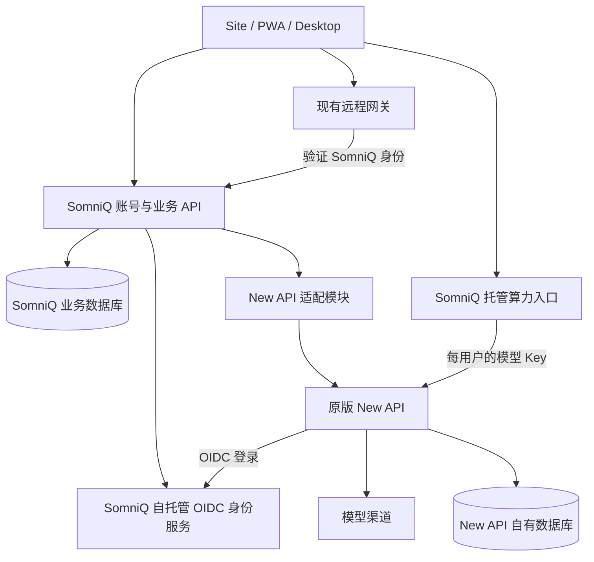

# SomniQ 独立账号与 New API 集成方案

日期：2026-09-23。状态：设计提案，尚未实施或部署。

用户已明确目标：SomniQ 拥有独立账号体系；New API 作为算力、额度和用量服务，并可持续跟进 GitHub 上游更新。

## 目标与验收标准

建设 SomniQ 自有账号入口和身份边界，通过上游支持的认证与业务接口接入独立部署的 New API，尽量保持 New API 源码零修改。

- 新用户在 SomniQ 注册、登录、找回密码；New API 故障时仍能登录 SomniQ 和管理非算力业务。
- Site、PWA、Desktop 使用稳定的 SomniQ 用户身份；不会把 New API 用户 ID 当成产品主键。
- 老用户迁移后沿用原 New API 账户，余额、消费记录、模型权限和已有设备关系能核验保留。
- 在隔离环境完成 New API 候选版本的自动兼容验证，版本固定、部署有记录、数据恢复经过演练。
- 研究文件、对话历史和任务内容仍按现有本地优先架构存储；本次账号建设不迁移这些数据。

此文记录本次候选里程碑。仓库现有 `.somniq/project-goal.json` 中另一项活动目标保持原状。

## 已核实的现状

| 位置 | 代码中的事实 | 对本方案的影响 |
| --- | --- | --- |
| `site/src/context/AuthContext.tsx` | 注册调用 `/v1/auth/register`，登录调用 `/v1/auth/login`，返回数据直接使用 New API 用户结构 | Site 当前没有独立身份边界 |
| `site/server/deploy/behind-existing-nginx/nginx/20-somniq-domain-tls.server.conf.template` | 将这些端点直接映射到 New API `/api/user/*` | 需要引入真正的 SomniQ 账号后端 |
| `site/remote/src/accountToken.ts` | Site 与 PWA 共享 New API access token，刷新依赖 `/api/user/auth/refresh` 和 `new_api_refresh` Cookie | 更换认证涉及两个前端，不能只改注册弹窗 |
| `desktop/src-tauri/src/newapi.rs` | 桌面直接登录 New API，创建或读取当前用户的模型调用 Key，并读取额度和分组 | 桌面认证和托管模型凭据也要纳入迁移 |
| `site/server/src/lib.rs` | 远程网关调用固定账号查询端点，账号摘要包含该端点 URL 与 New API 数字用户 ID | 直接替换 ID 或查询地址会改变设备归属摘要 |
| `site/src/components/AuthModal.tsx`、`site/README.md` | 协议接受目前是前端校验；后端同意记录仍待实现 | 同意记录应归 SomniQ 账号服务 |
| `site/src/autoRenew.ts`、`site/README.md` | 前端存在续费接口约定，仓库未提供完整签约、订单与支付回调服务 | 账号分离不能被当作支付接入已完成 |

本次核查范围是当前工作树与公开上游源码。没有登录生产服务器；实际运行的 New API 镜像、版本、数据库、已有 fork 差异和线上 Nginx 配置仍需在实施第一步盘点。仓库部署模板不能证明线上状态。

## 推荐结构



图中是逻辑职责。初期账号 API、适配模块、托管算力入口可以在同一个新的 Rust 服务内实现并分别设限；已有远程网关继续独立运行。身份服务独立部署，业务库与 New API 库使用不同数据库和数据库账户，可先复用同一数据库服务器。

身份底座建议先以自托管 Keycloak 做原型。SomniQ 控制域名、用户、注册策略、账号恢复与界面品牌，Keycloak 承担 OIDC 协议和凭据管理。Site 的注册按钮进入 SomniQ 品牌的身份页面，成功后回到账户中心。第一版采用品牌化跳转页面，避免同时实现自定义密码协议与 New API 集成。[Keycloak 部署文档](https://www.keycloak.org/server/containers)、[OIDC 文档](https://www.keycloak.org/securing-apps/oidc-layers)。

| 数据或行为 | 权威来源 |
| --- | --- |
| 登录凭据、身份验证、密码恢复 | SomniQ 自托管身份服务 |
| 产品用户 ID、资料、账号状态、角色、协议记录、设备归属 | SomniQ 账号服务 |
| 产品套餐、订单、支付签约和产品功能权益 | SomniQ 业务服务；完整支付实现另设里程碑 |
| 模型渠道、可用模型、模型调用 Key、算力额度、消耗和调用日志 | New API |
| 套餐与算力配置之间的映射、同步状态、对账任务 | SomniQ 适配模块 |

账号注册成功与算力开通成功是两个状态。New API 暂不可用时，SomniQ 账号保持有效，算力显示“开通中”或“暂不可用”，可重试开通。

## 通过官方能力接入 New API

### 认证方向

New API 的内置 OIDC 实现能向外部身份服务换取 token、读取 userinfo，并使用 `sub` 关联其用户。这里 New API 是身份服务的客户端；SomniQ 身份服务才是账号入口。OIDC 登录后仍然需要 New API 自己签发的会话或模型 Key，不能把 SomniQ JWT 直接当作 New API 模型 Key 使用。[已核查的 OIDC 实现](https://github.com/QuantumNous/new-api/blob/v1.0.0-rc.40/oauth/oidc.go)。

至少区分 `somniq-web`、`somniq-desktop`、`newapi` 三个身份服务客户端。SomniQ 客户端采用 Authorization Code + PKCE；New API 按该版本原生支持的机密客户端流程配置。不要假设所有客户端都有相同的 PKCE、退出登录或 token exchange 能力。

New API 新用户可通过 OIDC 首次登录创建。其 OAuth 创建流程也受总注册开关限制：不能为了禁止密码注册就关闭总注册。迁移结束后关闭密码注册和普通用户的旧登录入口，仅开放必要 OIDC 入口；其他第三方登录提供者按实际需要关闭。运营管理员的受限访问入口单独保留。[OAuth 用户创建逻辑](https://github.com/QuantumNous/new-api/blob/v1.0.0-rc.40/controller/oauth.go)。

### 新用户的完整流程

1. 用户完成 SomniQ 注册和必要验证，服务端记录协议版本、同意时间和正文快照引用。
2. SomniQ 分配自己的不可变 `user_id`，关联身份服务的 `issuer + sub`，建立 SomniQ 会话。
3. 首次开通算力时，适配模块调用 New API 的 OAuth state 接口启动 OIDC 登录，再让浏览器完成 New API 客户端的授权跳转。已有身份服务登录态通常可以复用，无须再次输入密码；仍需实际验证跳转和授权体验。
4. 用 New API 自己生成的一次性流程标识处理回调；将流程绑定到发起操作的 SomniQ 会话。配置 `ServerAddress` 对应的 `/oauth/oidc` 回调路由，由桥接服务接收并向 New API 完成交换，确切代理和 Cookie 行为先做原型验证。
5. New API 返回自己的用户会话后，读取并核对用户 ID，以及 `/api/user/self` 返回的 `oidc_id`。它必须匹配当前 SomniQ 身份在 New API 客户端下的 subject；浏览器中途切换身份时终止流程，不能只凭回调来自同一个浏览器就建立映射。核对后写入唯一账户映射，再以该用户身份创建或取回模型 Key。[用户资料 DTO](https://github.com/QuantumNous/new-api/blob/v1.0.0-rc.40/controller/user.go)。
6. New API 的会话、刷新凭据和模型 Key 仅由服务端适配模块管理；浏览器与桌面使用 SomniQ 自己的凭据。

**关键可行性约束：** 当前 `POST /api/token/` 将 Key 归属固定为鉴权上下文中的当前用户。不能以管理员身份提交任意 `user_id`，就假设生成了该用户的 Key。首个原型必须验证上述“OIDC → 用户会话 → 用户模型 Key”全过程。[上游令牌控制器](https://github.com/QuantumNous/new-api/blob/v1.0.0-rc.40/controller/token.go)。

若账号已建成但 Key 创建响应丢失，先按已经验证的账户映射查询并对账；每个账户串行开通，记录上游资源 ID 和处理状态，避免重试产生多个账户或无限增发 Key。注册密码不写入同步任务或日志。

### 会话与调用边界

- 浏览器使用 SomniQ 服务端会话和 HttpOnly、Secure Cookie；变更操作校验 CSRF/Origin。逐步清除现有 Web Storage 中的 New API 凭据。
- 桌面通过系统浏览器登录，安全保存自己的刷新凭据。后台研究任务依靠设备授权续期，不依赖某个 Site 页面一直打开。
- 托管模型请求经过 SomniQ 算力入口。入口验证用户、设备、产品权限与请求目标，再取对应 New API 用户 Key 转发；支持流式输出与取消传播，不重复实现 New API 的模型计费。
- New API 模型入口限制到内部网络或可信入口，模型 Key 留在服务端。SomniQ 停用账号后，算力入口即可拒绝其新请求；不依赖 New API 下一次交互式登录来发现停用。
- 普通退出仅结束当前会话。退出所有设备、停用账号、注销分别有明确流程，并同步撤销所需的设备授权和上游凭据。OIDC 单点登录不自动等于两套系统的会话、Key 和账号生命周期同步。
- 托管调用凭据绑定固定算力入口；本地自有 Key 模式继续保持独立配置。登录账号并不取消原有远程设备配对和本机授权要求。

新增算力入口会增加一跳流量与运维成本，需要测量流式延迟、并发、取消和故障恢复。这一跳让 SomniQ 能统一控制托管账号权限，而客户端不必了解 New API 的认证变化。

### 对客户端的稳定接口

建议为新的账号契约使用 `/v2/account/*`，例如登录启动与回调、`GET /v2/account/me`、设备会话、产品权益和用量查询。资料中的 `id` 是 SomniQ UUID，产品角色与上游 New API 角色分开。用量响应定义自己的 DTO、单位与时间范围，不向客户端直接透传 New API 数据结构。

现有 `/v1/auth/*`、`/v1/user/*` 在有限兼容窗口内继续服务旧客户端；不能将相同 URL 的数字用户 ID 静默替换成 UUID。老会话升级为新身份必须经过已验证的账户关联。模型接口可在独立算力域名维持 OpenAI 兼容的 `/v1/*`，与账号 API 的版本独立。

## 账户映射与旧用户迁移

建议至少包含以下业务记录：

| 记录 | 主要字段与约束 |
| --- | --- |
| `users` | SomniQ UUID、状态、资料；主键永久稳定 |
| `identity_links` | `user_id, issuer, subject`；`issuer + subject` 唯一 |
| `compute_accounts` | `user_id, newapi_instance_id, newapi_user_id, state`；同一实例内双向唯一 |
| `provider_credentials` | 加密保存上游会话与 Key，记录密钥版本、过期时间和撤销状态 |
| `consents` | 用户、协议版本、服务端接收时间、主动接受记录、正文快照引用及内容摘要 |
| `provisioning_jobs` | 幂等业务键、步骤、上游资源 ID、重试与核验结果；不含密码 |
| `identity_migrations` | 已验证的旧账号、新账号与旧远程账号摘要之间的关联 |

同一 OIDC issuer 的 `sub` 必须保持稳定。若身份服务为不同客户端生成不同的 pairwise subject，需要显式保存 New API 客户端对应 subject；首版建议固定单一 realm 和明确的稳定 subject 规则。当前上游 OIDC 还要求非空 email，旧用户无邮箱时应在迁移中补充验证，不能忽略这一条件。

旧用户采用“验证旧账户并绑定”的渐进迁移：

1. 保留旧入口一段迁移窗口。用户验证原 New API 账号及其已有二次验证，同时建立或登录自己的 SomniQ 身份。
2. 通过上游标准账号绑定流程把 SomniQ OIDC 身份绑定到**原 New API 用户**，按目标版本完成绑定所需的安全校验。
3. 服务端确认双向唯一映射；重复登录同一 SomniQ 身份必须得到同一个 New API 用户。
4. 校验旧用户余额、用量、分组与权限，不搬迁消费账本、不另建一个空余额账户。
5. 迁移远程身份关系，验证原设备仍可发现并按原授权连接。
6. 用户后续从 SomniQ 登录；遗忘旧凭据的用户走受控账号恢复。密码保留还是首次设置新密码在原型后确定，方案不承诺无需用户参与的密码迁移。

不能按“邮箱相同”或“用户名相同”自动合并账户。先证明对两个身份的控制，再绑定；邮箱冲突进入迁移流程。已有用户应先完成绑定，再尝试 OIDC 自动开户，避免重复用户或邮箱冲突。

远程网关现在的摘要输入是 `somniq-account/v1 + account_self_url + verified_user_id`。应增加带版本的身份表示，并在强验证后记录旧摘要到 SomniQ 身份的受控映射。不要只修改 `SOMNIQ_GATEWAY_ACCOUNT_SELF_URL` 或把数字 ID 换成 UUID；这会改变设备查找结果。迁移需要备份网关状态，保持原有配对授权范围。

## 产品权益与算力账本

SomniQ 负责判断产品功能是否可用；New API 负责模型用量与余额扣减。账户中心通过适配模块展示这两类状态，不从 New API 的 `group` 字段推断自动续费授权或全部产品会员权限。

本次迁移沿用现有算力余额和消费记录。完整支付签约、周期扣款及新的充值方式另行实施；届时明确唯一订单来源、发放业务键、上游操作幂等性和对账流程。不能用“读余额，再覆盖写余额”的方式处理并发充值和模型消费，也不能假设所有管理接口天然支持幂等重试。

## 持续跟进 GitHub 上游

### 管理方式

- New API 作为单独部署的外部依赖，使用上游镜像或从指定上游 tag 构建。Site 与业务代码保留在 SomniQ 仓库，适配逻辑集中在一个模块。
- 业务服务通过 HTTP 接口访问 New API；不向其数据库直接写入 SomniQ 业务表，也不依赖跨库 SQL 查询。
- 建立 `deploy/newapi/version.lock.json`，记录仓库、tag、commit、镜像 digest、适配契约版本和验证记录。具体文件名为拟议结构。
- 若生产现有 fork 有定制，先盘点并逐项外移；实在不能外移的补丁保留独立列表和回归测试，定期争取上游接纳。

截至本次核查，官方 latest 为 2026-09-21 发布的 `v1.0.0-rc.40`，GitHub API 的 `prerelease` 字段为 false，但版本名仍有 `rc`。因此更新策略同时检查 SemVer 标签与发布字段，不能把 `latest` 或 `prerelease=false` 等同于生产批准。[官方发布记录](https://github.com/QuantumNous/new-api/releases/tag/v1.0.0-rc.40)。

正式版本和 RC 候选分两个通道。若当前生产已经采用 RC，则保持已验收版本并使用明确白名单推进，不能因为筛选规则而自动退回旧版本。

### 拟议流水线

```text
GitHub Releases 出现候选版本
  → 自动解析 tag、变更和镜像 digest
  → 提交版本更新 PR
  → 隔离数据库上执行迁移演练与兼容测试
  → 生成接口变化、测试和回退记录
  → 在预发布环境验证
  → 通过既定发布门槛后切换生产
```

初期自动发现、自动测试、自动生成更新 PR，生产采用显式发布。积累兼容记录后，可对允许的版本通道启用通过全部门槛后的自动发布。破坏性数据库变更、身份流程变化及不支持的版本进入待处理队列。

兼容测试至少覆盖：

1. SomniQ 注册与登录不依赖 New API 在线；恢复后可补齐算力开通。
2. 新用户 OIDC 开户、旧用户绑定、重复登录不重复创建账户，A 用户不能读取 B 用户的 Key 或用量。
3. 上游会话刷新、并发刷新、账号切换、退出与撤销，以及异常后的重新授权。
4. 用户 Key 创建、查询、撤销；模型列表、流式调用、取消与额度消耗归属。
5. 协议记录完整、余额和日志读取正确、旧设备关系保留。
6. SomniQ 当前客户端及兼容窗口内旧客户端的 API 行为。
7. 数据迁移、旧版本兼容性及恢复演练。

隔离环境使用测试身份、独立数据库和模型桩，不复制真实上游渠道密钥执行 CI。数据库结构样本若来自生产，需先处理账户凭据和其他敏感内容。

### 部署与恢复

上游认证更新已有 Cookie 协议和数据库迁移变化，所以仅替换镜像后“容器能启动”不能作为升级通过。[上游认证与升级说明](https://github.com/QuantumNous/new-api/blob/v1.0.0-rc.40/docs/authentication.md)。

- 升级前记录旧 digest，备份 New API 库、SomniQ 映射库、网关身份迁移状态，以及必要配置和密钥的可恢复版本。
- 在隔离副本上跑候选版本迁移；新旧 schema 不兼容时采用维护窗口，停止相关写入并处理流式请求排空，不让旧实例继续访问被新版本改变的 schema。
- 升级后核验账户映射、模型调用、余额和用量，再恢复业务写入。
- 只有验证过 schema 向后兼容，才允许直接切回旧镜像。否则恢复备份与对应配置，并处理切换后新产生的记录；不能宣称一条镜像回滚命令能无损撤销数据库迁移。
- 日后接入支付时，维护期间的支付回调须持久化排队并按订单幂等重放，不能在恢复数据库时丢失或重复发放额度。

## 实施顺序与代码落点

| 阶段 | 工作内容 | 完成判据 |
| --- | --- | --- |
| 0：部署盘点 | 确认生产版本、镜像、数据库、fork 差异、认证配置和旧用户类型 | 有可核验基线与可恢复备份；明确原型目标 tag |
| 1：集成原型 | 自托管身份服务 + 原版 New API；测试新用户登录、旧用户绑定、用户 Key、回调与刷新 | 同一 SomniQ 身份稳定关联一个 New API 用户，能够完成一次模型调用 |
| 2：账号服务与 Site | 建立用户映射、协议记录和服务端会话，接入注册、登录、资料和账户中心 | Site/PWA 拥有独立身份，New API 停机不影响基本账号登录 |
| 3：桌面与旧用户 | 桌面浏览器登录、托管算力入口、旧账户绑定、远程身份迁移 | 余额、用量与设备保持关联；托管账号停用后新请求被拒绝 |
| 4：更新机制 | 锁定上游版本，增加候选版本 PR、兼容测试、预发布与恢复演练 | 在两个明确版本之间完成一次可重复的升级演练 |

建议代码组织：

- `site/account-server/`：新的 Rust/Axum 账号与业务服务，内含 New API 适配模块和第一版托管算力入口；数据存储独立于现有网关。
- `crates/account-protocol/`：需要跨 Rust 服务与客户端共享的稳定 DTO/协议，避免将服务部署依赖带入桌面 runtime。
- `site/src/context/AuthContext.tsx`、`site/remote/src/account*.ts`：切换 SomniQ 会话，Web/PWA 共用协议实现。
- `desktop/src-tauri/src/newapi.rs`：逐步把托管产品认证切换到 SomniQ；保留明确的自托管兼容适配边界。
- `site/server/src/lib.rs`：使用新的账号验证契约，并实现版本化设备身份迁移。
- `site/server/deploy/`：更新 Nginx/Caddy 的账号路由，保持 OAuth 回调、管理面和模型调用路由明确。
- `deploy/newapi/`、`.github/workflows/newapi-compat.yml`：版本清单、独立部署及升级验证，均为拟新增路径。

验证按变更范围执行：独立服务的集成测试、Site/PWA 的聚焦测试和构建、Desktop 的聚焦 Vitest 与构建；共享 Rust 协议跨 crate 时运行对应测试与 `cargo test --workspace`。本提案尚未运行上述原型或实现测试。

第一项实施应是阶段 0 和阶段 1：先证明不修改 New API 源码也能完成独立身份接入与老用户绑定，再推进产品页面和全量迁移。
