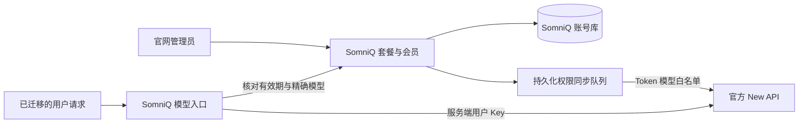

# SomniQ Go / Plus / Pro 会员与模型权限

日期：2026-09-23。状态：独立账号预览已实现会员管理；生产尚未切换。接续[独立账号方案](site-identity-newapi-integration-plan.md)与[阶段一记录](site-identity-phase1.md)。

用户最终确认：Go ¥29/月、Plus ¥49/月、Pro ¥99/月。此定义替代此前讨论的社区版 / Pro / 团队版；本次不引入团队席位或共享额度业务。具体模型由官网管理员配置。

## 产品与职责

| 版本 | 月度报价 | 模型权限 |
| --- | --- | --- |
| Go | ¥29 | 管理员配置的 Go 白名单与默认执行/审查模型 |
| Plus | ¥49 | 管理员独立配置的 Plus 白名单与默认模型 |
| Pro | ¥99 | 管理员独立配置的 Pro 白名单与默认模型 |

三档不自动继承模型。可按商业策略配置为递增集合，也可给每档不同模型。新增上游模型不会自动加入任何档位；新套餐初始为空且未启用。

SomniQ 拥有身份、会员有效期、模型白名单、管理员授权与审计；New API 保持官方版本，负责渠道、模型调用及原有钱包计费。价格是月度报价，目前由管理员手动授予会员，未接入付款、自动扣款或周期赠送额度。

账号管理员和 New API 管理员是独立身份角色。服务端使用已配置 OIDC issuer 和 subject 精确授权；邮箱、余额、New API 角色及前端状态均不授予管理权。

## 已实现的入口

- 官网主页与价格页：独立模式下读取同一份后端目录，展示 Go/Plus/Pro 月度报价、可用模型和默认模型。
- 账户中心 `/account.html`：展示当前会员、有效期、模型权限与原有算力余额；管理员可进入后台。
- 管理员 `/admin.html`：配置三档模型、从 New API 读取候选模型、启用/停用套餐，搜索用户、开通/修改/撤销限期会员，查看最近审计并重试同步。
- `GET /v2/account/entitlements`：提供唯一的当前权益，不从旧的 group、quota、role 推算会员。
- `/v1/models`：返回有效会员白名单和当前上游列表的交集。
- Chat Completions、Responses、Messages：统一校验模型再转发，支持流式输出；未列明的接口不做通用透传。

默认 Site 构建仍保留旧登录契约。需部署账号服务并以 `VITE_ACCOUNT_MODE=independent` 构建后才启用这些入口，不能只替换静态 HTML。完整变量、初始化步骤和路由见[服务 README](../../site/account-server/README.md)。

## New API 的结合方式

官方 Token API 已具备模型限制字段，会员映射留在 SomniQ，避免修改上游源码。[官方 Token 接口](https://github.com/QuantumNous/new-api/blob/v1.0.0-rc.40/controller/token.go)。

1. 用户通过独立账号连接到经过验证的 New API 用户映射，每用户使用自己的服务 Key，Key 只存在服务端。
2. 对该 Key 设置 `model_limits_enabled=true`，将当前会员的精确模型集合写入 `model_limits`。空集合表示没有调用权限，不关闭限制开关。
3. 保存 Token ID、归属及已同步的权益摘要；同步后回读核验。旧 Key 的无限制配置在首次请求或后台核验时收紧。重复服务 Key、身份不一致、停用 Key 等状态会拒绝调用并要求核验。
4. 路由分组沿用 New API 用户账户的受控分组，本次不按套餐自动调整倍率或渠道。管理员需在 New API 保证目标用户分组可调用所选模型；发现模型清单不等于每个渠道当前健康。
5. 会员修改在 SomniQ 立即约束后续请求；同步队列持久化并重试。请求需要的白名单未同步成功时拒绝转发，不使用旧权限放行高级模型。
6. New API 自身还有名称规范化规则，SomniQ 精确白名单作为第一道检查，不依赖前端隐藏或上游单独鉴权。[上游检查](https://github.com/QuantumNous/new-api/blob/v1.0.0-rc.40/middleware/distributor.go)。

会员和余额分别处理：充值不自动升级、余额不延长会员、到期不清空余额。服务 Key 将计费交给原 New API 钱包，不建立重复的消耗账本；人工修改为有限 Token 预算的 Key 不由同步程序覆盖其剩余额度。

## 生效与并发规则

- 管理员变更校验会话、服务协议与 Origin。套餐和会员分别携带期望版本；过时的编辑返回 409，刷新后重新编辑。
- 会员到期按服务端时间即时计算，不依赖定时器执行。新用户不会自动获得付费会员。
- 未授权模型在请求转发前返回 403，不消耗上游额度；重复 JSON 字段、未知别名、客户端指定路由等请求被拒绝。
- 已获得许可、开始执行的有限时长请求可以结束；后续请求重新检查当前权限。界面缓存不参与后端授权。
- Executor 与独立 Reviewer 的默认模型分别配置，不合并研究角色。桌面运行时消费该新契约仍属后续迁移。

## 数据与变更位置

| 位置 | 作用 |
| --- | --- |
| `site/account-server/schema.sql`、`src/membership.rs` | 套餐、会员、版本冲突、到期判断、审计、同步队列 |
| `site/account-server/src/membership_http.rs` | 管理员与公开目录接口，服务端权限校验 |
| `site/account-server/src/http.rs`、`src/newapi.rs` | 模型请求授权、过滤、固定路径转发、上游 Key 核验与同步 |
| `site/src/AdminApp.tsx`、`membership.ts` | 管理页面及 Cookie API 客户端 |
| `site/src/components/MembershipPlans.tsx` | 主页/价格页共享套餐卡片和账户权益 |
| `site/account-server/scripts/membership-compat.mjs`、`browser-smoke.mjs` | 官方 New API 与真实浏览器回归 |

## 验证与上线边界

已完成的检查范围与运行结果见[会员实现记录](site-membership-implementation.md)。上游版本兼容任务现在同时验证三档会员、降级、撤销和到期，继续固定生产版本与候选版本，不自动部署 latest。

生产后续仍需要：配置管理员 subject 和真实模型名单、身份服务与 SMTP、旧账号绑定、Desktop/PWA 设备会话和旧 Key 迁移、账号库备份恢复和生产数据库方案。浏览器当前使用 Cookie，会话不能直接当作桌面或 SDK Bearer Key。

旧客户端和旧 New API 公网入口仍走原有契约。在迁移完成并收紧这些入口前，不能宣称全站所有旧 Key 已纳入会员控制。现阶段是可验收的独立账号会员闭环，未向生产写入配置或数据。

支付、订单校验、退款、自动续费与周期额度发放另设下一阶段；当前管理员操作都记录为人工会员变更，不伪装为支付成功。
