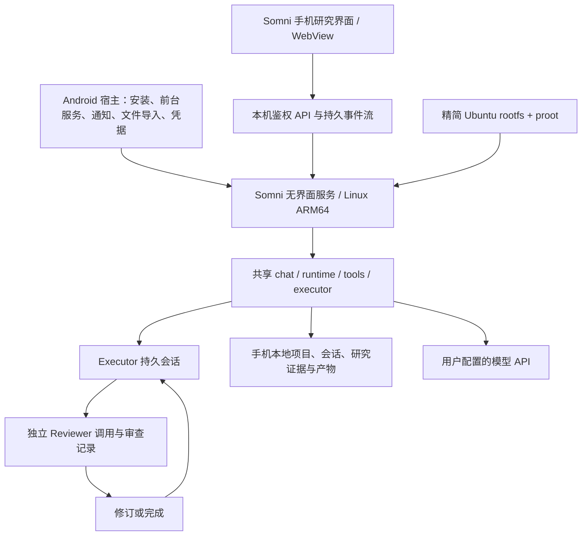

# Somni Android 独立运行方案与 DSHA 选型

评估日期：2026-09-20。用户已明确：首版优先 Android，手机应能独立运行科研 Agent，模型可以通过 API 调用。

本次方案目标：确定代码归属、运行架构、复用范围、首版边界和实施顺序。验收标准是给出源码依据、明确选择一种主路线、列出可在真机验证的里程碑，并区分已经存在的能力与待开发能力。本文件记录方案，不代表已经完成移植或真机验证。

**建议：在 Somni 仓库内用短期功能分支开发 Android 产品模块，选择性复用 DSHA 的 Android/Linux 运行层，继续使用 Somni 的共享 Rust 内核。**

“在哪个仓库开发”和“复用谁的技术”是两个决定。Somni 可以保持自己的主干、会话格式、研究工作流和发布体系，同时吸收 DSHA 已解决的 Android 启动与运行环境问题。这里建议的分支是 `codex/somni-android`；验收通过的基础改动逐步合回主干，避免形成长期分叉的手机内核。

**选型依据**

| 路线 | 首次演示的优势 | 后续主要成本 | 结论 |
| --- | --- | --- | --- |
| 整体 fork DSHA，再替换 Agent 和产品界面 | 现成 APK、环境安装器、终端和后台服务 | 替换 DSH 启动、配置、插件、鉴权和会话假设；还要同步 Somni 内核的演进 | 适合短期兼容性试验；不作为 Somni 产品主仓库 |
| 在 Somni 内直接从零做 Android 原生执行环境 | 平台边界可完全自行设计，后续有减重空间 | Rust Android 目标、bionic 与 glibc 差异、Python/Node 工具链和子进程管理都要重新解决 | 首版投入偏大，待 Linux 环境方案有实测瓶颈再评估 |
| Somni 仓库 + DSHA 运行层 + Somni 无界面服务 | 保留科研内核，并复用 Linux 工具兼容路径 | 需要抽离桌面宿主依赖，裁剪 DSHA 模块并完成真机验证 | **推荐主路线** |

DSHA 的核心价值是把 Linux Agent 的运行条件带到 Android。它自身的科研任务状态、审查标准和会话实现不能直接替代 Somni 的产品内核。

**已经核实的 DSHA 状态**

源码固定于提交 [`c8590e8a0616b336255670e94bd5d0e0e4f15b9d`](https://github.com/DSH-APP/DSHA/commit/c8590e8a0616b336255670e94bd5d0e0e4f15b9d)，提交日期 2026-09-19。查询时最新正式 Release 为 [`v0.1.5-rc2`](https://github.com/DSH-APP/DSHA/releases/tag/v0.1.5-rc2)，发布时间 2026-09-12，版本码 129。源码快照比该 Release 更新，不能将两者视为同一构建。

| 核查项 | 源码或发布资料显示的事实 | 对 Somni 的影响 |
| --- | --- | --- |
| Android 壳 | Java 17、原生 Android UI；标准版使用系统 WebView | 可复用平台服务；手机研究界面可继续使用 Web 技术 |
| 系统范围 | 标准版 `minSdk 30`、arm64-v8a；另有 `minSdk 23` 的 low flavor | 建议首版聚焦 Android 11+ / ARM64，不承担旧系统双浏览器维护 |
| Linux 环境 | Ubuntu arm64 rootfs，proot/proroot 运行适配，包含 Python/Node 等工具 | 优先验证 Somni 的 Linux ARM64 二进制，而非直接移植全部工具到 Android ABI |
| 宿主管理 | `ContainerRuntime` 抽象、进程身份检查、前台服务、安装恢复和备份流程 | 是值得学习和选择性移植的部分 |
| DSH 耦合 | `HarnessController` 设置 `DSH_HOME` 并启动 `dsh web`；`ProotBootstrap` 包含 DSH 包路径和插件修补 | 不能只改入口命令就认为移植完成 |
| APK 大小 | 当前 Release 标准版 185,267,651 字节，约 176.69 MiB；兼容版约 253.23 MiB | 仅说明完整环境有显著分发成本，不能直接当作 Somni 的包体预测 |
| 测试边界 | 上游发布记录列出真机检查；也注明 Android 6/7、真实 16 KiB 页设备未在最终轮次重测 | 引用的是上游报告，不是本项目已经验证的兼容性 |

DSHA README 后半部分明确保留了旧版介绍。其中 Android 版本、包体、浏览器内核等旧描述不宜用于当前选型；上述判断优先采用当前 Gradle、源代码和构建 129 发布记录。

**本次 UI 复核**：按上述提交的 DSHA `activity_main.xml`、主题色资源和移动 Web Chat 验收截图复核了界面结构。可复用的交互语言包括顶部应用栏、对话/轨迹切换、圆角消息表面、思考状态折叠行、消息操作条、底部圆角输入框、模型/推理级别控件和底部运行统计。Somni 移动端采用这些移动布局规律，同时保留桌面 Chat 的 Executor、工具证据和独立 Reviewer 语义；没有复制 DSHA 的会话、插件或 DSH 业务代码。

**Somni 可以复用的基础与实际缺口**

| 位置 | 已有基础 | Android 所需工作 |
| --- | --- | --- |
| `crates/chat`、`crates/executor`、`crates/api` | 共享会话运行时组装、模型调用、工具调用和流式观察接口；这些 Cargo 清单没有直接依赖 Tauri | 组装可长期运行的宿主服务，接入手机配置、取消、审批和事件持久化 |
| `crates/runtime` | 项目目标、会话、记忆、权限、工作流状态和阶段转换 | 验证 Android 容器里的路径、进程、SQLite、权限与恢复行为 |
| `crates/tools` | 研究工具和通用工具 | 清点传递依赖；目前 `tools` 会依赖 `notebook`，API/网络模块使用 native-tls，不能假设已经是轻量手机构建 |
| `desktop/src-tauri/src/app_ctx.rs`、`workflow.rs` | 已有宿主抽象；独立 Reviewer 调用和持久 Executor 会话的职责有明确区分 | 抽象仍位于桌面 crate，部分类型来自 `engine.rs`；需要移入共享层并让桌面也采用它 |
| `desktop/src-tauri/src/engine.rs` | 桌面执行、流式事件、权限交互与工作流会话绑定 | 很多路径仍接受 `AppHandle`，是本次移植的重要工作量 |
| `site/remote` | TypeScript + Vite 手机 PWA；配对、聊天、模型切换、事件补拉、恢复前台、Markdown 等 | 抽取通用逻辑，增加本机后端接入和研究界面；当前 package 并不依赖 React，不应按旧 README 将其视作现成 React 手机应用 |
| `crates/remote-protocol` | 版本化命令、能力声明、端到端加密协议 | 用于后续桌面连接；本机运行不应依赖云端配对网关 |

已有“协议声明”不等于已经实现产品能力。在当前 `desktop/src-tauri/src/remote.rs` 中，任务时间线返回空列表，`StopRun` 返回 `NotFound`，`GetReviewConclusion` 返回暂不可用。因此首版的研究任务控制、审查视图和产物访问需要接入真实持久状态。

现有 `devserver` 是开发调试入口，Executor 默认可使用 stub，live 模式也没有完整的持久工作流 Chat 会话。它可以提供抽象方式的参考，不能直接包装成正式手机服务。

当前 `review_workflow_driver.rs` 还将 `evidence-synthesis`、`manuscript`、`independent-review`、`submission-package` 标为未实现阶段。前面已有阶段的独立 Reviewer 能力可以复用；首版不能据此宣称完整论文流水线已经移植。

**建议运行架构**



图中的“独立”指角色、输入上下文、调用和审查记录独立；允许使用同一模型，但 Executor 不能写入自己的通过结论。Reviewer 可以读取明确提供的研究材料和待审产物，不继承 Executor 的私有推理上下文。

手机承载 Agent 调度、工具执行、会话和文件；推理可以联网调用模型。断网后仍可读取本地项目、笔记和已下载文献；依赖模型或在线检索的步骤进入等待网络状态，不承诺离线大模型推理。

Android 壳建议使用 Java/Kotlin + 系统 WebView。借用的 DSHA Java 代码先保留原语言，新适配层可以用 Kotlin；避免为统一语言先重写已稳定的平台代码。手机研究界面采用 React + TypeScript + Vite，提取现有 PWA 的纯逻辑和可用样式，按手机任务流组织页面。

不将现有整个 Tauri 桌面后端打入手机。容器内服务优先编译为 `aarch64-unknown-linux-gnu`，利用 Ubuntu 的 glibc、TLS 和工具依赖；Android 外层负责启动它。该目标是待验证方案，不代表目前已经编译成功。若未来再做 iOS，可共享界面和远程协议；Android 的 proot 执行方案不能直接移植到 iOS。

**模块组织与复用边界**

建议形成以下结构，具体命名可随首个技术验证调整：

```text
mobile/android/          Android 应用及 DSHA 平台代码的适配
mobile/web/              手机研究界面
packages/mobile-core/    从现有 PWA 提取的通用 TS 类型、渲染和状态逻辑
crates/host/             从桌面抽出的会话、项目、权限、工作流宿主组装
crates/mobile-service/   Linux ARM64 本机 HTTP/事件服务的薄入口
crates/runtime/          继续共享的状态、记忆与运行机制
crates/chat/             继续共享的会话运行时组装
crates/tools/            继续共享的工具，逐步增加移动能力选择
```

`host` 承担可共享的业务入口，`mobile-service` 只做宿主与传输适配。业务 DTO 从共享契约生成或导出给 TypeScript；本机与远程传输使用各自的鉴权边界。原有 `remote-protocol` 继续负责远程封装，避免在手机端另写一套研究状态机。桌面也应复用抽出的 `host`，否则只是把重复代码搬到了新目录。

| DSHA 部分 | 处理方式 |
| --- | --- |
| `ContainerRuntime`、nativeLibraryDir 启动方式 | 固定来源提交，保留许可证，移植为可替换平台适配层 |
| 安装校验、空间预检、版本化 rootfs、失败恢复 | 借用机制，重写成 Somni 的运行环境清单，消除 DSH 包和配置假设 |
| 前台服务、通知、进程身份验证、PTY | 按首版能力选择性移植；停止逻辑重新绑定 Somni 服务和工具子进程 |
| 备份、迁移、维护事务 | 参考一致性和回滚机制，使用 Somni 项目格式；不直接沿用 DSH 备份内容和目录 |
| `dsh web`、Cordis 插件注册、DSH 会话修补、DOM 注入补丁 | 从产品构建中移除，接入 Somni 内核与手机界面 |
| ADB、Shizuku、无障碍、悬浮窗、全盘文件访问 | 不纳入科研 MVP 的默认权限；后续有明确手机操作场景再单独加入 |
| 发布包名、更新源、签名 | 使用 Somni 自己的身份和发布链，保留所复用源码的作者与许可证归属 |

DSHA 的平台代码并非一个可以直接引用的独立 SDK。移植时需要记录来源提交、依赖闭包、必要的行为测试和本地改动。可先用独立参考 checkout 做启动试验，再按模块引入；不要把整个上游升级都当作必须合入的变更。

**本机服务与数据约定**

第一版 API 覆盖项目/目标、会话消息、运行状态、用户问题、权限审批、审查结论、产物索引和导出。前端通过本机服务读取真实状态，提交操作只传项目/运行/产物 ID，文件路径在宿主侧解析。

回环地址同样需要鉴权：只监听 loopback，验证短期会话凭据和受信 Origin，避免其他 App 或外部网页调用本机接口。token 不放 URL 或日志。WebView 的本地入口和文件打开方式需要在真机确认；外部文献页面不获得本机特权桥。

每个运行保留稳定的 `project_id`、`session_id`、`run_id`、操作 ID 和递增事件序号。断线后按序号补拉；写操作去重。审批绑定当前运行、具体工具调用和状态版本，不能把旧通知上的批准用于新动作。是否进入下一研究阶段由后端检查 Reviewer gate。

运行环境与用户数据分开：可替换的 rootfs/工具包放运行环境目录；项目、会话、附件和产物默认保存在 App 私有数据目录。用系统文件选择器导入或导出，不要求默认开放整部手机的共享存储。导出包采用相对路径、稳定项目 ID、版本清单和文件校验值；数据库使用一致性快照，不能直接复制正在写入的 SQLite/WAL 文件。

模型凭据由 Android Keystore 保护静态存储，按需提供给调用组件；不写入运行环境包、默认项目备份、命令行参数或诊断日志。Keystore 不能被描述为容器内任意代码执行的完整隔离方案。托管账户的凭据与官方网关绑定、BYOK 凭据与自定义服务分流，应复用经过核验的共享鉴权实现；仓库现有项目 goal 仍记录该边界的待处理事项，本方案不将其视为已完成。

电脑与手机最先通过“显式导出/导入项目”衔接。实时双向编辑同步放到后续：不要直接同步两端都在写的会话数据库，也不要在手机继续使用 Windows 的绝对路径。将来接入桌面或远程计算节点时，明确显示执行位置和传输的材料；手机独立模式不以电脑在线为前提。

**首版产品范围**

建议先交付一个可持续使用的研究闭环：在手机建项目和目标，导入 PDF/文本/网页资料，执行阅读与小规模 Python 分析，让独立 Reviewer 审查一份带引用或结果文件的产物，按意见修订，并保存可追溯记录。

| 产品面 | MVP 内容 |
| --- | --- |
| 项目 | 项目列表、研究目标、当前阶段、最近产物 |
| 任务 | 聊天与工具进度、Executor/Reviewer 状态、继续/暂停/取消、用户问题和权限处理 |
| 材料 | 文件导入、PDF/Markdown 阅读、来源与产物关联、图表和 CSV 查看、导出 |
| 设置 | 执行者/审查者模型、API 或托管账户、环境状态、存储、备份和恢复 |

首版工具包以文本/PDF 提取、HTTP 检索所需依赖、git、Python 和基础数值/绘图库为主，验证目标 ARM64 包的可获取性。Node/MCP、LaTeX、Notebook 按实用需求分包或能力启用；不能只在界面隐藏功能却仍把所有依赖带入 APK。

完整 IDE、VSCodium、桌面浏览器自动化、MATLAB、GPU 训练、完整 TeX 发行版和任意手机 App 自动操作不进入首版承诺。大型实验后续可以显式委派给远端计算资源，但轻量科研闭环必须在手机独立完成。

**影响可行性的四个工程约束**

1. **后台运行以可恢复为目标。** 前台服务和 WakeLock 可以改善持续运行，但不能保证任何厂商、熄屏状态或强制停止后永远存活。控制并发与模型预算，在阶段和工具边界写检查点；重启后恢复项目和可恢复任务，对外部副作用不盲目重放。WorkManager 可做有限恢复/维护工作，不能当作无限 Agent 进程。
2. **Linux 兼容环境不等于强隔离。** proot/proroot 不提供 Docker 式安全边界；Android 应用 UID 与用户授予的权限仍是实际边界。Somni 当前沙箱检测会检查 Linux 与 `unshare` 命令是否存在，容器内存在该命令不代表 Android 允许创建 namespace，必须实际探测并报告有效能力。需要隔离的动作在能力不足时拒绝或走明确许可，不能静默冒充隔离成功。限制工作目录或挂载列表也不能当作任意 shell 的完整防逃逸保证。
3. **运行时许可必须逐组件处理。** DSHA 主项目 MIT 可支持代码复用，但第三方声明将 proot 标为 GPL-2.0，将 proroot 标为 Proprietary，并写明禁止分发修改过的二进制。建议先以能从对应源码和补丁复现的 proot 为基线，履行对应组件的分发义务；proroot 作为后续可选性能试验项，先核对采用版本的原始授权和再分发条件。不能仅凭 DSHA 的 MIT 标签给整个 APK 下结论，也不能无依据断言 Somni 全部代码都因此必须改变许可证。
4. **包体、性能和系统兼容需要真机数据。** DSHA 的速度宣传不能外推到 Somni。记录首次安装空间、环境展开时间、冷/热启动、流式输出、Python 工具耗时、内存、耗电、退出后的子进程，以及 16 KiB 页设备表现。发行可执行文件需遵守 Android 的加载限制，不假设下载到可写目录后直接 exec 可用。首发建议签名 APK 内测；应用商店分发是包含前台服务和运行时代码策略评估的单独里程碑。

**实施阶段与验收**

工期是方案估算，假设一名 Android 工程师和一名熟悉 Somni Rust/Web 的工程师参与，有至少两台 ARM64 真机及 Linux ARM64 构建环境。稳定内测版约 6–10 周；已有适配经验和工具链会缩短时间，跨平台依赖或厂商后台限制可能延长。P0 后应重新估算。

| 阶段 | 预计投入 | 交付与验收 |
| --- | --- | --- |
| P0 可行性验证 | 3–5 个工作日 | 在 Android 11+ ARM64 真机通过 proot 启动最小 Somni Linux 服务；不依赖 Tauri；完成一次真实模型调用、Python 文件产物、独立 Reviewer 请求、一次修订与会话重开；记录依赖/内存/启动日志 |
| P1 共享宿主与持久运行 | 约 2 周 | 抽出 `host` 和薄服务入口；桌面保持原行为；手机通过同一持久会话/权限/审查逻辑执行；事件可补拉、操作可去重；拒绝审查时不可完成阶段 |
| P2 手机研究界面 | 约 2 周，可与 P1 后半段重叠 | 项目、任务、材料、设置四个产品面；本机流式交互、导入、阅读、审查意见、图表和导出可用；适配键盘、返回键、旋转和 WebView 重建 |
| P3 生命周期与数据可靠性 | 约 2 周 | 熄屏、网络切换、进程退出、磁盘不足、升级中断、恢复与取消；项目状态正确，不能重复执行已完成副作用；通知可回到对应任务 |
| P4 内测交付 | 约 1 周 | 最小依赖清单、来源与许可证材料、独立签名/包名/更新链、诊断导出；多机型验收、项目迁移到桌面继续；给出实测包体、性能与已知限制 |

P0 的首次闭环可以只支持一个项目和一个活动运行。不能用 DSH 代替 Somni 执行后宣称已完成移植，也不能用 stub 的审查“通过”充当真实 Reviewer 验证。验证完成后再扩大界面和工具范围。

P0 的推进条件是：共享 Rust 内核在 Android/Linux 环境中实际可运行，核心网络、子进程和存储依赖能满足，原有执行/审查分离可保留，停机恢复没有根本障碍。若失败，应据失败项评估精简依赖或原生 Android 执行器；不擅自把用户要求的独立运行改成远程访问电脑。

建议最终验收场景：电脑关闭，手机导入少量文献和一份数据，运行研究任务；Reviewer 对真实问题提出修订，Executor 生成修订后的 Markdown/CSV/PNG 及审查记录；锁屏和重开后记录可继续；导出项目并在桌面核对目标、材料、会话和产物。网络中断时不伪造完成，恢复网络后继续可恢复步骤。

改动共享 Rust 后先跑相关 crate 测试，跨 crate 变更执行 `cargo test --workspace`。桌面宿主/UI/API 改动执行相关 Vitest 与 `desktop/` 的 `npm run build`；手机执行自己的类型检查、构建、Android 单元/仪器化测试与真机验收。必须测试 Reviewer 独立性、取消和恢复等行为，不能只验证能产出 APK。

**实施前优先形成的第一份交付物**

一个最小验证 APK、所用 ARM64 服务和 rootfs 的版本清单，以及“真实执行 → 独立审查 → 修订 → 重新打开会话”的真机日志。这份结果用于确定后续共享宿主抽离、手机界面和工具包的投入范围。

**可追溯来源**

- DSHA [构建配置](https://github.com/DSH-APP/DSHA/blob/c8590e8a0616b336255670e94bd5d0e0e4f15b9d/app/build.gradle)、[Android Manifest](https://github.com/DSH-APP/DSHA/blob/c8590e8a0616b336255670e94bd5d0e0e4f15b9d/app/src/main/AndroidManifest.xml)。
- DSHA [ContainerRuntime](https://github.com/DSH-APP/DSHA/blob/c8590e8a0616b336255670e94bd5d0e0e4f15b9d/app/src/main/java/com/deepseekharness/app/runtime/ContainerRuntime.java)、[HarnessController](https://github.com/DSH-APP/DSHA/blob/c8590e8a0616b336255670e94bd5d0e0e4f15b9d/app/src/main/java/com/deepseekharness/app/core/HarnessController.java)、[ProotBootstrap](https://github.com/DSH-APP/DSHA/blob/c8590e8a0616b336255670e94bd5d0e0e4f15b9d/app/src/main/java/com/deepseekharness/app/runtime/ProotBootstrap.java)。
- DSHA [主许可证](https://github.com/DSH-APP/DSHA/blob/c8590e8a0616b336255670e94bd5d0e0e4f15b9d/LICENSE)、[第三方组件声明](https://github.com/DSH-APP/DSHA/blob/c8590e8a0616b336255670e94bd5d0e0e4f15b9d/THIRD_PARTY_NOTICES.md)、[安全模型](https://github.com/DSH-APP/DSHA/blob/c8590e8a0616b336255670e94bd5d0e0e4f15b9d/docs/security-model.md)。这些文件也含历史描述，正式分发前仍要按所采用的具体组件版本核对。
- DSHA [构建 129 发布记录](https://github.com/DSH-APP/DSHA/blob/c8590e8a0616b336255670e94bd5d0e0e4f15b9d/docs/releases/v0.1.5-rc2-build129.md)、[README](https://github.com/DSH-APP/DSHA/blob/c8590e8a0616b336255670e94bd5d0e0e4f15b9d/README.md)。
- Somni 工作区基于提交 `326690ff196384e6d37284f842186918039e1b9f`，本次读取时存在尚未提交的桌面聊天界面修改；本方案没有改动那些文件。主要内部依据为上文列出的源码及 [浏览器调试架构](browser-debugging.md)。
- 本次做了源码、依赖声明和发布资料核查；未构建 DSHA/Somni Android APK、未运行上述真机验收，未将上游测试结果记作本项目通过记录。
